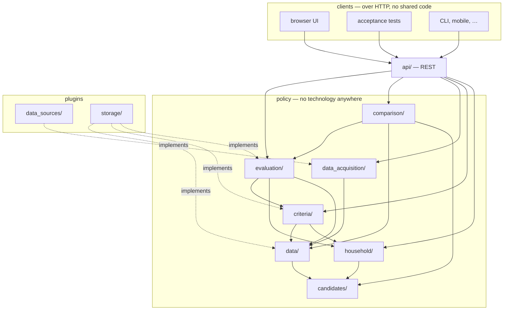

# Architecture — Starnest

Refined from `relocation-app-master-spec-v1.md` (Part 3), and from the ontology discussion that
followed `reqs.md`. Terms used here are defined in `reqs.md` Appendix A.

**Status: partial.** This document currently covers the ontology only. The stack — language,
UI framework, database engine — is deliberately still open (§11). The ontology is settled
independently because none of it changes based on that choice.

---

## 1. The ontology in two tiers

The data model splits into **archetypes** and **instantiations**, and they live in different
places for a reason that is not stylistic.

| | Archetypes | Instantiations |
|---|---|---|
| Examples | `Candidate`, `Attribute`, `Value`, `Pillar`, `Criterion`, `CriteriaSet`, `Evaluation`, `Household`, the ten value types, the **rule shapes** | `country`, `city`, `economics`, `rent_centre`, `population`, `rent_vs_spend` |
| Live in | **Code** | **Database tables**, seeded and changed by migrations |
| Changed by | A developer, in a release | A data migration, versioned in git |
| They are | The vocabulary | The sentences |

The **rule shapes** of `reqs.md` §3.7a are archetypes for the same reason: `ShareOfHouseholdField`
performs a comparison, and `rent_vs_spend` is one instantiation of it — inputs and a threshold,
stored as data.

**Why archetypes cannot be config.** An archetype like `Monetary` does not merely declare
fields — it declares *operations*. `Monetary` converts through an fx rate. `Quantity` converts
through unit factors. `Index` rescales from provider-declared bounds. Those are three different
algorithms. Expressing them in config would require either an expression language (a language,
with all that implies) or a declaration kept manually in sync with the code that implements it
(drift, silently). So behaviour stays in code.

**Instantiations reference archetypes by name; they never define one.**

```sql
INSERT INTO attribute (id, level, pillar, value_type, max_age)
VALUES ('country.population', 'country', NULL, 'Count', INTERVAL '24 months');
```

`value_type` is a foreign key into the `value_type` reference table, which the application
populates from its registry of implemented types at startup. **An attribute naming a type that
is not implemented cannot be inserted** — the database refuses it, rather than the application
discovering it at fetch time.

### 1.2 The catalog is data in the database, not a config file

The attribute catalog, pillars, data sources, breakdown schemes, levels and the shipped default
criteria set are **rows in ordinary tables**, seeded and modified by migrations that live in git
alongside the schema.

**Why not YAML or JSON files.** A config file and a database table holding the same rows are two
stores with no link between them. Either can be edited independently, they drift, and the
application has to decide which wins — a decision that has to be right in every code path
forever. Removing an attribute from a file cannot delete its stored values (nothing is ever
discarded), so the file stops describing what actually exists. The whole class of problem
disappears if there is one store.

Keeping the catalog in the database buys three things a file cannot:

- **Referential integrity.** An attribute's `value_type`, `pillar` and `level` are foreign keys.
  A typo is rejected on insert. A pillar cannot be removed while attributes reference it. With a
  file, all of this is a startup validation pass that has to be written and maintained.
- **One audit trail, the same one.** A change to the catalog is a change to a table, visible to
  whatever row-level auditing covers every other table. A config edit that silently changed which
  values are active — shortening `max_age` — would otherwise leave no trace in the database at
  all, which is untenable for a tool whose premise is that every number is traceable.
- **Transactions.** Adding a pillar and the six attributes that belong to it either all happens
  or none of it does.

**What is not lost:** git remains the history of catalog changes, because catalog changes ship
as migration scripts. The readability of a YAML diff is traded for a SQL diff, which is a smaller
loss than it sounds and comes with the integrity above.

**Retirement, not deletion.** An attribute that should no longer be scored is marked retired
(§2). Its values remain. There is no operation that deletes a catalog row with values behind
it, and a foreign key enforces that.

### 1.3 The guardrail

**Instantiations declare data, never behaviour.** No expressions, no formulas, no conditionals in
YAML. The moment the catalog needs an `if`, that is code trying to escape into a data row, and the
answer is a new archetype rather than a more expressive schema.

This is what keeps the ontology from becoming a programming language nobody wants to maintain.

The rule survives the move into the database unchanged: a table column may hold a unit, a rank
or a threshold, and never an expression to be evaluated.

---

## 2. Immutability, and why migration is not a problem

An attribute's **`id` and `value_type` are immutable together.** Changing an attribute's type
means creating a new attribute and retiring the old one.

This dissolves what looks like the hardest problem with a config-driven ontology — what happens
when an attribute changes from `Ratio` to `LabelSet`, and how do stored values convert?

They do not convert, and they should not:

- An attribute's type is part of its **identity**. "Forest cover as a `Ratio`" and "forest cover
  as a `LabelSet` of biome names" are not one attribute modelled two ways; they are different
  questions. Changing the type means you decided to measure something else.
- The stored values are **still true**. Forest cover really was 38% in 2024, whatever you now
  want to model. Discarding them would violate *no value is ever discarded*.

So the old attribute is marked **retired**: it drops out of active scoring, its values remain
as historical record, and the new attribute starts empty.

Attribute IDs are `<level>.<name>` — `city.rent_centre`. The level is in the ID because
cross-level concepts are separate attributes; the pillar is not, precisely so that pillar
assignment stays mobile.

**What may change freely**, because no stored value depends on it: name, description, pillar
assignment, sources, source priority, `max_age`. Everything subjective — weight, direction,
thresholds, anchors — was never on the attribute at all; it lives in `CriteriaSet`.

**One edge case:** tightening `allowed_range` must **re-validate stored values** and mark newly
implausible ones rejected, rather than silently changing which value is active.

---

## 3. Storage

### 3.1 Narrow, not wide

There is no `countries.population` column, and there must not be. If attributes were columns,
adding an attribute would be a schema migration — which contradicts *adding an attribute is a
data change*.

Storage is **narrow**: values are rows keyed by candidate, attribute and source. Adding a
attribute inserts rows and never alters a table.

### 3.2 Identifiers and keys

**Attributes and candidates are rows** (§1.2), so `value` holds **real foreign keys**, not loose
strings.

This is what makes retirement work. When an attribute is retired (§2), its stored values must
keep pointing at something. If attributes lived only in a file, removing an entry would orphan
every historical value. As a row with `lifecycle_status = retired`, the foreign key stays valid
permanently while the attribute drops out of active scoring.

**Identifier schemes**, one readable convention across both halves of the key:

| Entity | ID | Why |
|---|---|---|
| Attribute | `city.rent_centre` | `<level>.<name>` — level is identity, pillar is not (`reqs.md` §3.3) |
| Country | `country.portugal` | The name, lowercased, underscores for spaces — `country.united_kingdom` |
| City | `city.portugal.lisbon` | Country-qualified — city names are not globally unique |

**Identifiers are ours; adapters translate.** World Bank and Eurostat key on `PT`, Numbeo on
`Portugal` in a URL path, GeoNames on a numeric ID. Each adapter maps our identifier to
whatever its source expects — that translation is the adapter's whole job and must never leak
into how we name things internally. ISO 3166 alpha-2 and alpha-3 are stored in
the attribute catalog, where adapters read them.

> Country names do drift — Czechia, Türkiye, Eswatini — which is a genuine argument for codes.
> But that argues for keeping the code as a **fact**, not for making an unreadable string the
> identity. Where a name is contested, pick one canonical form for the ID and record the
> alternates as facts; the ID never changes afterwards, whatever the country later calls itself.

**`value` uses a surrogate primary key.** The natural key is six columns —
`(candidate, attribute, data_source, breakdown_option, reference_period_start, retrieval_date)` —
and propagating that into ten child tables would mean sixty columns of duplication and joins on
six conditions. Instead:

```
value          id            surrogate PK
               UNIQUE (candidate, attribute, data_source, breakdown_option,
                       reference_period_start, retrieval_date)

value_monetary value_id      PRIMARY KEY, FK → value.id
```

Exactly one payload row per value — see §3.3b for why, and for what enforces it.

A composite key therefore reads as `city.portugal.lisbon` × `city.rent_centre` — both
halves legible without a lookup.

The UNIQUE constraint still prevents the same fetch being stored twice, while legitimate
history — the same source re-fetched later — differs by `retrieval_date` and is preserved.
Because `breakdown_option` is one of the six columns, the three Lisbon rents are three distinct
rows rather than a collision.

### 3.2a Reference tables

The database is **normalised**. Anything that is a fixed, rarely-changing thing — a country, a
attribute, a source, a unit — lives in its own small table with a stable identifier, and
everything else stores that identifier rather than the name. These are commonly called
**lookup tables** or **reference data**.

The point is that a display name can be corrected, translated or re-styled without touching a
single row that refers to it.

| Table | Holds | Identifier |
|---|---|---|
| `candidate` | Countries and cities | `country.portugal`, `city.portugal.lisbon` |
| `pillar` | The eleven pillars | `housing`, `nature` |
| `level` | The ordered levels | `country` (1), `city` (2) |
| `attribute` | The attribute catalog, seeded by migration | `city.rent_centre` |
| `data_source` | Sources, with kind and reliability tier | `eurostat`, `numbeo`, `manual` |
| `value_type` | The ten archetypes, so values can point at one | `Monetary`, `Index` |
| `unit` | Units a `Quantity` may carry | `celsius`, `km`, `mbps`, `hours_per_year` |
| `currency` | Currencies a `Monetary` may carry | `EUR`, `GBP`, `CHF` |
| `confidence_level` | The four grades | `absolute`, `high`, `medium`, `low` |
| `match_rule` | The named gates of `reqs.md` §7.3 | `uk_skilled_worker` |
| `label_vocabulary` | Controlled vocabularies for `LabelSet` attributes | Köppen zone codes |
| `criteria_set` | Named criteria sets | `alex`, `remote_only` |
| `evaluation` | One criteria set run against one level | surrogate |
| `data_acquisition_run` | Data acquisition runs | surrogate |

**The rule that makes this work: identifiers never change; names do.** An identifier is
assigned once and is permanent, even when the thing it names is renamed. Country names drift —
Czechia, Türkiye, Eswatini — and when one does, `candidate.name` is updated and `candidate.id`
is not. Every foreign key survives. The identifier may end up reading oddly; that is the correct
trade, because the alternative is rewriting every row that points at it.

> A readable identifier is a surrogate key that happens to be legible. It is not derived from
> the display name and is never regenerated from it.

### 3.3 A shared parent with typed children

Values share seven fields and differ in the rest by type. Rather than one table with nullable
columns for every type's payload, or ten unrelated tables, the shape is a **parent table with
typed child tables**:

```
value              id, candidate, attribute, value_type, data_source,
                   breakdown_option, reference_period_start,
                   reference_period_end, retrieval_date,
                   confidence_level, rejection_reason, data_acquisition_run

value_monetary     value_id, value_type, amount, currency, amount_eur,
                   fx_rate, fx_rate_date
value_quantity     value_id, value_type, magnitude, unit
value_count        value_id, value_type, count, basis
value_ratio        value_id, value_type, value, basis
value_index        value_id, value_type, value, provider, scale_min, scale_max
value_labelset     value_id, value_type, label
value_sharecomp    value_id, value_type, label, share
value_boolean      value_id, value_type, value
value_score        value_id, value_type, value, range_min, range_max,
                   assigned_by, rationale
value_text         value_id, value_type, body
```

This buys three things at once:

- **Real constraints.** `amount NUMERIC NOT NULL`, `currency CHAR(3) NOT NULL`,
  `CHECK (amount > 0)`. The database enforces the type-implicit validation rules from
  `reqs.md` §3.3a, rather than trusting application code to remember.
- **The common path stays cheap.** The four operations the app performs most — every value for
  a candidate, choosing the active value, computing coverage, the attribute drill-down — read
  `value` alone and never touch a child table.
- **Adding a type is one new child table**, which is consistent: adding a type is already a
  code change.

### 3.3a Several numbers for one attribute — two different cases

These look alike and are not.

**Time series — the same measurement at different times.** GDP per person for 2020, 2021, 2022.
Only one is current; the rest are history. They differ by `reference_period_start`, which is
already part of the uniqueness constraint, so they are **separate `value` rows** and need no
schema change. What is missing is only a *reducer*: a rule for using more than the freshest one,
such as a three-year mean or a trend. **Not in v1.**

**Multi-value — different measurements at the same time, all current.** Rent in Lisbon is about
€1,100 for a one-bedroom, €1,410 for two, €1,900 for three. None is history; they coexist and
together describe the attribute (`reqs.md` §3.3b).

**These are also separate `value` rows**, distinguished by `breakdown_option`:

```
value  9001 | city.portugal.lisbon | city.rent_centre | one_bedroom   | numbeo | 2026-07
value  9002 | city.portugal.lisbon | city.rent_centre | two_bedroom   | numbeo | 2026-07
value  9003 | city.portugal.lisbon | city.rent_centre | three_bedroom | numbeo | 2026-07

value_monetary  9001 | 1100 EUR
value_monetary  9002 | 1410 EUR
value_monetary  9003 | 1900 EUR
```

> **An earlier draft of this section put all three in one `value` row** with a `key` column on
> the child table. That was written before `breakdown_option` joined the uniqueness constraint,
> when three separate rows would have collided. It is superseded, and separate rows are better
> for a reason beyond avoiding the collision: **confidence, freshness and supersession are
> properties of one figure, not of three.** Numbeo may hold two hundred submissions for a
> two-bedroom and five for a four-bedroom — genuinely different confidence. Sharing one row
> would force one `confidence_level`, one `reference_period` and one rejection state across all
> of them, and would stop a fresher two-bedroom figure superseding on its own.
>
> It also makes **exactly one payload row per value** true, which §3.3b depends on.

The reducer runs **at scoring time, never at fetch**. An adapter that fetched all three rents
and stored only the selected one would make changing household size require re-fetching every
city, and would make simulation impossible. Every option is written; the choice happens when the
score is computed.

### 3.3b The database enforces that a payload matches its attribute's type

Nothing so far stops a value for `city.rent_centre` — declared `Monetary` — from carrying a
`value_count` payload instead. Both rows would be individually valid, and no constraint would
connect them.

**The damage would be a plausible wrong answer rather than a crash.** Zurich's rent stored as a
count is the bare number 2900, with no currency, so the EUR conversion never runs. The ranking
then compares 2900 against Lisbon's 1410 and reports a gap that is simply wrong — with every
provenance field correctly filled in and nothing looking broken.

Three constraints close it, and they need no triggers:

```sql
-- 1. the catalog's declaration becomes referenceable
ALTER TABLE attribute      ADD UNIQUE (id, value_type);

-- 2. a value must agree with its attribute
ALTER TABLE value          ADD FOREIGN KEY (attribute, value_type)
                               REFERENCES attribute (id, value_type);
ALTER TABLE value          ADD UNIQUE (id, value_type);

-- 3. a payload may only attach to a value of its own type
ALTER TABLE value_monetary ADD CONSTRAINT is_monetary
                               CHECK (value_type = 'Monetary');
ALTER TABLE value_monetary ADD FOREIGN KEY (value_id, value_type)
                               REFERENCES value (id, value_type);
```

The chain reads: **the catalog says `Monetary` → the value must say `Monetary` → only the
monetary payload can attach → and its primary key on `value_id` makes it the only one.** A bad
insert fails at insertion, naming the constraint, rather than surfacing as a wrong number weeks
later.

`value.value_type` is **denormalised on purpose**. It duplicates what the attribute already
declares, and that duplication is the whole mechanism: a two-column foreign key needs both
columns present on the referring row. Since attribute type is immutable (§2), the copy can never
drift.

**The same pattern applies to criteria.** A `CRITERION` carries the attribute's `value_type` the
same way, and each threshold child table pins its own — so a `LabelSet` attribute cannot be
given a numeric range, and exactly one threshold kind can exist.

### 3.4 Never discarding, and why only rejection is stored

Nothing is deleted. A value that fails validation is stored with its `rejection_reason` and never
becomes active.

**Being active is not stored.** It is computed on read (§4), because it is a *comparison between*
values rather than a fact about one: it changes when a fresher value arrives, when `max_age` is
shortened, or when source priority is edited. A stored flag would be a cache of that comparison
with no owner responsible for refreshing it, and a stale `active` does not fail loudly — it
scores the wrong number with correct-looking provenance.

Rejection is the opposite: a fact about one value, decided once at insert, never changing because
another value appeared. So it is stored.

### 3.5 Scale

For v1 — 32 countries × ~44 country attributes × ~2 sources ≈ **2,800 rows**. With cities and
accumulated history, perhaps 50,000. Small enough that no storage decision here is driven by
performance.

---

### 3.6 Two families of table, and the line between them

The schema divides exactly as `reqs.md` §3.0 does, and the division is worth enforcing in the
database rather than only in prose:

| Objective — what is true | Subjective — what you make of it |
|---|---|
| `level`, `candidate`, `pillar`, `attribute` | `criteria_set`, `criterion` |
| `value` and its typed children | `evaluation`, `candidate_result` |
| `data_source`, `run`, `external_score` | `household` |
| `match_rule`, `match_rule_result` | |

**No table on the left ever carries a foreign key to one on the right.** Values do not know
which criteria set is active; candidates do not store a score. That is what makes a
re-evaluation pure arithmetic over stored rows, and it is why switching from `alex` to
`partner` cannot trigger a fetch (`reqs.md` §5.6).

`evaluation` and `candidate_result` are the tables that did not exist in the earlier draft,
where score and match status sat on the candidate. Keeping several evaluations is a matter of
retaining rows — they are cheap, and comparing two criteria sets over the same data becomes a
query rather than a re-run.

`household` is a single-row table. It is on the subjective side because it describes the asker,
not any candidate, and because changing it changes criterion defaults and warnings without
touching a single measured value.

---

## 4. Choosing the active value

**A database view, not a column.** Implemented once, in one place, against `Candidate` — never
per level. In order:

1. Discard values with a `rejection_reason`.
2. **Fresh beats stale** — older than the attribute's `max_age` drops below every fresh value.
3. **Source priority** — the attribute's override first, then every other source in the global
   order beneath it (`reqs.md` §6.6).
4. **Confidence** breaks ties within a priority rank.
5. Most recently retrieved wins anything remaining.

```sql
CREATE VIEW active_value AS
SELECT DISTINCT ON (candidate, attribute, breakdown_option) *
FROM   value_with_rank                 -- value joined to attribute and source rank
WHERE  rejection_reason IS NULL
ORDER  BY candidate, attribute, breakdown_option,
          is_fresh DESC, source_rank, confidence_rank, retrieval_date DESC;
```

Every input is read at query time, so the answer follows a new value, a shortened `max_age` or a
re-ranked source with nothing to invalidate. This is why source priority and confidence are both needed and neither
subsumes the other: priority encodes standing domain knowledge (*Numbeo beats national
statistics for city rent*), confidence grades one particular number.

---

## 5. Adapters and the binding to data

Each source is a plug-in behind one interface. An adapter declares what it can answer:

```yaml
adapter: worldbank
kind: structured
reliability_tier: official
rate_limit: none
mode: per_candidate
provides:
  - attribute: country.population
    level: country
    indicator: SP.POP.TOTL
    produces: Count
```

**The adapter declaration is validated at boot against the catalog.** Does attribute
`country.population` exist? Does its `value_type` match what the adapter claims to produce? A
mismatch is a **startup error**, not a corrupted value discovered months later.

Since the catalog is a table (§1.2), the first half of that check is a foreign key the database
already enforces — an adapter registration naming an attribute that does not exist cannot be
stored. Only the type agreement needs code, and §3.3b makes even that a constraint once a value
is written.

An attribute gets its value by one of two bindings:

| Binding | Declared where | Example |
|---|---|---|
| **Adapter fetch** | The adapter's `provides` block | World Bank `SP.POP.TOTL` → `country.population` |
| **Manual entry** | Typed by the user, ranked like any source | The UK visa match-rule result |

> **There used to be a third**, letting an attribute borrow a value from a separate facts
> entity. `reqs.md` §3.3 dissolved that entity: descriptive facts *are* attributes, so
> `country.population` is fetched once by an adapter and read directly by whatever judges it.
> One binding fewer, and one indirection that can no longer go stale.

### 5.1 Two fetch modes

Adapters declare `mode`, because the two behave nothing alike:

- **`bulk`** — one download refreshes many candidates. UNODC, Ookla tiles, Köppen zones, WDPA.
  Scheduled, infrequent, cheap per candidate.
- **`per_candidate`** — one call per candidate or attribute. Eurostat, World Bank, Open-Meteo,
  the LLM path. Subject to rate limits and the budget cap.

The data acquisition layer must support both. A run mixes them.

### 5.2 What an adapter does inside, and why the core never asks

Three kinds exist, and **the data acquisition core cannot tell them apart**:

| Adapter | Inside |
|---|---|
| Eurostat, World Bank, OECD | HTTP, then JSON or SDMX parsing |
| Numbeo | HTTP, then **HTML parsing** — the page structure is the adapter's private business |
| The LLM path | Prompt construction, tool use, structured-output parsing, citation extraction |

All three implement `SourceAdapter`. Scraping is not a special case; it is one adapter's parsing
strategy, and it belongs behind the same interface as everything else. The moment the core
branches on what kind of source it is calling, the plugin boundary has stopped working.

**The LLM adapter fits the same contract**, which is why the contract carries citations and cost
for every adapter rather than only for that one. Most return an empty citation list and zero
cost; the interface does not bend for the exception.

### 5.3 Timeouts, retries, and three different kinds of not-getting-a-value

Each adapter declares a **timeout** alongside its rate limit. Beyond that, the distinction that
matters is *why* nothing came back, because the three cases deserve different treatment:

| Case | Example | Treatment |
|---|---|---|
| **Transport failure** | Timeout, connection reset, `503` | Retried inside the adapter, with bounded exponential backoff. If it still fails, the item is recorded as a run failure and is retryable later |
| **Parse failure** | The page changed shape; a field is missing | **Not** retried — repeating it produces the same result. Recorded as a run failure with the response kept, because this is a bug in the adapter, not a bad day for the source |
| **Absence** | Numbeo has no data for a town of 7,000 | **Not a failure at all.** The source answered; the answer is that it does not know. Nothing is written, and coverage falls (`reqs.md` §5.3), which is exactly the disclosure that was wanted |

> **Confusing absence with failure would be the expensive mistake.** Small localities are sparsely
> covered by design (`datasources.md` §3), so treating "no data" as an error would fill every run
> with failures, make retry meaningless, and hide the real ones.

### 5.4 Bulk downloads are kept, not just parsed

A bulk adapter fetches one artefact — a CSV of 95 countries, a Köppen zone file — and fans it out
to many values. **The artefact is stored**, in a run-scoped directory, with a row recording its
source, URL, retrieval timestamp, checksum and path.

This costs a few megabytes and buys the ability to answer the question that actually gets asked
six months later: *is this figure wrong because the source said so, or because we parsed it
wrong?* Without the original, that is unanswerable and the parser bug is unfixable.

The artefact table is an **implementation record, not a domain concept** — it does not appear in
the ontology of `reqs.md`, because nothing in the domain refers to it. It exists so that
provenance can be checked rather than trusted.

---

## 6. Application architecture

**A backend that exposes a REST API, and clients that consume it.** The backend is a monolith —
one deployable, one database, no independent scaling story — but "monolith" describes deployment,
not structure. The boundaries below exist so that technology decisions stay deferred, policy is
testable without a database or a browser, and **the interface is not privileged over any other
consumer**.

The top-level structure names what the system is about, not how it is built. There are no
`controllers/`, `services/` or `models/` directories, because those name a file's technical role
rather than the part of the problem it belongs to.

### 6.1 Seven policy modules, an API, and two plugin areas

| Module | Owns | May import |
|---|---|---|
| `candidates/` | Candidate, Level, the nesting rule, identifier conventions | — nothing |
| `data/` | Attribute, Value, the ten value types and their operations, DataSource, FxRate, breakdown schemes, provenance, confidence, the active-value rule | `candidates` |
| `household/` | The household record and what reads from it | `candidates` |
| `criteria/` | CriteriaSet, Criterion, matching thresholds, scale anchors, weight rebalancing with locks, which match rules a set enforces | `candidates`, `data`, `household` |
| `data_acquisition/` | DataAcquisitionRun, run planning and estimation, the spend cap, partial failure and selective retry, the `SourceAdapter` contract | `candidates`, `data` |
| `evaluation/` | Normalisation, weight redistribution, coverage, matching, ranking, the compound rule shapes and their evaluation, the Evaluation snapshot and its per-attribute detail | `candidates`, `data`, `household`, `criteria` |
| `comparison/` | Focus and comparators, deltas, weighted contribution, the templated synthesis | `candidates`, `data`, `evaluation` |

| Outside the policy core | Contains | Depends on |
|---|---|---|
| `api/` | The REST surface: routing, request parsing, DTO-to-JSON serialisation, status codes, error shapes | every use case it exposes |
| `data_sources/` | One adapter per data source — Eurostat, Numbeo, the LLM path, manual entry | `data_acquisition`, `data` |
| `storage/` | The schema, its migrations, all SQL, and the store implementations | every module whose store interface it implements |

**The user interface is not in this list.** It is a **separate client**, built and deployed on its
own, that reaches the backend only over HTTP. It imports nothing from the backend and appears
nowhere in its dependency graph.



> **`api/` is the presenter.** Clean architecture inverts the output boundary so a use case never
> knows how its result is displayed. That inversion is real here, and the REST layer performs it:
> use cases return DTOs, and `api/` turns them into a representation. What it does **not** need is
> a presenter interface per use case — the multiplicity lives in *clients of the contract*, not in
> implementors of an in-process interface. One representation, many consumers.

> **The package is not named after the application.** `Starnest` is a display string in the
> settings, never an identifier (`reqs.md` §10). The top-level package takes a neutral domain
> name; renaming the product must not touch a single import.

### 6.2 The dependency rule, as something a build can check

**Dependencies point inward. Control flows outward.** A client calls `api/`, which calls a use
case, which calls a store — but every interface is declared by the module that *needs* it, so the
arrow of dependency runs opposite to the arrow of control.

Four rules, each mechanically checkable by an import linter:

1. **No policy module imports `api/`, `data_sources/` or `storage/`.** Concrete implementations are
   supplied at startup (§6.7).
2. **The import table in §6.1 is exhaustive.** An import not listed there is a violation, not a
   judgement call. The list is a directed acyclic graph; a cycle is always a bug, and the fix is
   to extract the shared piece into a module both may import.
3. **`data/` may not import `criteria/`, `household/` or `evaluation/`.**
4. **No backend module imports anything from the interface**, and the interface imports nothing
   from the backend. The only contract between them is HTTP and JSON.

> **Rule 3 is the ontology's central invariant, expressed as imports.** `reqs.md` §3.0 says no
> arrow runs from the subjective side back to the objective side — no value knows which criteria
> set is active, no candidate stores a score. As long as `data` cannot *import* `criteria`, that
> property cannot be violated even by accident. It stops being a convention people remember and
> becomes something the build refuses to compile.

**`candidates/` imports nothing and everything imports it.** That is what a stable core should
look like: the most-depended-upon module is also the least likely to change, which satisfies the
Stable Dependencies Principle rather than merely respecting it.

### 6.3 The seams

Inner modules declare the capability they need as an interface. Outer modules implement it. No
inner module ever names a concrete implementation.

| Interface | Declared in | Implemented in | Contract |
|---|---|---|---|
| `SourceAdapter` | `data_acquisition` | `data_sources/*` | Which attributes it can answer, at which levels, in bulk or per candidate; fetch and return values with their provenance |
| `CostMeter` | `data_acquisition` | `data_sources/llm` | What a planned call will cost, and what a completed one did |
| `ValueStore` | `data` | `storage` | Read active values for candidates and attributes; append new values; never update |
| `CatalogStore` | `data` | `storage` | Read attributes, pillars, levels, sources, breakdown schemes |
| `FxRateProvider` | `data` | `sources` | The rate for a currency pair on a date, with its source |
| `Clock` | `data` | runtime | Now — so `max_age` and staleness are testable without waiting |
| `CriteriaStore` | `criteria` | `storage` | Read and write criteria sets and their criteria |
| `HouseholdStore` | `household` | `storage` | Read and write the single household record |
| `EvaluationStore` | `evaluation` | `storage` | Persist a saved evaluation with its snapshot and per-attribute detail |

**One store interface per module that needs one, never one per table.** A module receives only
the operations it actually calls, so `comparison` cannot accidentally write a value and
`evaluation` cannot accidentally start a data acquisition run. Interface Segregation applied to
persistence.

### 6.4 The REST surface

Resources, not remote procedure calls, **all under `/v1`** (§7.6). The shape follows the
ontology, which is why it reads as the domain rather than as a list of screens.

> **`openapi.yaml` is the contract.** This table is the map; the specification is the territory —
> 31 paths, 38 operations, 48 schemas, request and response bodies included. Backend and
> interface are both written against it, and the acceptance suite exercises it.

| Resource | Operations | Notes |
|---|---|---|
| `/household`, `/settings` | read, update | Singletons |
| `/candidates` | list, read, create | Nomination is post-MVP; v1 seeds by migration |
| `/attributes`, `/pillars`, `/levels`, `/data-sources` | list, read | **Read-only.** The catalog is changed by migration (§1.2), and there is deliberately no admin interface (`reqs.md` §2) |
| `/criteria-sets`, `/criteria-sets/{id}/criteria` | full CRUD | Where weights, goals and thresholds are edited |
| `/values` | list, filtered by candidate and attribute | Read-only over HTTP; values are written by data acquisition, never by a client |
| `/data-acquisition-runs` | create, read, list | `POST` starts one; `GET` polls its status, cost and failures |
| `/data-acquisition-runs/{id}/retry` | create | Retries only what failed |
| `/rankings` | read, parameterised by criteria set and level | **Computes and returns; stores nothing.** This is how "moving a weight recalculates instantly" works over HTTP |
| `/evaluations` | create, read, list | `POST` is the deliberate act of keeping a ranking, with its snapshot |
| `/comparisons` | read, parameterised by focus and comparators | |
| `/match-rule-results` | read, update | Update is how an override, or a manual exclusion, is recorded |

> **Two resources express one decision.** `GET /rankings` computes without writing;
> `POST /evaluations` persists. Keeping them separate is what makes `reqs.md` Q155 real rather
> than a note — a slider drag is a `GET`, and nothing accumulates.

> **Progress needs no streaming.** A run is a resource with a status, so a client polls
> `GET /data-acquisition-runs/{id}`. Live progress falls out of the run record already being
> persisted, and no callback interface, socket or server-sent-event channel is required.

### 6.5 Use cases behind the surface

Each does one thing, has one reason to change, and returns a plain data structure. They are named
for what they accomplish, not for what they touch: `RankCandidates`, `SaveEvaluation`,
`CompareCandidates`, `ExplainCandidateScore`, `PlanAcquisition`, `RunAcquisition`,
`RetryFailedItems`, `AdjustWeight`, `SetMatchingThreshold`, `ChooseEnforcedMatchRules`,
`EditHousehold`, `ExcludeCandidate`.

A use case is not a route handler. `api/` parses and validates the request, calls one use case,
and serialises the result; the use case knows nothing about HTTP, status codes or JSON.

### 6.6 What is deliberately not abstracted

Every abstraction has a carrying cost. These were considered and rejected, with reasons recorded
so they are not silently re-litigated:

- **No presenter interface per use case.** `api/` is the presenter, and it serves every use case
  (§6.1). A per-use-case output boundary would add an interface with exactly one implementor for
  each, on top of a boundary that already exists.
- **No portability across database engines.** The design leans on `DISTINCT ON` for the
  active-value view, composite foreign keys for type agreement, `num_nonnulls` for the one-of
  constraint, and `INTERVAL` for `max_age`. An abstraction preserving engine choice would have to
  target the common subset, forfeiting the capabilities the engine was chosen for. **`storage/`
  is a plugin so that policy stays clean, not so that PostgreSQL is swappable.**
- **No shared code between backend and interface.** Not even DTO definitions. A shared type would
  be a dependency that HTTP is supposed to have removed, and it is how a "decoupled" interface
  quietly becomes coupled.
- **No dependency-injection framework.** The composition root is a function (§6.7).
- **No repository per entity.** See §6.3.

### 6.7 Testing seams

The boundaries above are what make each of these possible without the layer beneath it:

| What | How | Why it works |
|---|---|---|
| Normalisation, redistribution, coverage, matching | Table-driven tests over plain inputs | Pure functions of a value and a criterion — no store, no clock, no network |
| Use cases | In-memory fakes of the store interfaces | A fake implementing `ValueStore` is a dictionary; the use case cannot tell |
| Staleness and `max_age` | A fake `Clock` | Otherwise a test for "this value is stale" would wait months |
| Source adapters | Recorded fixtures of real responses | Live APIs are slow, flaky, rate-limited, and change underneath you |
| `storage/` | A **real** PostgreSQL instance | The schema carries the type-agreement constraints, the one-of checks and the singleton checks. Testing those against a fake proves nothing — the constraints *are* the behaviour under test |
| **The whole backend** | **An acceptance suite that speaks HTTP** | The same contract the interface uses, exercised end to end with no browser. This is the consumer that makes the API a boundary rather than an intention |

### 6.8 The composition root

**One function, run at startup, that knows every concrete type.** It opens the database
connection, constructs the stores, registers the source adapters, builds the use cases with those
dependencies, mounts them behind `api/`, and starts the server. Nothing else in the system names a
concrete implementation.

It is also the only place that reads the environment — connection strings, the API key, the log
level. Configuration in the technical sense (how to reach things) stays here; configuration in the
domain sense (attributes, weights, thresholds) is data in the database (§1.2), and the two are
never confused.

Swapping the LLM provider, adding a source, or replacing the interface entirely is an edit to this
function plus one new directory. No policy module changes.

---

## 7. How it runs

### 7.1 A data acquisition run, start to finish

**Starting one.** `POST /v1/data-acquisition-runs` with a scope — a level, a set of candidates, a
set of attributes — creates the run row with `run_status: running`, returns its id immediately,
and hands the work to a background thread. The client polls the run resource for progress
(§6.4).

**Planning.** The scope expands into **work items**. Each adapter declares which attributes it
answers, at which levels, and in which mode (§5.1):

- A **per-candidate** adapter yields one item per candidate and attribute.
- A **bulk** adapter yields one item per download, which fans out to many values when it lands.

Which adapters are asked follows one rule: **every structured adapter that can answer is asked;
the LLM is asked only where none can, or where all of them failed.** Multi-source is the point —
competing values are how the active-value rule has anything to choose between (§4) — but the LLM
is a fallback and never a shortcut (`reqs.md` §6.10), so it is scheduled last and only for the
gaps that remain.

**Estimating, before anything runs.** `PlanAcquisition` produces the same work items without
executing them, counts the LLM calls among them, and asks the `CostMeter` what they would cost.
That is the dry-run figure the user confirms (`reqs.md` §6.3).

**Executing, in parallel.** Work items run concurrently against a bounded pool. Concurrency is
bounded **per source**, from the rate limit each adapter declares, so a slow or strict source
throttles only itself. Ordering within a source is not significant; ordering *between* sources is,
only in that LLM items are scheduled after the structured ones they might replace.

**Committing, one item at a time.** Each item is its own transaction:

```
BEGIN
  either  insert value + its typed payload row
  or      insert data_acquisition_failure (run, candidate, attribute, error)
COMMIT
```

Nothing accumulates in memory waiting for the run to finish, so a crash, a halt or a failed
adapter costs only the item in flight. Selective retry then knows exactly what is missing without
comparing anything.

**Validation happens on the way in** (`reqs.md` §3.3a). A value that fails is still written, with
its `rejection_reason` set; it never becomes active and never counts toward coverage. This is not
an error — it is a recorded observation about a source.

**Halting on the spend cap.** The `CostMeter` accumulates as items complete. When it crosses the
cap, the scheduler stops issuing new work, lets in-flight items finish and commit, and marks the
run `halted_on_spend_cap`. Everything already written stays.

**Failing.** A run continues past individual failures — for sparse sources they are routine, and
aborting would discard good work (`reqs.md` §6.4). `POST /v1/data-acquisition-runs/{id}/retry`
creates a **new run** whose scope is exactly the failures of the referenced one.

**Crashing.** Runs left `running` when the process died are marked `failed` by a sweep at
startup. Values they wrote are untouched, and retrying is the same operation as any other retry —
which is only true because commits are per item.

> **A separate worker process is not needed yet, and the design does not preclude one.** Run
> state lives entirely in the database, not in the thread, so moving execution to its own process
> later means changing who reads the run row — not how a run is represented.

### 7.2 Computing a ranking

`GET /v1/rankings?criteria_set=…&level=…` **computes and returns; it writes nothing** (`reqs.md`
Q155). In order:

1. **Load the criteria set** — its criteria, pillar weights, applied compound rules and enforced
   match rules. One read.
2. **Load the active values** for those candidates and attributes, through the active-value view
   (§4). One read. Everything after this point is in memory.
3. **Reduce breakdowns.** Where an attribute has several options, the criterion names the one to
   score (`reqs.md` §3.3b). All options were fetched; the choice happens here, which is what makes
   changing household size instant.
4. **Normalise** each value against its criterion — `fixed` against its anchors, `percentile`
   against the candidate set, `as_is` unchanged.
5. **Redistribute weight** for attributes with no value, proportionally across those that have
   one, and compute **coverage** as the share of active weight actually backed by data.
6. **Total**, at full precision. Rounding happens only at display (`reqs.md` §5.1).
7. **Decide eligibility** — see below.
8. **Raise warnings** from compound rules whose outcome is `warning`.
9. **Rank** what remains, keeping non-matching candidates visible with their scores.

**Eligibility is decided independently of scoreability, and first.** A candidate fails to match
if an enforced match rule says so, if a compound rule with outcome `not_matching` fires, or if a
criterion's matching threshold is crossed by a value that exists. It is `insufficient_data` if
coverage is below the floor or a `blocks_if_missing` criterion has no value.

> **A candidate can be both, and the model reports the decisive one: `not_matching`.** A visa gate
> that fails is definite regardless of how much data was gathered, whereas insufficient data is a
> statement about the *score*, not about eligibility. Scoring runs for every candidate either way,
> because `reqs.md` §5.4 requires a non-matching candidate to keep and display its score.

**Two properties worth naming.** The whole computation is **two queries and pure arithmetic**, so
it is fast enough to run on every slider movement. And every step is a pure function of its
inputs, so each is table-testable without a database (§6.7).

### 7.3 Errors, and where each is caught

Three layers, each with a job the others cannot do. **A check is not duplicated across layers
unless the error message is worth the duplication.**

| Layer | Catches | Example |
|---|---|---|
| `api/` | Malformed requests | Missing field, unparseable id, unknown query parameter → `400` |
| Policy modules | Domain invariants | Weights that would not sum to 100; a rebalance blocked because every other weight is locked; a threshold shape that contradicts the attribute's value type |
| The database | Everything structural | Type agreement, one-of on non-match reasons, singletons, foreign keys, allowed ranges (§3.3b) |

**The database is authoritative.** A domain check exists where a good message is worth producing
*before* the constraint fires — "you cannot raise this weight, these four are locked" reads better
than a check-constraint violation. Where no such message is needed, the constraint stands alone.

**Errors are exceptions, never return codes.** Calling code stays free of status checks. `api/`
holds the single place that maps exception types to HTTP statuses, so no policy module knows what
a `409` is.

**A rejected value is not an error.** Validation failure on the way in is a recorded fact about a
source (§7.1) — stored, visible, and excluded from scoring. Raising it as an error would abort a
run over a bad row, which §6.4 forbids.

### 7.4 Migrations and seed data

Everything that defines the system ships as a migration, versioned in git: the schema, and the
catalog that lives in it (§1.2).

| Kind | Contains |
|---|---|
| **Structural** | Tables, constraints, indexes, views |
| **Catalog** | Levels, pillars, attributes and their type parameters, data sources, breakdown schemes, compound rules, match rules, the shipped default criteria set |

**Catalog migrations upsert by identifier**, so re-running one is safe and a partially applied
sequence can be repeated. **No migration deletes a catalog row that has values behind it** — an
attribute leaving the catalog is marked retired (§2), and a foreign key makes the alternative
impossible.

**Migrations run by an explicit command, never automatically at startup.** A process that
migrates when it boots will one day migrate when you did not intend it to. The application
instead **refuses to start if the schema version is behind**, naming the gap.

### 7.5 Configuration and secrets

Two kinds of configuration, deliberately kept apart:

| | Technical | Domain |
|---|---|---|
| What | Connection string, API key, port, log level | Attributes, weights, thresholds, sources |
| Where | Environment variables | Database rows (§1.2) |
| Read by | The composition root, and nothing else (§6.8) | Policy modules, through their stores |
| In git? | **Never** | Yes, as migrations |

The Anthropic API key is the only secret. It is read once at startup, held by the LLM adapter,
and never written to the database, the statement log, or an error message.

### 7.6 REST conventions

- **Versioned from the first request**: `/v1/…`. The contract has consumers other than the
  interface (§6.1), and adding a version prefix afterwards is a breaking change to all of them.
- **One error shape**, everywhere: a stable machine-readable `code`, a human-readable `message`,
  and optional `details` naming the offending field. Clients branch on `code`, never on prose.
- **No authentication** (`reqs.md` §10). The service binds to localhost; that is the whole
  security model, and it is stated rather than assumed.
- **Pagination only where lists grow**: values, data acquisition runs, evaluations. Candidates,
  attributes and pillars are bounded by the catalog and are returned whole.
- **`POST` is not idempotent**, and for one user that is acceptable — starting two runs by
  double-clicking produces two runs, both visible, either cancellable.

---

## 8. The interface

A **separate client** over HTTP, built and deployed on its own, sharing no code with the backend
(§6.1). Its architecture is deliberately thin, and one rule does most of the work.

### 8.1 The interface holds no domain logic

**It renders what the API returns and nothing else.** No scoring, no weight rebalancing
arithmetic, no coverage calculation, no matching, no threshold evaluation. Every number it shows
was computed by `evaluation/` and travelled over the wire.

> **This is the rule that keeps the split honest.** The moment the client computes a score "just
> for responsiveness", the scoring engine exists twice, in two languages, and the two drift. The
> place that divergence would be least visible is exactly the place it would happen — a ranking
> that looks plausible either way.

What the client legitimately owns: routing between screens, form state, what is selected, what is
expanded, sort order within a rendered table, and how a number is formatted for display.

### 8.2 Screens

The four tabs of `reqs.md` §8, each a route, plus the persistent sidebar:

| Route | Reads | Writes |
|---|---|---|
| `/configure` | criteria sets, attributes, pillars, match rules, compound rules, household, settings | criteria sets and their criteria, household, settings, match-rule overrides |
| `/run` | data acquisition runs and their failures | starts runs, retries failures |
| `/rank` | rankings, candidate detail, values with provenance, external scores | saves evaluations |
| `/compare` | comparisons | — |

### 8.3 Adjusting a weight, end to end

The interaction the whole product turns on, and the one that HTTP makes least obvious:

```
drag slider
   │  (client shows the dragged value immediately — that is form state, not a score)
   ├─ 100ms quiet
   ├─ PATCH /v1/criteria-sets/{id}/criteria/{attribute}   { weight }
   │     server rebalances the unlocked weights, honouring locks
   │     -> the updated criteria set
   └─ GET /v1/rankings?criteria_set={id}&level=country
         -> the new ranking
```

**Rebalancing is domain logic and stays on the server**, because it depends on which weights are
locked and must never leave a set summing to anything but 100 (`reqs.md` §3.4). The client sends
one weight and is told what the others became.

**A drag edits the criteria set directly.** There is no draft state: `duplicate` exists precisely
so that experimenting on a copy is the safe path, and it is one click. Adding an unsaved-changes
concept would mean a second representation of every criteria set and a merge question at the end
of it.

**Debounced, not per-frame.** Both calls are local — two database queries and pure arithmetic —
so a short quiet period reads as continuous. The alternative was recomputing in the client, which
§8.1 exists to prevent.

### 8.4 Long operations

A data acquisition run is the only one. The client `POST`s, receives a run id, and polls
`GET /v1/data-acquisition-runs/{id}` while the run is live — status, items completed, cost so far,
failures as they accumulate. No socket, no streaming, no callback: the run record already holds
everything the screen shows (§6.4).

---

## 9. Operations

### 9.1 Running it locally

Three processes: **PostgreSQL**, the **backend**, the **interface**. The database is the only one
that needs infrastructure, so it is defined in a compose file and everything else runs from the
command line. One documented command brings the database up; the application refuses to start
against a schema it does not recognise (§7.4).

### 9.2 Startup sequence

Deterministic, and it fails loudly rather than degrading:

1. Read the environment — connection string, API key, port (§7.5).
2. Connect, and **compare the schema version**. Behind ⇒ refuse to start, naming the gap.
3. Build the adapter registry and **validate every declaration against the catalog** — attributes
   that exist, value types that agree (§5). A mismatch is a startup error.
4. **Sweep abandoned runs** — anything left `running` becomes `failed` (§7.1).
5. Mount the API and serve.

Steps 2 and 3 are the ones worth having: both catch, at boot, a class of problem that would
otherwise appear hours later as a corrupted value or a failed run.

### 9.3 Indexes that earn their place

Four queries dominate, and each needs one:

| Query | Index |
|---|---|
| The active value, per candidate and attribute | `value (candidate, attribute, breakdown_option, retrieval_date DESC)` — the ordering the view scans |
| Everything known about one candidate, for the detail screen | `value (candidate)` |
| What a run produced or failed on | `value (data_acquisition_run)`, `data_acquisition_failure (data_acquisition_run)` |
| A saved evaluation's per-attribute detail | `candidate_attribute_score (candidate_result)` |

At the size in §3.5 none of this is performance-critical; they are here so the shape of the hot
path is deliberate rather than discovered.

### 9.4 Logging

Application logging, distinct from the database's statement log (§10.7):

| Logged | Why |
|---|---|
| Run lifecycle — started, item completed, halted, finished | The narrative behind a run record |
| Adapter failures, with the URL and the response | The only way a parse failure is diagnosable (§5.3) |
| Spend accumulation as it approaches the cap | So a halt is never a surprise |
| Startup decisions — schema version, adapters registered, runs swept | The boot log answers "why did it refuse to start" |

**Never logged:** the API key, and no full response body — the artefact store already keeps those
that matter (§5.4).

### 9.5 Backup

`pg_dump` in custom format to a local directory, **before every migration** and on a schedule.

The reasoning is specific rather than generic: structured values could be re-fetched slowly,
LLM-sourced values would cost money again, and **manually entered values — visa verdicts, quota
research, exclusion reasons — cannot be re-fetched at all.** They exist in one place. That is what
is being protected.

### 9.6 Time

`timestamptz` for every moment the system records — run timestamps, retrieval dates, evaluation
timestamps. Plain `date` for reference periods, which describe a span in the world rather than an
instant in a timezone. Confusing the two is the standard PostgreSQL mistake, and the two-date rule
(`reqs.md` §3.6) makes it more likely here than usual.

---

## 10. Carried from the master spec

Preserved before the spec's deletion. These are its proposals, not settled decisions.

### 10.1 Goal

A **local, self-contained application** that runs the whole pipeline — data acquisition,
interpretation, scoring, ranking — with no manual intervention beyond configuring attributes and
starting a run. The spec's phrase for the bar it must clear: **"zero copy-paste between chat
and the app."**

### 10.2 Proposed stack, and the alternative it rejected

| Component | Proposed | Reason given |
|---|---|---|
| Language | Python 3.12+ | Fastest ecosystem for data + LLM SDK + UI |
| UI | Streamlit | Weight sliders and a sortable table with minimal frontend code; runs locally, no deployment |
| Storage | **PostgreSQL** | **Decided.** See below — supersedes the spec's SQLite proposal |
| Qualitative | Anthropic API + `web_search` | Removes the need for a custom scraper; structured JSON with score and citations |
| Structured | Direct fetch | Cheaper, more reliable, deterministic |

**The rejected alternative, recorded because the reasoning still applies:** Alex's background is
Go, and now C#/.NET. The spec chose Python for ecosystem reasons — pandas, requests, the LLM
SDK, and Streamlit's interactivity for free. Go or C# remain feasible at the cost of building a
separate frontend for the interactive parts.

**Storage is PostgreSQL.** The spec proposed SQLite on a "15–40 cities" premise that no longer
holds — v1 alone seeds 32 countries with ~44 attributes, before the city level exists at all. The
choice is made on optionality rather than on present need. Data volume is not the argument —
32 countries is trivial for any engine. The argument is **operational**: Postgres has native
streaming replication, so read replicas and failover are available later without changing
engines, and nothing in this document depends on running locally from a single file. That
capability is unused today, and on a single-user local app it stays unused for some time; it
is bought now because acquiring it later would mean a migration. Decided 2026-08-23.

**The schema is versioned in git**, as migrations rather than as a hand-managed database.
Seed and data-insertion scripts are versioned the same way. This matters more than the engine
choice: it is what makes the database reproducible from the repository, so a dropped database
is an inconvenience rather than a loss. Every schema change ships as a migration — no
out-of-band edits to a live database.

### 10.3 Proposed module layout — superseded by §6.1

The spec proposed `config/`, `acquisition/structured.py`, `acquisition/qualitative.py`,
`storage/db.py`, `scoring/engine.py`, `scoring/compare.py`, `ui/app.py`.

**§6.1 replaces it.** That layout named files after their technical role and split data acquisition by
*source kind* rather than by what data acquisition means, which would have made "add a source" a
change to the core rather than a new plugin. `config/` has no place at all now that the catalog
is data in the database (§1.2).

The spec's SQLite schema sketch — tables `countries`, `country_scores`, `cities`,
`city_scores`, `config` — **predates the `Candidate` unification and must be re-derived, not
copied.** Separate country and city tables would reintroduce exactly the duplication that
`Candidate` exists to prevent.

### 10.4 Data flow

**Country level:** configure attributes → select countries → screen using structured sources only
→ score → those below the qualification threshold do not have cities extracted.

**City level:** for qualified countries, nominate cities → structured *and* qualitative
data acquisition, **run in parallel** → store → filter and score → ranking updates.

**Comparison:** pick a focus candidate and comparators → delta table plus templated synthesis.

### 10.5 Sizing, and why the levels exist

The figures that justify the architecture:

- ~30 countries screened cheaply is expected to **eliminate 15–20 clearly unsuitable ones**
  before any city work begins.
- That takes deep city evaluation from ~100 candidates down to **~40–50**, without losing a
  serious contender.
- Running the full attributes set including LLM calls on all 100 directly would waste most of the
  effort on cities that fail a cheap gate anyway.

This is the whole argument for evaluating in levels rather than one uniform pass, and it is the reason the
country level is v1.

### 10.6 Setup

The qualitative path needs a **dedicated Anthropic API key** from console.anthropic.com,
separate from a Claude.ai subscription and billed per use. The spec's cost framing: a few dozen
calls per city, not millions.

### 10.7 Auditing is the database's own statement log

**No audit tables, no triggers, no changelog of ours.** PostgreSQL's built-in statement logging
records what happened; the application adds nothing.

```
log_statement = 'mod'          # every INSERT, UPDATE, DELETE and DDL
log_line_prefix = '%m [%p] %u@%d '
log_min_duration_statement = 500ms
```

**`mod` rather than `all`.** `all` includes every SELECT, and a UI that re-queries on each slider
movement would bury the handful of statements that changed something under thousands that read
something. `mod` logs exactly the statements that alter state. Switch to `all` temporarily when
debugging a read path.

**What this gives:** a timestamped, chronological record of every statement that changed
anything, in the server log.

**What it does not give**, stated plainly so it is not assumed later:

- **Row states, only statements.** `UPDATE attribute SET max_age = '3 months' WHERE pillar =
  'housing'` is logged verbatim; which rows it matched, and what their values were before, is
  not. Reconstructing a past state means replaying the log, not querying it.
- **A queryable history.** It is a text file. Grep, not SQL, and no joins to the data it
  describes.

**Why that is sufficient here**, given three properties the design already has:

| What could change | What records it |
|---|---|
| The catalog — attributes, pillars, sources, thresholds | **Migrations in git.** The catalog is data changed by migration (§1.2), so its history is the repository's history, with a message per change |
| The criteria used in a past ranking | **The evaluation snapshot** (`reqs.md` §3.4a) — frozen at the moment it ran, unaffected by later edits |
| A measurement | **Nothing overwrites a value.** The `value` table is its own history |
| Everything else — settings, household, ad-hoc edits | The statement log |

The statement log is therefore the backstop for the residue, not the primary mechanism. The
things whose change would silently alter a result are each covered by something stronger and
queryable.

> If a queryable history is ever wanted, `pgaudit` adds structure without application code, and a
> trigger-based changelog on the ten mutable tables remains available. Neither is needed to start.

---

> **Decisions with their rationale live in `reqs.md` Appendix B**, which is the project's single
> decision log — architecture entries included, most recently Q140–Q150. This document explains
> the design; the log records why each call was made and what it superseded.

---

## 11. Open

- **Backend language and interface framework** are still undecided, and they are now **two
  independent decisions** rather than one: the backend serves REST, the interface consumes it, and
  they share no code (§6.1). §10.2 records what the spec proposed, as a starting point rather than
  a conclusion — though **Streamlit is effectively excluded** by that split, since its value was
  precisely that UI and logic live in one process. **The database is settled: PostgreSQL**
  (§10.2). Whether geometry lives in the database via PostGIS, or is computed at data acquisition
  time and stored as plain numbers, stays open — but it is now an extension question inside a
  chosen engine, not an engine question.
- **Time-series reducers.** Which rows scoring uses when an attribute has several reference
  periods — latest, a three-year mean, a trend. A preference rather than a fact, so it belongs
  in `CriteriaSet`. **Not in v1**, and it needs no schema change: the rows are already separate
  (§3.3a).

  *(The multi-value reducer is **not** open — it is in v1. `CRITERION.reducer_mode` plus
  `CRITERION.breakdown_option` select which rent applies, `reqs.md` §3.4.)*
- **Derived attributes**, deferred to post-MVP. `two_role_feasibility` and
  `country.natural_diversity` both want one. When built, a derivation is an **adapter that reads
  other attributes** rather than a formula in config — which keeps §1.3's guardrail intact and
  gives a derived value provenance, confidence and a reference period like any other.

- **The REST contract is written** — `openapi.yaml`, versioned alongside the schema. What
  remains open there is small: whether request bodies get stricter validation than the schema
  expresses, and how the interface's generated client is produced, both of which follow from the
  language choice.
- **First implementation order.** The spec's suggestion, still sound: repo scaffolding, then the
  database schema, then structured data acquisition as the first end-to-end sanity check. Sequencing
  belongs in `devplan.md`.
