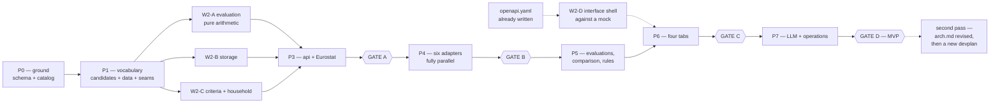

# Development plan — Starnest **MVP**

**Status:** written 2026-08-30 from `reqs.md` and `arch.md`. **Reassessed 2026-09-05**, after
minE2E — see section 0.0, which is the only part of this document written with output to look
at rather than a design to reason from.

> ### This plan covers the MVP only, and the MVP is the country level
>
> **"MVP" and "v1" name the same thing** across `reqs.md`, `arch.md` and this document. They
> are not two scopes — the term is doubled only because `reqs.md` 1.3 says "v1" and
> `CLAUDE.md` says "post-MVP". There is no third boundary hiding between them.
>
> The MVP is **the country level, with the full feature set applied to it** (`reqs.md` 1.3):
> pillars and criteria as data, weight profiles, structured data acquisition, scoring with
> coverage and confidence, match and compound rules, the ranking dashboard with drill-down and
> provenance, and comparison. It ends at **Gate D** (section 3).
>
> **Everything after the MVP gets a second pass over *two* documents, not one.** The city level
> brings the LLM-plus-search acquisition path, city nomination and approval, and roughly 33 new
> attributes — enough that `arch.md` is revised first and a **second `devplan.md` is written
> against the revised architecture**. This document is not extended in place, and no phase
> below quietly reaches past Gate D. section 8 lists what is deferred and where each item goes.

This document says **how the thing gets built**: what the independently implementable pieces
are, which may run at the same time, where work must stop and be proven end to end, and what
each agent is allowed to decide alone.

It does not restate requirements or architecture. Where it names a rule, the authority is the
section it cites.

---

## 0.0 Where this plan actually stands — 2026-09-05

Written after minE2E (`docs/mine2e.md`) landed a working vertical slice. Everything below this
section was reasoned from documents; this section is the first part written from a running
application, and where the two disagree, this one is right.

### What is built

| Phase | State |
|---|---|
| **P0** Ground | **Done.** 30 migrations, the catalog seeded, `make check` a real gate |
| **P1** Vocabulary and seams | **Done**, with one correction: `CandidateStore` was declared during minE2E because nothing had needed it, and `CriteriaStore` had no implementation until M3 needed one |
| **P2** Core policy | **Done for the MVP's needs.** `evaluation/` has all three normalisation methods -- `fixed` added 2026-09-11, anchored on the eight criteria whose data has landed (Q206, Q209). The ranking reports how its covered weight splits by confidence (`reqs.md` 5.7). `target_range` built 2026-09-11 for the climate stream. The compound-rule shapes and match rules are not built |
| **P3** First vertical slice | **Done. Gate A closed 2026-09-05.** 16 of 40 operations, one source adapter, two screens, a browser test against the real stack, and the gate itself as an acceptance test |
| **P4** Adapter fan-out | **Done but for the family pillar.** Seven adapters (Eurostat, World Bank, WHO, IMF, OECD, Open-Meteo, and an estimate from Eurostat's tax-benefit figures) plus declared stand-ins and manual entry, 10 of 11 pillars. Family waits on OECD, which blocks scripts |
| **P5**-**P7** | Not started |

**1,635 backend tests (two of them `live`) and 98 interface tests. The shipped set `local_employment` ranks all 32 countries** (2026-09-11). Liechtenstein is ranked on Switzerland's figures for three attributes, visibly (Q208), and the ranking says how much of each score rests on low-confidence figures: 41% of Liechtenstein's, 7% for the five countries on the estimated tax rate, none for anyone else. **Coverage is 67%** (36% before Gate B's anchors); every remaining gap is a criterion with **no data**, not one waiting for an anchor.

### GATE B — closed 2026-09-12

Every assertion below holds, and the live suite (`make live`, 14 minutes) proves the first of
them against the real sources rather than against captured responses. **The family pillar is the
one known gap**, and it is blocked rather than unfinished: OECD serves scripts a Cloudflare
browser challenge (`catalog-blockers.md` item 5), probed repeatedly through the session. It is
the first work after the gate, with the eight attributes no stream was ever given.

| Assertion | State |
|---|---|
| All six blocking attributes for all 32 | **Yes, and a test** — `tests/live/test_gate_b.py` runs every real source and the stand-ins into the test database and reads the result through the active-value rule. `make live`, never `make check`. Watched failing with the stand-ins removed: exactly Liechtenstein's three |
| No country spuriously `insufficient_data` | **Yes.** All 32 ranked under `local_employment` |
| Coverage high, and honest | **Honest, and higher**: 67% for the EU countries, from 36%, once the household anchored every `fixed` criterion with data (Q206, Q209, Q212, Q213). **Twenty scored criteria have no figure.** Twelve are accounted for: family (OECD, blocked), the five manual-entry attributes (the household's to type), sunshine (no usable source, Q210), summer heat days (a Copernicus account), the derived house-price ratio (post-MVP, Q204) and the two tech-jobs attributes (no source). **Eight are in no P4 stream at all** -- see below. **Spot-checked 2026-09-12, all four matching** -- see below |
| Two sources for one attribute: both stored, the right one active | **Yes, and tested.** The tax rate (OECD beside the estimate) and Liechtenstein (a stand-in beside a real figure) — `test_runs_api.py` proves the real figure wins with the stand-in still stored |
| Reference date distinct from retrieval date, both displayable | **Yes.** Both columns on every value since `0005`, and served by `GET /v1/values` since W4-E; a stand-in keeps the original's period and records its own retrieval |
| `POST /data-acquisition-runs/{id}/retry` re-runs only what failed | **Yes, and tested** (2026-09-11). A new run asking only the sources that failed, only about the attributes each failed on. It needed failures to name their source first (`0461`) |
| Every P4 stream has populated real values | **All but OECD's family pillar, which is blocked, not unfinished**: W4-A, W4-D and W4-F done; W4-C (temperature, 32 of 32) and W4-E (the machinery; values are the household's to type) done 2026-09-11; W4-B has the tax rate from OECD and nothing else, because OECD serves scripts a Cloudflare challenge. Probed between every task this session; still closed |

**The spot-check, done by routes the adapters never use** (2026-09-12). The household asked the
agent to do it rather than by hand, so each figure was read from somewhere other than where its
adapter reads it, and each dataset's own title and unit were checked, so a wrong series would
show rather than agree with itself:

| Figure | Stored | Read independently from | Found |
|---|---|---|---|
| Romania, cost of living, 2025 | 65.1 | Eurostat's SDMX TSV service (the adapter reads JSON-stat); category confirmed as household final consumption expenditure | 65.1 |
| Greece, housing cost overburden, 2025 | 26.4% | Eurostat's SDMX TSV service; dataset titled "Housing cost overburden rate", unit percentage | 26.4 |
| Portugal, rule of law, 2024 | 1.0721547 | The World Bank's own 2025 WGI workbook (the adapter reads its API) | 1.0721547, 13 sources, the same standard error |
| Germany, healthcare coverage, 2023 | 87 | Our World in Data's republication of WHO's GHO (the adapter reads WHO's OData service) | 87 |

What it cannot replace is a person's eye on the publisher's page: it proves each number is the
one the publisher holds under that name, not that the name is the right question to ask.

**A planning gap, found by listing what has no figure.** Eight scored attributes of the shipped
set were never assigned to a P4 stream, though each declares a source:
`international_air_connectivity` (Eurostat), `coastline_access` (Natural Earth),
`elevation_range` (Copernicus), `forest_cover` (FAO), `natural_diversity` (derived),
`english_proficiency` (EF EPI), `openness_to_foreigners` (MIPEX) and `press_freedom` (RSF). The
stream table was written from `datasources.md`'s headline sources and these fell between rows.
Gate B's assertions do not need them -- none blocks -- so they are recorded here as the first
work after the gate rather than folded into it quietly.

**Found on the way:** a run through the API had been fetching from the first source only
(`known-issues.md` P5, fixed); a whole source failing left no trace on the run, and a failure
did not say which source had failed (P7, fixed); and OECD's front door served a Cloudflare
browser challenge to a script for the first time (`catalog-blockers.md` item 5). None was
visible from the stored figures, which `make acquire` had been writing by looping over every
adapter itself.

### GATE A — closed 2026-09-05

**All nine checks green.** `tests/acceptance/test_gate_a.py` is the gate written down: the seven
steps in order, against a real database, plus the two standing checks. It is not a second copy
of the endpoint tests -- those prove each operation in isolation, and this proves the sequence.

| Step | State |
|---|---|
| 1. Configure the household, read it back | **Yes.** `PUT`/`GET /v1/household`, and the record reaches criterion defaults |
| 2. Read the catalog through the API | **Yes.** 11 pillars, 41 attributes, and the shipped set's weights summing to 100 within every pillar |
| 3. Duplicate a set, adjust a weight, assert the rebalance | **Yes.** Through `POST /duplicate` then `PATCH`, the way a user does it -- nothing shipped is touched |
| 4. Plan an acquisition, assert the estimate | **Yes.** `POST /v1/data-acquisition-runs/plan` returns the count, the cost and the per-source split before any fetch |
| 5. Run it, poll, assert values land with both dates and their source | **Yes.** Through the API and a persisted run; the assertion counts rows carrying *both* dates, the source and the run |
| 6. Rankings against the **shipped** set: all 32 `insufficient_data`, each naming what it lacks | **Yes**, and it was the last to fall -- see below |
| 7. Rankings against a Gate-A set: 32 ranked, honest coverage | **Yes.** This is `minimal` (`0121`), and it is what the browser shows |
| The contract-drift test | **Yes**, and stronger than designed -- see "the two contracts" below |
| UI e2e against the real backend | **Yes**, for the Rank and Configure screens; no pillar tree |

**Step 6 was untestable rather than failing, which is a worse thing for a gate to be.** The
shipped set could not have scored with perfect data (`docs/d6-scale-anchors.md`), so a test
asserting `insufficient_data` would have passed for the wrong reason and gone on passing after
the data arrived. Migration `0122` removed that: the three `LabelSet` criteria no longer claim
to be scoreable, so what remains is honestly missing figures. **A step that cannot fail is not a
check**, and this one can now -- it fails the moment those seven required attributes land, which
is exactly when it should be rewritten.

**What Gate A does not cover, deliberately.** `fixed` normalisation, `target_range`, the compound
rule shapes and match rules are not built (P2 was cut to the MVP's needs). 16 of the contract's
40 operations are served. The ranking rests on 3 attributes in 2 of 11 pillars -- true of housing
and happiness, not yet of relocating. That last one sets P4's order; see point 3 below.

### Four things minE2E discovered that this plan did not anticipate

**1. The contract was never generated, and could not be.** `arch.md` 10.2 and section 0.6 below
both said FastAPI regenerates `openapi.yaml`. Nothing ever has: it is hand-written, has been
hand-edited in four commits, and describes 40 operations against the 7 served — regenerating it
would delete the design. There are now **two files with two jobs**: `openapi.yaml` is the target,
`openapi.implemented.yaml` is generated from the code and committed, and three tests hold them
together. The acceptance suite validates responses against the *target*, which is what makes it
an independent check rather than the code agreeing with itself.

**2. An endpoint count is not a plan.** P3 named four endpoints. The interface cannot draw a
screen without seven — the levels for its toggle, the criteria sets for its switcher, the
candidates behind its counts. Endpoint counts in the phases below should be read as lower
bounds.

**3. Breadth across pillars beats depth within one.** The ranking currently rests on 3 of 41
attributes in 2 of 11 pillars, and two of the three measure housing cost. Finland leads because
it has good housing and content people, which is a true statement about housing and happiness
and not yet about relocating. **A fourth housing attribute would change almost nothing; the
first safety or health attribute changes everything.** P4's adapter fan-out should be ordered by
pillar coverage, not by adapter convenience.

**4. The shipped criteria set was blocked on a decision, not on data.** All 41 of its criteria
normalise `fixed` (26) or `as_is` (15), so `local_employment` could not have scored even with
perfect data — which made "Deriving the scale anchors" not a step inside Gate A but a
**precondition of it**. **Answered 2026-09-05** (D6, `docs/d6-scale-anchors.md`): it was three
problems wearing one label, and only one of them was the sitting-down-with-bands exercise this
plan imagined. The shipped set now reads 12 scored `as_is`, 3 excluded, 26 awaiting anchors as
their figures land.

### The delivery model changed

**Sections 0.1 and 0.2 describe agent fan-out. That is not how this is being built.** Decided
2026-09-05, from observation rather than preference: three workstream agents ran on this project
and all three produced work that had to be discarded or substantially reworked. The cost that
sank them is specific — an agent starts cold and re-derives the project's context, and this
codebase's standard is unusually implicit (the mutation-testing discipline, the never-fabricate
rule, the comment voice, the composite-key idiom). Transferring that costs more than the work
it buys, and it arrives imperfectly.

**The rule now:** work is done sequentially by one agent holding the context. Delegation is for
tasks where the *exploration* is large and the *result* is small — a broad search across many
files — which is the opposite shape of "write a module to this standard".

Sections 0.1 and 0.2 stand as a description of how the work is decomposed and reviewed. Read
"agent" as "one task, done and proven before the next", not as "a process running in parallel".

---

## 0. The delivery model

### 0.1 The rhythm

Work moves in a repeating cycle, and the cycle is the point:

```
  fan out ──▶ each agent: one task, then its unit tests
      │
      ▼
  checkpoint ──▶ linters + unit tests green, master integrates
      │
      ▼
  … repeat until a vertical slice exists …
      │
      ▼
  GATE ──▶ ALL development stops
           write the end-to-end tests for the slice
           run them, find the gaps, fix the bugs
           only then does the next phase start
```

**A checkpoint is cheap and frequent. A gate is expensive and rare.** There are four gates in
v1. Nothing after a gate begins until that gate is green.

### 0.2 Who does what

| | Owns |
|---|---|
| **Master agent** | This plan. Task dispatch. Integration and merges. **All end-to-end tests — API acceptance *and* browser automation.** The dependency manifest. Migration numbering. Deciding when a gate is green |
| **Workstream agent** | One task: the code, and the unit tests that prove it. Nothing outside its assigned directories |
| **Alex** | Every decision in section 7, and any question an agent stops on |

The master agent writes the end-to-end tests deliberately: an agent testing its own slice
end to end tests what it built, not what was asked for. The e2e suite is written from
`reqs.md` and `openapi.yaml`, by someone who did not write the implementation.

### 0.3 The stop rule

**An agent stops and asks rather than deciding, whenever any of these is true.** Stopping is
not failure; guessing is.

1. A requirement admits two readings that would produce different code.
2. A value the documents mark **TBD or provisional** would have to be invented to proceed —
   the compound-rule thresholds (`reqs.md` 7.4), a scale anchor, a normalisation band.
   **Seed it `NULL` and leave the rule inactive; never invent a number.** This is
   "never fabricate a score from missing data" applied to the build itself.
3. A new dependency is needed (section 0.6).
4. The work would require importing across a boundary the import table forbids
   (`arch.md` 6.1). The rule is not negotiable at the task level; if it genuinely blocks the
   task, the design is wrong and Alex decides.
5. `openapi.yaml` would have to change. The contract has other consumers; changing it is a
   decision, not a refactor.
6. A migration would delete or alter a catalog row that already has values behind it
   (`arch.md` 7.4).

If a stop invalidates the premise of a whole workstream, the **workstream** stops, not just
the task.

### 0.4 Definition of done, per task

A task is done when all of these hold — not when the code exists:

- The code does what the task says, and nothing the task does not say.
- **Unit tests cover the sad path**, not only the happy one: error cases, edge cases, empty
  and missing input (global `CLAUDE.md` 9.4).
- **Coverage does not fall below 85%** — lines *and* branches, raised from 75 on 2026-09-05. `make check` enforces it; a
  task that drops the number below the bar is not done.
- `ruff` clean, `import-linter` clean.
- The full existing test suite still passes.
- Anything left undone is written down, not left as an intention (`Later Equals Never`).

> **85% is a floor on the code, not a ceiling on the testing, and the difference matters.**
> The target is **full coverage of features and functionality** — every requirement in
> `reqs.md` exercised by something. The percentage catches only one failure mode: a whole
> region of code nobody ran at all. A module can sit at 90% lines with an untested
> requirement inside it, which is why "coverage is green" is never the argument that a task is
> tested. It is the argument that nothing was *forgotten wholesale*.
>
> The bar is set at 75 rather than higher on purpose. A number high enough to require tests
> written for the coverage report rather than for the behaviour produces exactly those tests,
> and they are worse than no tests because they look like protection. Revisit after the MVP.

### 0.5 Isolation — hybrid

Decided: worktrees only where the risk earns them.

| Work | Where | Why |
|---|---|---|
| Backend policy modules (`candidates/`, `data/`, `criteria/`, `evaluation/`, …) | **Main tree**, disjoint directories | They are already isolated by the module boundary. Sharing the tree means an agent sees the vocabulary the previous phase established, immediately |
| **The interface** | **Own worktree** | Separate npm project, separate toolchain, thousands of `node_modules` files, and a build that has nothing to say to `pytest`. It shares no code with the backend by design (`arch.md` 6.1) — so it should not share a working tree either |
| **Adapter fan-out (P4)** | **Own worktree each** | Six agents at once, each adding migrations and fixture files. Highest collision risk in the plan |
| Anything that would touch more than its own directory | Own worktree | And it stops first, per section 0.3 |

**Test databases do not collide.** Every test run uses a database named for its workstream
(`starnest_test_w2b`), created and dropped by the fixture. Two agents running `pytest` at the
same moment never see each other's rows.

### 0.6 Shared files, and how agents avoid fighting over them

Files everyone wants to edit. Each has a rule.

| File | Rule |
|---|---|
| `backend/pyproject.toml` | **Written before any agent starts** — dependencies, the coverage bar, the ruff rules and the four `import-linter` contracts all live here. An agent needing a dependency it does not find **stops** (section 0.3); master runs `uv add` at the checkpoint. Never `pip` (`CLAUDE.md`) |
| `backend/migrations/` | Numbered `NNNN-slug.sql`. **Each workstream is allocated a reserved block** in its task brief — W4-A owns 0410–0419, W4-B owns 0420–0429, and so on. Two agents cannot pick the same number because neither may pick outside its block |
| `docs/openapi.yaml` | **The target.** Hand-written, deliberately ahead of the code, and the file the interface generates its typed client from. Changing it is a decision, not a step |
| `docs/openapi.implemented.yaml` | **The truth.** Generated by `make openapi` from the routes that exist, and committed. Never edited by hand. Regenerate after any endpoint change — a test fails when it is stale |
| `Makefile`, `compose.yaml`, `.env.example` | **Master only.** They describe how the whole system is built and run, which is not any one workstream's business |
| `.env` | **Never committed, never generated by an agent.** It holds the database password and the Anthropic API key. `.gitignore` ignores every `.env*` and re-includes only `.env.example`, so a new variant is ignored by default rather than by someone remembering |

### 0.7 The repository, and why the two halves never touch

```
starnest/
├── backend/                 Python. The API and every domain rule
│   ├── pyproject.toml       deps, coverage bar, ruff, import-linter contracts
│   ├── src/starnest/        the ten modules of arch.md 6.1
│   ├── migrations/          yoyo, plain .sql — schema AND catalog
│   └── tests/               unit, storage, acceptance
├── ui/                      TypeScript. A client of the contract, nothing more
│   ├── src/                 React
│   ├── e2e/                 Playwright — master agent's, not the screen author's
│   └── vite.config.ts       includes the 85% vitest coverage thresholds
├── docs/                    reqs.md, arch.md, datasources.md, devplan.md, openapi.yaml
├── tools/                   the three structural audits
├── compose.yaml             four containers: database, backend, ui, schema diagram
├── Makefile                 every command the project has
└── .env.example             technical configuration, with placeholders
```

**`backend/` and `ui/` are peers with no path between them.** Neither has a parent
directory containing code from both, neither imports from the other, and the only file they
share is `docs/openapi.yaml` — which one generates and the other consumes. A single top-level
`src/` holding both would have made the separation a convention people remember; two sibling
projects with separate toolchains make it a fact.

> **`docs/openapi.yaml` sits with the documents rather than inside `backend/`, deliberately.**
> It is the contract *between* the two halves, and putting it under `backend/` would imply the
> backend owns it. The backend generates it; it does not own it. The acceptance suite, the
> interface's generated client, and any future consumer read the same file from a neutral place.

---

## 1. Where the decomposition comes from

Three facts in the existing documents determine almost the entire shape of this plan. None of
it is invented here.

**1. The import table is a DAG, so it is also a schedule.** `arch.md` 6.1 says exactly which
module may import which. `candidates/` imports nothing; `evaluation/` imports four things.
Reading that table topologically gives the only ordering the code permits — and, more usefully,
tells you which modules have **no path between them** and can therefore be built at the same
moment by people who never speak.

**2. The OpenAPI contract already exists, so the interface does not have to wait.**
`openapi.yaml` was written before a line of backend code. A mock server generated from it
answers every one of the 31 paths with schema-valid responses. The interface can be built,
routed, styled and Playwright-tested against that mock **before the backend serves a single
request** — and when the real backend arrives, the client swaps its base URL. This is the
single largest parallelism win available, and it exists only because the contract was designed
rather than discovered.

**3. `SourceAdapter` makes every data source an independent unit.** `arch.md` 6.3 declares one
interface: which attributes it answers, at which levels, in which mode. An adapter for Eurostat
and an adapter for the World Bank share nothing but that interface. Once one adapter has proven
the contract works, the rest are a pure fan-out — six agents, no coordination, no shared state.

**What does *not* parallelise**, and is therefore deliberately kept small: the schema, the
catalog, and the shared vocabulary of `candidates/` + `data/`. Everything waits on those, so
P0 and P1 are single-agent phases sized to finish fast rather than to be complete.

---

## 2. The phases at a glance

**All eight phases are MVP scope.** Nothing below reaches past Gate D (section 8).

| Phase | What | State (2026-09-05) | Ends with |
|---|---|---|---|
| **P0** | Ground: scaffold, schema, catalog | **Done** | Checkpoint |
| **P1** | The shared vocabulary, and all nine seam interfaces | **Done** | Checkpoint |
| **P2** | Core policy | **Done for the MVP's needs** — `evaluation/` is cut to two normalisation methods | Checkpoint |
| **P3** | The first vertical slice — API + Eurostat | **Done.** Gate A closed 2026-09-05 | **GATE A** |
| **P4** | Adapter fan-out | **Under way** — four of six streams' worth of sources, 9 of 11 pillars | **GATE B** |
| **P5** | Evaluation persistence, comparison, rules | **Done 2026-09-12** | Checkpoint |
| **P6** | The interface's four tabs | Two of four exist in skeleton | **GATE C** |
| **P7** | Hardening: the LLM path, operations, failure modes | Not started | **GATE D — the MVP ships** |

The **Agents** column is gone. Work is sequential (section 0.0), so a phase's shape is what it
contains and what it depends on, not how many things run at once.

Sizes below are **S / M / L**, meaning roughly one, two, or several working sessions. They are
relative, not calendar estimates.

---

## 3. Phase by phase

### P0 — Ground

**One agent, serial. Nothing else can start.** Sized to be finished, not to be thorough.

| # | Task | Size | Done when |
|---|---|---|---|
| **T0.1** | ~~Scaffold.~~ **Done ahead of P0 by master** — `backend/pyproject.toml`, the ten module directories, `ui/` with its Vite/Vitest/Playwright configs, `compose.yaml`, `Makefile`, `.env.example`, `.gitignore`, both `Dockerfile`s. The P0 agent **inherits** these and does not recreate them | — | `make env && make up` gives a database; `uv sync` resolves |
| **T0.2** | ~~Tooling config.~~ **Also done ahead** — ruff, pytest markers, coverage at 85% lines and branches, and the four `import-linter` contracts of `arch.md` 6.2. What remains for the P0 agent: **the per-workstream database fixture** (section 0.5), and **proving the boundary contracts actually fail** | S | **Write a deliberately illegal import — `data/` importing `criteria/` — and watch `make boundaries` reject it, then delete it.** A linter that is silently misconfigured passes everything, so it is proven failing before it is trusted passing |
| **T0.3** | Structural migrations: every table, constraint, view and index from `arch.md` 3, section 3.3b, section 4, section 9.3. Includes the composite-key type agreement, the one-of check on non-match reasons, the singleton checks, and the active-value view | **L** | Migrations apply to an empty database and are **idempotent** — applying twice is a no-op |
| **T0.4** | Catalog migrations: 2 levels, 11 pillars, **41 country attributes** with value types and type parameters, data sources, breakdown schemes, the 4 country-relevant match rules (`reqs.md` 7.3), the 2 country compound rules (section 7.4, **thresholds `NULL`**), and the shipped default criteria set with its weights, goals and the 7 `blocks_if_missing` flags (section 7.5) | **L** | Every row traces to a table row in `reqs.md` 7.1 |
| **T0.5** | Verify `make check` end to end — ruff + import-linter + coverage + both audits — and confirm the three containers build and start | S | One command, one exit code. `make docker-build && make docker-up && make docker-migrate` brings the stack up |

**Checkpoint C0.** The catalog is not merely present, it is **arithmetically correct**, and
that is a test, not an inspection:

- Pillar weights sum to 100 at country level.
- Criterion weights sum to 100 **within each pillar**.
- Every attribute names a value type that exists, and its type parameters are valid for it.
- The 7 `blocks_if_missing` attributes are exactly those in `reqs.md` 7.5.
- Both audit tools pass.

> **This test is the "nothing hardcoded" invariant becoming enforceable.** `tools/audit_ontology.py`
> already checks the weights *in the document*. C0 checks the same arithmetic **in the database**.
> After this, the document and the database cannot silently disagree.

---

### P1 — The shared vocabulary

**One agent, serial, and deliberately minimal.** Everything in P2 waits here, so this phase
buys parallelism by staying small. It defines names and types; it implements almost no
behaviour.

| # | Task | Size | Done when |
|---|---|---|---|
| **T1.1** | `candidates/`: Candidate, Level, the nesting rule, identifier conventions. **Levels are ordered records, not a hardcoded pair** (`reqs.md` 3.1) | S | Nothing is imported. A test constructs a third level and nothing breaks |
| **T1.2** | `data/`: the **ten value types** and their operations, Attribute, Value, DataSource, provenance, confidence, breakdown schemes, FxRate, the two-date rule | **M** | Each value type round-trips; each rejects input the type forbids |
| **T1.3** | **All nine seam interfaces of `arch.md` 6.3**, each declared in the module that needs it — `SourceAdapter`, `CostMeter`, `ValueStore`, `CatalogStore`, `FxRateProvider`, `Clock`, `CriteriaStore`, `HouseholdStore`, `EvaluationStore` | S | Every interface is abstract; no implementation exists yet |

> **T1.3 is what makes P2 parallel, and it is the same move that made the interface parallel.**
> Declaring all nine seams up front means `storage/` can implement `CriteriaStore` in the same
> hour that `criteria/` is written against it, without either agent waiting. The interfaces are
> tiny — a handful of method signatures — and they are the entire coordination cost of a
> four-way fan-out. Contract first, twice: once for HTTP, once for the seams.

**Checkpoint C1.** Unit tests green. `import-linter` proves rule 3 — `data/` cannot reach
`criteria/`, `household/` or `evaluation/`. **The ontology's central invariant is now mechanical.**

---

### P2 — Core policy fan-out

**Four agents, no dependencies between them.** This is where the real work starts.

| Stream | Task | Size | Directories |
|---|---|---|---|
| **W2-A** | `evaluation/` — the pure arithmetic. Normalisation (`fixed`, `percentile`, `as_is`), weight redistribution, coverage, the matching decision, the **three compound-rule shapes**, ranking. **No I/O whatsoever** | **L** | `evaluation/` |
| **W2-B** | `storage/` — aiosql query files and the implementations of `ValueStore` and `CatalogStore`, including the active-value view | **M** | `storage/` |
| **W2-C** | `criteria/` + `household/` — weight rebalancing **with locks**, threshold validation per value type, criteria-set semantics (create, duplicate, switch), the household record | **M** | `criteria/`, `household/` |
| **W2-D** | The interface shell — **own worktree**. Vite + React + TS; **client generated from `openapi.yaml`**; a mock server from the same file; the four routes; the persistent sidebar; the Playwright harness | **M** | `ui/` |

**W2-A is the single richest task in the plan and the most testable.** Every function in it is
a pure function of a value and a criterion — no store, no clock, no network (`arch.md` 6.7).
It gets table-driven tests, and the sad paths are the interesting ones: a `percentile`
normalisation over one candidate, a redistribution where every criterion is missing, coverage
when the only present attribute is excluded from scoring.

**Checkpoint C2.** Unit tests green in all four. Nothing serves HTTP yet, so there is no gate —
resist the temptation to invent one.

---

### P3 — The first vertical slice

**Two agents.** The goal is narrow and specific: **a real ranking of real European countries
from real Eurostat data, over HTTP.**

| Stream | Task | Size |
|---|---|---|
| **W3-A** | `api/` and the composition root. FastAPI app, `/v1` prefix, the single exception→status map, the one error shape (`arch.md` 7.6). Endpoints: `/household`, `/settings`, `/levels`, `/pillars`, `/attributes`, `/data-sources`, `/candidates`, `/values`, the full `/criteria-sets` tree including the weight `PATCH`es, and **`GET /rankings`** | **L** |
| **W3-B** | `data_acquisition/` and the **Eurostat adapter**. Run planning and work items, per-item transaction, partial failure, selective retry, the abandoned-run sweep. Endpoints `/data-acquisition-runs`, `/plan`, `/{id}`, `/{id}/retry` | **L** |

**Why Eurostat first.** It needs no API key, is CORS-open and rate-limit-free, and answers
seven country attributes on its own — including `cost_of_living_index` and
`house_price_to_income_ratio`, two of the seven `blocks_if_missing` attributes. It is the
cheapest possible proof that the whole chain works.

---

## GATE A — the first end-to-end proof

**All development stops.** Master agent writes and runs:

**API acceptance suite** (Python, `pytest` + `httpx`, against a live server and a real
PostgreSQL — `tests/acceptance/`). One narrative, executed:

1. Configure the household. Read it back.
2. Read the catalog — 11 pillars, 41 attributes, weights that sum.
3. Duplicate the default criteria set. Adjust one weight. **Assert the server rebalanced the
   others and the pillar still sums to 100.** Lock three, adjust a fourth, assert the locks held.
4. Plan an acquisition. Assert the estimate names work items and costs nothing (Eurostat is free).
5. Run it. Poll until complete. Assert values landed **with both dates and their source**.
6. `GET /rankings` **against the shipped default set. Assert all 32 come back
   `insufficient_data`, each naming the required attribute it lacks** — five of the seven
   `blocks_if_missing` attributes have no adapter until P4.
7. `GET /rankings` **against a Gate-A criteria set requiring only the two Eurostat attributes.
   Assert 32 countries come back ranked, with honest coverage.**

**The contract-drift test.** The FastAPI-generated spec still contains every path and every
operation ID that `openapi.yaml` designed. This is the guard that made code-first acceptable
(`arch.md` 10.2).

**UI e2e** (Playwright, TypeScript, `ui/e2e/`): the app loads against the **real**
backend, the sidebar shows the active criteria set and the candidate counts, the Configure tab
renders the pillar tree, and the on-screen total reads 100%.

### Deriving the scale anchors — answered, and not the way this section assumed

> **Revised 2026-09-05, then answered the same day** (`docs/d6-scale-anchors.md`).
>
> This was written as one step inside Gate A: sit down, choose 26 sets of anchors, proceed. Two
> things were wrong with that. Ten of the criteria it counted did not need anchors at all —
> they are `Index` attributes, and `as_is` now maps them from the bounds their publishers
> declare. Three more could never have been scored by any method, because they are `LabelSet`
> attributes and there is no arithmetic that orders a Köppen code.
>
> **And the 23 that remain cannot be answered before their data arrives.** Choosing anchors for
> an attribute nobody has fetched is guessing about a distribution that does not exist yet. So
> anchors are decided per attribute, as P4 brings each one's figures — which makes this a
> recurring small decision rather than a gate-shaped one.
>
> Gate A step 6 is now reachable: the shipped set's remaining criteria honestly lack figures
> rather than being unscoreable by construction.


**26 of the 41 country criteria normalise `fixed`, and no anchors ship** (`reqs.md` 7.1
tabulates none). Only 13 can score today. Decided 2026-08-30 (`reqs.md` Q188): anchors are
**derived from real figures and reviewed**, never invented, and Gate A is the first moment that
becomes possible.

**The derivation splits across two gates, because the data does.** At Gate A only Eurostat has
run, so only its `fixed` attributes have a distribution to observe. Anchors for the rest cannot
be derived from figures that do not exist yet.

| | Anchors derived for |
|---|---|
| **Gate A** | The `fixed` attributes Eurostat answers, and only those |
| **Gate B** | The remainder, once all six P4 adapters have populated real values |

At each, the same three steps:

1. Compute the attribute's **observed range across the 32 countries** — minimum, maximum, median.
2. Propose anchor pairs from those ranges, as a table Alex reviews.
3. Seed the approved anchors as a catalog migration like any other.

**Do not skip to step 3.** A band that looks reasonable in the abstract is usually wrong against
real figures, which is why every weight and threshold in `reqs.md` 7 is marked provisional.

### What Gate A was really testing, and two mistakes it used to contain

**An earlier version of this gate asserted a ranking that `blocks_if_missing` makes impossible.**
Only two of the seven required attributes come from Eurostat — `cost_of_living_index` and
`house_price_to_income_ratio`. The other five wait for P4. Under the default set `reqs.md` 5.3
is unambiguous: a missing value on a `blocks_if_missing` criterion makes the candidate
**insufficient data, and no total is produced**. Every country would have come back unscored,
and the gate would have failed on its own arithmetic.

**Two assertions replace it, and together they test more than the original did.** The first
proves `blocks_if_missing` actually fires and names what it lacks — a mechanism that would
otherwise go unexercised until P4, and whose silent failure would let a candidate be scored on
absent data. The second proves redistribution, coverage and ranking work, against a criteria set
honest about what P3 can answer.

**This paragraph used to project "roughly 20% coverage" and that turned out to be the wrong
shape entirely.** It assumed the second set would be the 41-criterion catalog with seven
attributes answered. What was actually built is `minimal` (`0121`) — three criteria over the
three attributes Eurostat answers — so the real figures are **100% for 31 countries and 0% for
Liechtenstein**, which reports no figure for any of the three. Coverage is not a dial that
settles near a plausible number; it is a statement about one candidate against one set, and it
turns out to be mostly all-or-nothing at this size. **31 ranked, 1 `insufficient_data`.**

Both halves still hold, and are what the gate asserts. `blocks_if_missing` fires and names what
it lacks; redistribution, coverage and ranking work against a set honest about what P3 can
answer. A system reporting a confident score from a fifth of its inputs would be broken in
exactly the way the "data quality is the product" invariant exists to prevent — and so would one
reporting a confident score for Liechtenstein.

**Closed 2026-09-05.** Every bug found was fixed; the tally is in section 0.0. P4 starts now.

---

### P4 — Adapter fan-out

**Sequential, one stream at a time** — the agent fan-out this section describes is not how this
is being built (see 0.0). The `SourceAdapter` contract was proven at Gate A; these add data, not
machinery.

**Ordered by pillar coverage, per D7.** W4-A went first on a measurement rather than a
preference: it answers three `Index` attributes that D6(A) made scoreable with no anchor to
invent, two of them `blocks_if_missing`, and it opened two dark pillars at once. OECD would have
opened three pillars but its blocking attribute normalises `fixed` and still has no anchors, so
its figures would have been stored without being scored.

**A stream may need no migration.** W4-A needed none for the adapter: `data_source`,
`attribute_source_priority` and `attribute_index_parameter` were already seeded, which is the
"nothing hardcoded" invariant paying back — the adapter reads the catalog instead of restating
it. Reserve the block, but do not assume it will be spent.

| Stream | Source | Attributes it answers | Migrations |
|---|---|---|---|
| **W4-A** | World Bank WGI | `political_economic_stability`, `rule_of_law`, `control_of_corruption` | **Done 2026-09-05.** Only `0410`, and not for the adapter — the catalog already declared the source, its priority and the −2.5/2.5 bounds, so the adapter needed no migration at all. `0410` adds the three to `minimal` so the figures are scored rather than merely stored |
| **W4-B** | OECD | **Tax done 2026-09-11**: `total_tax_rate_effective` from Taxing Wages (`0445`-`0447`), replacing `income_tax_effective`, with an estimate from Eurostat where OECD is silent (`0449`). **Still open:** `average_working_hours`, `statutory_paid_leave`, and the family pillar (`school_system_quality`, `parental_leave_policy`, `child_benefit_policy`). **Access is intermittent**: on 2026-09-11 `sdmx.oecd.org` served a script Cloudflare's browser challenge, two days after answering one (`catalog-blockers.md` item 5) | 0420–0429 |
| **W4-C** | Open-Meteo | **Done 2026-09-11** for `avg_annual_temperature`: D4 answered as the population-weighted mean over each country's five largest places (`0464`, from GeoNames), one settled year because ten would be ~42,000 calls against the free tier's 10,000 a day, paced under its per-minute limit, `medium` confidence as a derived figure. All 32 answer, Iceland 5.7 °C to Cyprus 20.8 °C. **Two seasonal measures joined it the same day** (`0466`, `0467`, Q213): the average daily high of summer (June to August) and of winter (December to February), asked for by the household because a yearly average hides the extremes. **`annual_sunshine_hours` is not fetched**: Open-Meteo derives sunshine from modelled radiation and runs 30% to 68% above the recorders, unevenly (London +60%, Madrid +32%), so it would be a plausible number in the wrong unit. `projected_summer_heat_days` needs a Copernicus account and is in no stream | 0430–0439 |
| **W4-D** | UNODC + WHO GHO | **WHO done 2026-09-09**: `healthcare_system_quality` from `UHC_INDEX_REPORTED`, and it is *not* a scheduled download — the Global Health Observatory is an unauthenticated OData service. `0440` puts ISO alpha-3 on the candidate (WHO, FAO, UNODC and Protected Planet all key on it), `0441` adds the attribute to `minimal`. **UNODC is not needed**: `crime_safety_index` split in two (`0442`), and `homicide_rate` comes from Eurostat `sdg_16_10`, which answers all 32 |
| **W4-E** | Manual entry | **Done 2026-09-11** as machinery: `POST /values/manual` (409 unless the attribute declares `manual_entry`), `GET /values` with both dates and `is_active`, `GET /match-rules`, `GET /match-rule-results`, `PUT /match-rule-results/{rule}/{candidate}` with a server-dated override. The five attributes the catalog permits (`international_employers`, `naturalisation_pathway`, `pension_portability`, `remote_work_tax_treaty`, `residency_admin_ease`) and the gates are answered **by the household**, never by an agent: a researched figure typed by an agent would be an LLM value laundered as a manual one (`reqs.md` 6.10). Wiring the gates into the ranking is P5 W5-C | — |
| **W4-F** | Eurostat, extended | **Done 2026-09-09** for `tech_employment_share` (`isoc_sks_itspt`) and `broadband_coverage` (`isoc_cbs`), which opened career and connectivity. `0411` adds both to `minimal`; the adapter needed only a manifest entry each, no code. **Closed 2026-09-11**: `rail_network_density` and `road_network_quality` as length over land area from two datasets (`EurostatDensity`), and `average_working_hours` from `lfsa_ewhun2` -- Eurostat is its declared second source while OECD blocks scripts. `0463` adds all three to `minimal`. Rail has no figure for Cyprus, Malta or Iceland, which have no railway: Eurostat publishes nothing rather than zero, and the attribute does not permit manual entry, so they show as missing until the catalog decides otherwise (`known-issues.md` P11). `house_price_to_income_ratio` is derived post-MVP (Q204) |

**Two attributes stay deliberately empty.** `tech_software_jobs` and `tech_product_jobs` have no
confirmed source (`datasources.md` 11). They remain in the catalog with no adapter, permitting
manual entry. **An agent must not invent a source for them** — that is a section 0.3 stop, and
`reqs.md` 9 already records the decision.

**Every adapter is tested against recorded fixtures**, never a live call (`arch.md` 6.7). A
separate, explicitly-marked `live` suite hits the real endpoints and is run by the master agent
at the gate — so a test failure means "our parser broke", not "Eurostat was slow".

---

## GATE B — coverage becomes real

**All development stops.** Now the ranking has substance, and this gate is where **data-quality
bugs surface** — the class of bug that unit tests structurally cannot find.

The acceptance suite grows to assert:

- **All seven `blocks_if_missing` attributes have values for all 32 countries.** A gap here
  means a broken fetch, not an undocumented country — that is precisely the condition on which
  those seven were chosen (`reqs.md` 7.5).

  > **Two known gaps have to be filled first, and honestly.** Eurostat does not survey
  > **Liechtenstein** in its price baskets — it sits in a customs and currency union with
  > Switzerland — and several series drop the **UK** post-Brexit. Left alone, both stay
  > `insufficient_data` and this assertion fails for a true reason rather than a bug.
  >
  > **Decided: fill them from fallback sources, with the substitution visible.** A Swiss figure
  > standing in for Liechtenstein carries its own provenance and a **`low` confidence**, never
  > as a Liechtenstein measurement. The screen therefore shows a number *and* shows that it is a
  > proxy. Storing it any other way would be fabrication with the paperwork filled in, which is
  > the one thing this application must not do.
  >
  > **Built 2026-09-11** (`0460`, Q208), with one refinement: the value's `data_source` is
  > `stand_in`, not the Swiss series' publisher. Stored as OECD's, it would rank as OECD and read
  > as OECD having measured Liechtenstein; the quote names the Swiss series and its publisher
  > instead. Declared per attribute in the `stand_in` table, each with its reason.
- **No country is spuriously `insufficient_data`.** Any that is, is investigated, not silenced.
- Coverage is high and, more importantly, **honest** — spot-checked against the catalog by hand.
- Where two sources answer one attribute, **both values are stored** and the active-value rule
  picked by source priority. Non-destructive selection is verified, not assumed.
- Values carry a **reference date distinct from their retrieval date**, both displayable.
- `POST /data-acquisition-runs/{id}/retry` re-runs **only** what failed.

**A spot-check by hand is part of this gate.** Pick three countries and one attribute each,
open the source's own website, and compare. Automated tests confirm the pipeline moved a number;
only a human confirms it moved the *right* number.

---

### P5 — The rest of the domain

**Three agents.** All the vocabulary and all the data now exist.

| Stream | Task | Size |
|---|---|---|
| **W5-A** | ~~Evaluation persistence~~ **Done 2026-09-12.** `POST /evaluations` keeps a ranking with a frozen copy of its criteria, anchors and scale; `GET /evaluations`, the kept ranking, its criteria and one candidate's drill-down. `GET /rankings` still writes nothing, and an acceptance test says so. Each contribution now names the value row behind it, which closes the provenance chain | **M** |
| **W5-B** | ~~`comparison/`~~ **Done 2026-09-12.** Focus and comparators, the gap in the attribute's own unit beside what it is worth, the templated synthesis ordered by weighted contribution, `GET /comparisons`. The comparator limit is read from settings and **refused when unset**, never defaulted. **Checkpoint C5 is met**: a 3,171 km coastline lead worth 0.3 of a point ranks below a 6.4-point tax lead worth 8 -- and the first version of that test could not tell, because the fixture had only one advantage to order | **M** |
| **W5-C** | ~~Rules end to end~~ **Done 2026-09-12.** The gates and their audited answers came with W4-E; `/compound-rules` lists both shipped rules **undecided**, and the ranking now applies them. A warning flags and changes nothing; a gate answered `not_matching` makes a candidate not match, **keeping its score and losing its rank**, with the reason beside it. `unknown` rules nothing out, an unmeasured condition never counts as satisfied, and an undecided rule never fires. The two shapes that read a household field belong to the city level and stay silent | **M** |

**Checkpoint C5.** The synthesis gets a specific test: a **large delta on a low-weight
criterion must not outrank a small delta on a high-weight one** (`CLAUDE.md`, `reqs.md` 8.5).
That inversion is the whole reason synthesis is derived from weighted contribution, and it is
the bug that would otherwise ship looking plausible.

---

### P6 — The interface

**Three agents, each in a worktree.** The shell and the generated client exist from P2; these
build the screens of `reqs.md` 8 against the now-real backend.

| Stream | Tab | Size |
|---|---|---|
| **W6-A** | **Configure** — the two-level criteria tree with sliders and lock toggles, live 100% indicators, criteria sets, thresholds, source priority, household, settings. The largest screen in the product | **L** |
| **W6-B** | **Rank** — ranking table with coverage and status, the **always-visible non-matching section**, attribute drill-down, candidate detail with **all** stored values not merely the active one, and the visually distinct external-scores panel | **L** |
| **W6-C** | ~~**Run** and **Compare**~~ **Done 2026-09-12.** Run: estimate first and confirm before anything is fetched, the run's progress, failures listed with the source that failed, one action retrying only those, and run history. Compare: focus and comparators within the configured limit, the per-attribute table with each gap and what it is worth, and the server's synthesis printed in its order. The placeholder screen is gone with the last unbuilt tab, and the screen map is keyed by the route table's own paths so a tab without a screen fails to compile | **M** |

**One rule governs all three:** the interface holds no domain logic (`arch.md` 8.1). No
scoring, no rebalancing arithmetic, no coverage calculation in TypeScript. A reviewer who finds
a number computed client-side rejects the work — that duplication is invisible precisely where
it does the most damage.

---

## GATE C — the product, driven by a browser

**All development stops.** Master agent writes the full Playwright suite. Each of these is a
requirement made executable:

| Test | Proves |
|---|---|
| **The weight drag, end to end** — move a slider, watch the `PATCH`, watch the `GET /rankings`, assert the order changed and the pillar still sums to 100 | `arch.md` 8.3, the interaction the product turns on |
| **Provenance on a displayed number** — click any score, reach the value, see source, reference date, retrieval date | "Full provenance on every displayed number" |
| **A non-matching country is visible**, greyed, keeping its score, with its reason shown | `reqs.md` 5.4 — a filtered-out row would be a silent failure |
| **Insufficient data is labelled, never scored** | The invariant the product exists to protect |
| **Switching criteria sets re-ranks instantly and fetches nothing** | Acquisition and scoring are separate operations |
| **A run, watched live** — start, poll, see failures accumulate, retry only those | `reqs.md` 6.4 |
| **Comparison** — a focus country against comparators, deltas and synthesis, never mixing levels | `reqs.md` 8.5 |

Fix every bug. Only then does P7 start.

---

### P7 — Hardening

**Two agents.**

| Stream | Task | Size |
|---|---|---|
| **W7-A** | The **LLM path** — the Anthropic SDK with `web_search`, as a `SourceAdapter` like any other. `CostMeter`, the spend cap and its halt, and **storing the pages the model actually read**. Country level uses it for `international_employers` only. **The inventory in `reqs.md` 6.10 is exhaustive** — an unlisted use is a section 0.3 stop | **M** |
| **W7-B** | Operations — the startup sequence and its **refusal to start on a schema gap**, adapter-declaration validation at boot, the abandoned-run sweep, `pg_dump` before every migration, `log_statement = 'mod'`, application logging, and the assertion that **the API key never reaches the log, the database or an error message** | **M** |

---

## GATE D — the MVP is done

Everything above, green, at once. Plus the failure modes, which are only testable now:

- **Kill the process mid-run.** Restart. The run is marked `failed`, the values it already
  wrote are intact, and retry works. This only holds because commits are per item
  (`arch.md` 7.1) — so it is worth proving rather than assuming.
- **Cross the spend cap.** In-flight items finish and commit, the run halts, nothing is lost.
- **Start against a stale schema.** The application refuses, and names the gap.
- **Restore from a `pg_dump`** and re-run the acceptance suite against the restored database.
  Manually entered values cannot be re-fetched at any price (`arch.md` 9.5); an untested
  backup is not a backup.

---

## 4. What runs at the same time, and what cannot



**The dotted arrows are the plan's leverage.** The interface never blocks on the backend,
because the contract it consumes was written before either existed.

---

## 5. The test suites, and what each is for

Four suites, four different jobs. **A check belongs to exactly one of them** — duplicating a
check across layers is a cost, not a safety net (`arch.md` 7.3).

| Suite | Where | Runs against | Answers |
|---|---|---|---|
| **Unit** | `tests/unit/` | Nothing — pure functions and in-memory fakes | Is the arithmetic right? |
| **Storage** | `tests/storage/` | **A real PostgreSQL** | Do the constraints hold? Testing type agreement against a fake proves nothing — **the constraints are the behaviour under test** |
| **Acceptance** | `tests/acceptance/` | A live backend over HTTP | Does the contract do what it promises? This is the consumer that makes the API a boundary rather than an intention |
| **Browser** | `ui/e2e/` | The real backend, through Chromium | Does the product work? |

**Fakes at the seams, real infrastructure below them.** A fake `ValueStore` is a dictionary and
the use case cannot tell. A fake PostgreSQL would be a lie, because the schema is where half the
invariants live.

**A fake `Clock` is not optional.** `max_age` and staleness are MVP behaviour, and a test for
"this value is stale" that waits for it would take months.

### 5.1 Coverage — the bar, and how to look at it

**85% of lines and 85% of branches, enforced on both sides**, configured in
`backend/pyproject.toml` (`[tool.coverage.report] fail_under`) and
`ui/vite.config.ts` (`test.coverage.thresholds`). Below the bar the command fails; it
does not print a warning nobody reads.

**Raised from 75 on 2026-09-05.** The backend was at 97.8% and the interface at 98.5%, so a
three-quarters floor had stopped being a check: roughly a fifth of the suite could have been
deleted without the gate noticing. A floor only measures anything when it sits close enough to
reality that a real regression trips it. 85 leaves about eight points of headroom on branch
coverage, which is the tightest of the four metrics, so a module landing mid-build does not
block the gate on its way to being finished.

**And held per package, not only in total** (`tools/audit_coverage.py`, added the same day). A
global floor hides a bad neighbourhood, and hides it better the larger the codebase gets: at
3,400 measurable points a new 100-point module at zero moves the total by three points. Each
package of `arch.md` 6.1 now clears the bar on its own. The interface does the same through
vitest's per-directory thresholds on `src/routes`, `src/api` and `src/shell`.

**Not per file, on either side.** Eighteen of seventy-five backend files have fewer than ten
measurable points, where a single uncovered line is worth more than ten percentage points. The
rule would be right on one side of the repository and noise on the other, and a gate nobody
trusts is a gate nobody keeps.

**The gap this found immediately was `main.py` at 45.9%** -- the composition root, invisible
inside a 97.8% total, and the one file whose failure means the container does not start. This
project had already paid for that: the Dockerfile asked for `starnest.main:app` where the code
offers `create_app()`, and eighteen acceptance tests missed it because each builds the
application itself. `tests/unit/test_composition_root.py` builds it the way production does.

| Command | Produces |
|---|---|
| `make coverage` | Backend: terminal summary with missing lines, **HTML at `backend/htmlcov/`**, XML for tooling |
| `make coverage-open` | The same, then opens the HTML report in a browser |
| `make ui-coverage` | Interface: terminal, **HTML at `ui/coverage/`**, lcov |
| `make ui-coverage-open` | The same, then opens it |
| `make check` | Everything, with the bar enforced. **This is the gate** |

**Branch coverage is on, and it is the half that earns its keep here.** Line coverage would
call a normalisation function covered after one `fixed` case, while `percentile` and `as_is`
never ran. Branch coverage names the paths nobody took — which, in a scoring engine whose
whole job is behaving differently per value type and per goal, is most of the interesting
behaviour.

**What is excluded, and why each is not a loophole:** abstract methods on the nine seam
interfaces (`arch.md` 6.3) are signatures, not behaviour, so counting their bodies measures
nothing; `if TYPE_CHECKING:` blocks never execute at runtime; and the interface's generated
`src/api/schema.ts` comes from `docs/openapi.yaml`, so testing it would test the generator.

---

## 6. Risks this plan carries

Named because they are real, with what the plan does about each.

| Risk | Mitigation |
|---|---|
| **The career pillar rests on two attributes with no source** — 14% of the score. `reqs.md` 1.3 already says local employment is the v1 assumption with the weakest evidence | Redistribution and coverage disclose it honestly. Gate B spot-checks that the career pillar's coverage is *reported* low rather than quietly filled |
| **Six agents adding migrations at once** | Reserved numbering blocks (section 0.6). Master applies them in order at the gate and re-runs C0's arithmetic assertions |
| **The generated OpenAPI drifts from the designed one** | The drift test at Gate A, run in `make check` from then on |
| **Domain logic leaks into the interface** for responsiveness | Explicit review criterion at Gate C. The debounce of `arch.md` 8.3 exists to remove the temptation |
| **An agent invents a provisional number** — a compound-rule threshold, a scale anchor | section 0.3 rule 2. Seed `NULL`, leave the rule inactive, stop and ask |
| **Adapter tests bind to live third-party APIs** and become flaky | Recorded fixtures for the normal suite; a separate `live` suite the master agent runs at gates |
| **P1 grows** and starves the fan-out | P1 is scoped to types and interfaces only. Behaviour belongs to P2 |

---

## 7. Decisions needed from Alex

Each blocks something specific. **D6 is the one blocking now** — the shipped criteria set cannot score until it is answered, whatever data arrives.

| # | Decision | Blocks | Recommendation |
|---|---|---|---|
| **D1** | ~~The top-level package name.~~ **Decided 2026-08-30: `starnest`.** The rule narrows rather than disappears — see below | — | **Answered** |
| **D2** | **PostGIS, or plain numbers?** (`arch.md` 11) Whether coastline, elevation and protected-area distances are spatial queries or `Quantity` values computed at fetch time | W4-C, and the nature attributes | **Plain numbers.** Nothing in v1 needs a spatial query, and `arch.md` already calls this the likely answer |
| **D3** | ~~The interface's component library.~~ **Answered 2026-09-05: none, for now.** | — | **Answered.** The interface is built behaviour-first while there is no visual design (`CLAUDE.md`): semantic HTML, roles and labels a test can find, styling confined to `styles.css`. A component kit is a design decision, and it is deferred to the design pass rather than guessed at now — which also keeps the visuals cheap to swap, since nothing is coupled to a kit's idioms |
| **D4** | ~~How a coordinate-bound source answers a country-level attribute.~~ **Answered 2026-09-11 by the household: population-weighted mean over the five largest places** (Q210). **How a coordinate-bound source answers a country-level attribute.** Open-Meteo is coordinate-bound, but `country.avg_annual_temperature` is a national figure. Centroid? Capital? Population-weighted mean of the largest cities? Grid mean? **The documents do not resolve this**, and it changes what the number means | **W4-C** | **Population-weighted mean over the country's largest cities.** A centroid gives Spain the temperature of an empty plateau; a capital gives Portugal the temperature of Lisbon. Neither describes where people would live. This is a real modelling choice and worth your call |
| **D5** | **The compound-rule thresholds** for `mild_now_brutal_later` and `cheap_but_taxed` (`reqs.md` 7.4, both TBD) | The rules firing at all | **Leave `NULL` through v1.** They are meant to meet real figures first — which Gate B is the first moment that becomes possible |
| **D6** | ~~The scale anchors, and what `as_is` should do with a published index.~~ **Answered 2026-09-05**, and it was three problems rather than one (`docs/d6-scale-anchors.md`) | — | **Answered.** (A) `as_is` maps a published `Index` from the `scale_min`/`scale_max` its own publisher declared — rescaling from bounds the source published invents nothing, and it unblocked 10 criteria with no band chosen. (B) Three `LabelSet` criteria carrying 68 weight-points asked to be scored, which `reqs.md` 3.3a forbids; migration `0122` corrects them and adds the constraint so it cannot recur. (C) The remaining 26 need anchors and 23 have no figures to calibrate against, so they are answered **per attribute as its data lands**, not in one sitting before Gate A |
| **D7** | **Which pillars to cover next.** The adapter fan-out can be ordered by adapter (all of Eurostat, then all of OECD) or by pillar (one attribute each from safety, health, connectivity, then depth). **Added 2026-09-05** | P4's ordering, and how soon the ranking means anything | **By pillar.** The ranking rests on 2 of 11 pillars and two of its three attributes measure housing cost; a fourth housing attribute changes almost nothing and the first safety attribute changes everything. Adapter convenience is the wrong axis to optimise while coverage is this narrow |

> **D1, decided: the package is `starnest`, and the rule it relaxes is worth stating precisely.**
> `arch.md` 6.1 asked for a neutral package name so that renaming the product would touch no
> import. That cost is accepted — a rename now means one `git mv` and one find-and-replace across
> import lines, which is a mechanical change a tool does correctly.
>
> **What the rule still forbids, and this part does not relax:** the name appears in **no class
> name, no table name, no config key, no environment-variable prefix, and no comment.** A
> `StarnestScoreCalculator` or a `starnest_value` table would be the actual failure the invariant
> was written against, because those are the occurrences a rename cannot mechanically find. The
> display name stays a single settings parameter (`reqs.md` 10).
>
> Concretely: `src/starnest/evaluation/normalisation.py` is fine; `class StarnestNormaliser` is not.

**D6 is the one that blocks.** D2, D4 and D5 can still wait; D3 is answered by deferring it.
D7 is a sequencing preference rather than a blocker, and the recommendation stands until real
output argues otherwise — which is exactly how D7 came to be asked.

---

## 8. What the MVP excludes, and where each excluded thing goes

The boundary of `reqs.md` 1.3, restated so that no agent has to infer it. **None of this is
built without being asked**, and an agent that finds itself needing one of these has hit a
section 0.3 stop.

| Deferred | Where it is handled |
|---|---|
| **The city level** — cities, the city attribute catalog, city nomination and the `proposed → approved / rejected` state, and the **LLM-plus-search acquisition path** the city attributes depend on | **The second pass.** This is the bulk of it, and the reason a second pass exists at all |
| The pillar expansions flagged in `reqs.md` 7 — health detail, seasonal climate, crime detail, rent outside the centre | The second pass, as catalog rows |
| The `remote-only` criteria set | **Already satisfied by the MVP.** It is 74 re-weighted rows in a `CriteriaSet`, needing no new attributes and no new machinery — a different opinion about the same data. It waits because it is cheap, not because it is hard |
| `relocation_window` | The second pass, as a match rule with its own requirements (`reqs.md` 1.3) |
| Personal annotations, gradient maps, favourites, saved comparisons | The second pass |
| Time-series reducers, derived attributes | The second pass. Both are recorded as open in `arch.md` 11 and neither needs a schema change |
| **`country.house_price_to_income_ratio`, derived** | **The second pass, decided 2026-09-11** (`reqs.md` Q204). An absolute house price level — euros per m² or a median dwelling price — over median household income, from sources whose definitions line up. No publisher offers it across countries: OECD's forms describe change over time, not level. It is the first concrete derived attribute, so it also decides what "derived" means in practice. Until then it sits in the catalog unanswered and non-blocking, keeping its weight so a figure counts the day it arrives |
| **The total tax rate for the household's own salary** | **The second pass, decided 2026-09-11** (`reqs.md` Q205). Store each country's tax brackets and contribution caps, and apply them to the salary the household enters, so the rate shown is the one *they* would pay rather than the rate at 167% of a national average wage. It also answers the question the MVP measure cannot: where between flat and progressive the household's own income falls. It is the household reaching evaluation (`reqs.md` Q84), which is the same deferred work as costs judged against income |
| **Connectivity between a country's main places, instead of network density** | **The second pass, asked for by the household 2026-09-11.** `rail_network_density` and `road_network_quality` divide a network's length by land area, which compares like with like by area and still punishes a country for its empty land: Norway scores near zero because it is mostly mountain, not because Oslo and Bergen are unlinked. The question the household actually asks is whether the main cities and regions are well connected. A measure that answers it: typical travel time by rail and by road between each country's largest places, which `population_centre` (`0464`, Q210) already names. Both attributes stay, anchored, through the MVP |
| **Caching of any kind** — no Redis, no in-process memoisation, no HTTP cache headers on `GET /rankings` | **Deferred, and only if a measured inefficiency appears.** See below |
| Any admin interface | **Never.** Its absence is deliberate (`reqs.md` 2) |
| Authentication or authorisation | **Never**, in any form |

### On caching, decided 2026-08-30

**No caching layer in the MVP**, and it is worth recording *why it is safe to omit* rather
than only that it is deferred — otherwise it reappears as an oversight rather than a decision.

**The expensive thing is already cached, by the design.** `reqs.md` 5.6 separates data
acquisition from scoring: values are fetched once and stored, and score recalculation never
triggers a re-fetch. The network round trip — the only genuinely slow operation in the system —
happens once per value and never again. **The `value` table is the cache**, and it is a durable,
inspectable, provenance-carrying one.

**What remains is not slow.** `GET /rankings` is two queries and pure arithmetic
(`arch.md` 7.2), over 32 countries × 41 attributes. Caching that would add an invalidation
problem to a computation that is already fast, and invalidation is exactly where a caching
layer would break the product's promise: a weight changes, the cache does not notice, and the
screen shows a stale ranking that looks entirely plausible. **A wrong number that looks right
is the specific failure this application exists to prevent.**

**When to revisit:** if a measurement — not an intuition — shows the read path is slow at
real scale. The city level multiplies candidates by roughly an order of magnitude, so the
second pass is the natural moment to measure. **Adding caching later is cheap** precisely
because nothing depends on its absence; removing a cache that turned out to be wrong is not.

### The second pass, and why it revises the architecture first

Post-MVP work is **not an extension of this document**. The sequence is deliberate:

1. **`arch.md` is revised**, because the city level introduces something the MVP never
   exercises — the LLM-plus-search acquisition path, with its cost meter, spend cap, stored
   read pages and `low` confidence ranking. The MVP builds that machinery at P7 for a *single*
   country attribute; the city level makes it load-bearing.
2. **A second `devplan.md` is written against the revised architecture**, with its own phases,
   its own fan-out and its own gates.

> **The MVP is what makes that second pass cheap, and it is also the test of whether this
> architecture was right.** Adding the city level should be *sources and rows* — new adapters
> behind the same `SourceAdapter` interface, new attributes as catalog migrations, a second set
> of weights in a `CriteriaSet` — and **not new machinery**. If it turns out to need new
> machinery, the boundary that failed will be visible in exactly which module had to change.
>
> This is why **nothing in this plan may assume there are exactly two levels**
> (`reqs.md` 3.1). Every task brief inherits that constraint, and it is checked at every
> review, not only at the gates.
