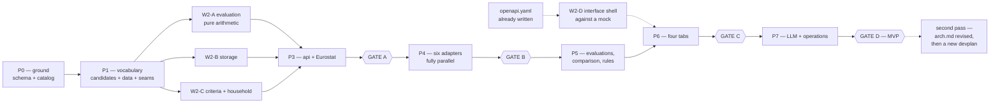

# Development plan — Starnest **MVP**

**Status:** written 2026-08-30, from `reqs.md` and `arch.md`.

> ### This plan covers the MVP only, and the MVP is the country level
>
> **"MVP" and "v1" name the same thing** across `reqs.md`, `arch.md` and this document. They
> are not two scopes — the term is doubled only because `reqs.md` §1.3 says "v1" and
> `CLAUDE.md` says "post-MVP". There is no third boundary hiding between them.
>
> The MVP is **the country level, with the full feature set applied to it** (`reqs.md` §1.3):
> pillars and criteria as data, weight profiles, structured data acquisition, scoring with
> coverage and confidence, match and compound rules, the ranking dashboard with drill-down and
> provenance, and comparison. It ends at **Gate D** (§3).
>
> **Everything after the MVP gets a second pass over *two* documents, not one.** The city level
> brings the LLM-plus-search acquisition path, city nomination and approval, and roughly 33 new
> attributes — enough that `arch.md` is revised first and a **second `devplan.md` is written
> against the revised architecture**. This document is not extended in place, and no phase
> below quietly reaches past Gate D. §8 lists what is deferred and where each item goes.

This document says **how the thing gets built**: what the independently implementable pieces
are, which may run at the same time, where work must stop and be proven end to end, and what
each agent is allowed to decide alone.

It does not restate requirements or architecture. Where it names a rule, the authority is the
section it cites.

---

## 0. The delivery model

### 0.1 The rhythm

Work moves in a repeating cycle, and the cycle is the point:

```
  fan out ──▶ each agent: one task, then its unit tests
      │
      ▼
  checkpoint ──▶ linters + unit tests green, master integrates
      │
      ▼
  … repeat until a vertical slice exists …
      │
      ▼
  GATE ──▶ ALL development stops
           write the end-to-end tests for the slice
           run them, find the gaps, fix the bugs
           only then does the next phase start
```

**A checkpoint is cheap and frequent. A gate is expensive and rare.** There are four gates in
v1. Nothing after a gate begins until that gate is green.

### 0.2 Who does what

| | Owns |
|---|---|
| **Master agent** | This plan. Task dispatch. Integration and merges. **All end-to-end tests — API acceptance *and* browser automation.** The dependency manifest. Migration numbering. Deciding when a gate is green |
| **Workstream agent** | One task: the code, and the unit tests that prove it. Nothing outside its assigned directories |
| **Alex** | Every decision in §7, and any question an agent stops on |

The master agent writes the end-to-end tests deliberately: an agent testing its own slice
end to end tests what it built, not what was asked for. The e2e suite is written from
`reqs.md` and `openapi.yaml`, by someone who did not write the implementation.

### 0.3 The stop rule

**An agent stops and asks rather than deciding, whenever any of these is true.** Stopping is
not failure; guessing is.

1. A requirement admits two readings that would produce different code.
2. A value the documents mark **TBD or provisional** would have to be invented to proceed —
   the compound-rule thresholds (`reqs.md` §7.4), a scale anchor, a normalisation band.
   **Seed it `NULL` and leave the rule inactive; never invent a number.** This is
   "never fabricate a score from missing data" applied to the build itself.
3. A new dependency is needed (§0.6).
4. The work would require importing across a boundary the import table forbids
   (`arch.md` §6.1). The rule is not negotiable at the task level; if it genuinely blocks the
   task, the design is wrong and Alex decides.
5. `openapi.yaml` would have to change. The contract has other consumers; changing it is a
   decision, not a refactor.
6. A migration would delete or alter a catalog row that already has values behind it
   (`arch.md` §7.4).

If a stop invalidates the premise of a whole workstream, the **workstream** stops, not just
the task.

### 0.4 Definition of done, per task

A task is done when all of these hold — not when the code exists:

- The code does what the task says, and nothing the task does not say.
- **Unit tests cover the sad path**, not only the happy one: error cases, edge cases, empty
  and missing input (global `CLAUDE.md` §9.4).
- **Coverage does not fall below 75%** — lines *and* branches. `make check` enforces it; a
  task that drops the number below the bar is not done.
- `ruff` clean, `import-linter` clean.
- The full existing test suite still passes.
- Anything left undone is written down, not left as an intention (`Later Equals Never`).

> **75% is a floor on the code, not a ceiling on the testing, and the difference matters.**
> The target is **full coverage of features and functionality** — every requirement in
> `reqs.md` exercised by something. The percentage catches only one failure mode: a whole
> region of code nobody ran at all. A module can sit at 90% lines with an untested
> requirement inside it, which is why "coverage is green" is never the argument that a task is
> tested. It is the argument that nothing was *forgotten wholesale*.
>
> The bar is set at 75 rather than higher on purpose. A number high enough to require tests
> written for the coverage report rather than for the behaviour produces exactly those tests,
> and they are worse than no tests because they look like protection. Revisit after the MVP.

### 0.5 Isolation — hybrid

Decided: worktrees only where the risk earns them.

| Work | Where | Why |
|---|---|---|
| Backend policy modules (`candidates/`, `data/`, `criteria/`, `evaluation/`, …) | **Main tree**, disjoint directories | They are already isolated by the module boundary. Sharing the tree means an agent sees the vocabulary the previous phase established, immediately |
| **The interface** | **Own worktree** | Separate npm project, separate toolchain, thousands of `node_modules` files, and a build that has nothing to say to `pytest`. It shares no code with the backend by design (`arch.md` §6.1) — so it should not share a working tree either |
| **Adapter fan-out (P4)** | **Own worktree each** | Six agents at once, each adding migrations and fixture files. Highest collision risk in the plan |
| Anything that would touch more than its own directory | Own worktree | And it stops first, per §0.3 |

**Test databases do not collide.** Every test run uses a database named for its workstream
(`starnest_test_w2b`), created and dropped by the fixture. Two agents running `pytest` at the
same moment never see each other's rows.

### 0.6 Shared files, and how agents avoid fighting over them

Files everyone wants to edit. Each has a rule.

| File | Rule |
|---|---|
| `backend/pyproject.toml` | **Written before any agent starts** — dependencies, the coverage bar, the ruff rules and the four `import-linter` contracts all live here. An agent needing a dependency it does not find **stops** (§0.3); master runs `uv add` at the checkpoint. Never `pip` (`CLAUDE.md`) |
| `backend/migrations/` | Numbered `NNNN-slug.sql`. **Each workstream is allocated a reserved block** in its task brief — W4-A owns 0410–0419, W4-B owns 0420–0429, and so on. Two agents cannot pick the same number because neither may pick outside its block |
| `docs/openapi.yaml` | **Nobody edits it.** It is the design; FastAPI regenerates it (`arch.md` §10.2). A drift test asserts the designed paths and operation IDs survive. Wanting to change it is a stop |
| `Makefile`, `compose.yaml`, `.env.example` | **Master only.** They describe how the whole system is built and run, which is not any one workstream's business |
| `.env` | **Never committed, never generated by an agent.** It holds the database password and the Anthropic API key. `.gitignore` ignores every `.env*` and re-includes only `.env.example`, so a new variant is ignored by default rather than by someone remembering |

### 0.7 The repository, and why the two halves never touch

```
starnest/
├── backend/                 Python. The API and every domain rule
│   ├── pyproject.toml       deps, coverage bar, ruff, import-linter contracts
│   ├── src/starnest/        the ten modules of arch.md §6.1
│   ├── migrations/          yoyo, plain .sql — schema AND catalog
│   └── tests/               unit, storage, acceptance
├── ui/                      TypeScript. A client of the contract, nothing more
│   ├── src/                 React
│   ├── e2e/                 Playwright — master agent's, not the screen author's
│   └── vite.config.ts       includes the 75% vitest coverage thresholds
├── docs/                    reqs.md, arch.md, datasources.md, devplan.md, openapi.yaml
├── tools/                   the two structural audits
├── compose.yaml             three containers: database, backend, ui
├── Makefile                 every command the project has
└── .env.example             technical configuration, with placeholders
```

**`backend/` and `ui/` are peers with no path between them.** Neither has a parent
directory containing code from both, neither imports from the other, and the only file they
share is `docs/openapi.yaml` — which one generates and the other consumes. A single top-level
`src/` holding both would have made the separation a convention people remember; two sibling
projects with separate toolchains make it a fact.

> **`docs/openapi.yaml` sits with the documents rather than inside `backend/`, deliberately.**
> It is the contract *between* the two halves, and putting it under `backend/` would imply the
> backend owns it. The backend generates it; it does not own it. The acceptance suite, the
> interface's generated client, and any future consumer read the same file from a neutral place.

---

## 1. Where the decomposition comes from

Three facts in the existing documents determine almost the entire shape of this plan. None of
it is invented here.

**1. The import table is a DAG, so it is also a schedule.** `arch.md` §6.1 says exactly which
module may import which. `candidates/` imports nothing; `evaluation/` imports four things.
Reading that table topologically gives the only ordering the code permits — and, more usefully,
tells you which modules have **no path between them** and can therefore be built at the same
moment by people who never speak.

**2. The OpenAPI contract already exists, so the interface does not have to wait.**
`openapi.yaml` was written before a line of backend code. A mock server generated from it
answers every one of the 31 paths with schema-valid responses. The interface can be built,
routed, styled and Playwright-tested against that mock **before the backend serves a single
request** — and when the real backend arrives, the client swaps its base URL. This is the
single largest parallelism win available, and it exists only because the contract was designed
rather than discovered.

**3. `SourceAdapter` makes every data source an independent unit.** `arch.md` §6.3 declares one
interface: which attributes it answers, at which levels, in which mode. An adapter for Eurostat
and an adapter for the World Bank share nothing but that interface. Once one adapter has proven
the contract works, the rest are a pure fan-out — six agents, no coordination, no shared state.

**What does *not* parallelise**, and is therefore deliberately kept small: the schema, the
catalog, and the shared vocabulary of `candidates/` + `data/`. Everything waits on those, so
P0 and P1 are single-agent phases sized to finish fast rather than to be complete.

---

## 2. The phases at a glance

**All eight phases are MVP scope.** Nothing below reaches past Gate D (§8).

| Phase | What | Agents | Ends with |
|---|---|---|---|
| **P0** | Ground: scaffold, schema, catalog | 1 | Checkpoint |
| **P1** | The shared vocabulary, and all nine seam interfaces | 1 | Checkpoint |
| **P2** | Core policy fan-out | 4 | Checkpoint |
| **P3** | The first vertical slice — API + Eurostat | 2 | **GATE A** |
| **P4** | Adapter fan-out | up to 6 | **GATE B** |
| **P5** | Evaluation persistence, comparison, rules | 3 | Checkpoint |
| **P6** | The interface's four tabs | 3 | **GATE C** |
| **P7** | Hardening: the LLM path, operations, failure modes | 2 | **GATE D — the MVP ships** |

Sizes below are **S / M / L**, meaning roughly one, two, or several agent sessions. They are
relative, not calendar estimates.

---

## 3. Phase by phase

### P0 — Ground

**One agent, serial. Nothing else can start.** Sized to be finished, not to be thorough.

| # | Task | Size | Done when |
|---|---|---|---|
| **T0.1** | ~~Scaffold.~~ **Done ahead of P0 by master** — `backend/pyproject.toml`, the ten module directories, `ui/` with its Vite/Vitest/Playwright configs, `compose.yaml`, `Makefile`, `.env.example`, `.gitignore`, both `Dockerfile`s. The P0 agent **inherits** these and does not recreate them | — | `make env && make up` gives a database; `uv sync` resolves |
| **T0.2** | ~~Tooling config.~~ **Also done ahead** — ruff, pytest markers, coverage at 75% lines and branches, and the four `import-linter` contracts of `arch.md` §6.2. What remains for the P0 agent: **the per-workstream database fixture** (§0.5), and **proving the boundary contracts actually fail** | S | **Write a deliberately illegal import — `data/` importing `criteria/` — and watch `make boundaries` reject it, then delete it.** A linter that is silently misconfigured passes everything, so it is proven failing before it is trusted passing |
| **T0.3** | Structural migrations: every table, constraint, view and index from `arch.md` §3, §3.3b, §4, §9.3. Includes the composite-key type agreement, the one-of check on non-match reasons, the singleton checks, and the active-value view | **L** | Migrations apply to an empty database and are **idempotent** — applying twice is a no-op |
| **T0.4** | Catalog migrations: 2 levels, 11 pillars, **41 country attributes** with value types and type parameters, data sources, breakdown schemes, the 4 country-relevant match rules (`reqs.md` §7.3), the 2 country compound rules (§7.4, **thresholds `NULL`**), and the shipped default criteria set with its weights, goals and the 7 `blocks_if_missing` flags (§7.5) | **L** | Every row traces to a table row in `reqs.md` §7.1 |
| **T0.5** | Verify `make check` end to end — ruff + import-linter + coverage + both audits — and confirm the three containers build and start | S | One command, one exit code. `make docker-build && make docker-up && make docker-migrate` brings the stack up |

**Checkpoint C0.** The catalog is not merely present, it is **arithmetically correct**, and
that is a test, not an inspection:

- Pillar weights sum to 100 at country level.
- Criterion weights sum to 100 **within each pillar**.
- Every attribute names a value type that exists, and its type parameters are valid for it.
- The 7 `blocks_if_missing` attributes are exactly those in `reqs.md` §7.5.
- Both audit tools pass.

> **This test is the "nothing hardcoded" invariant becoming enforceable.** `tools/audit_ontology.py`
> already checks the weights *in the document*. C0 checks the same arithmetic **in the database**.
> After this, the document and the database cannot silently disagree.

---

### P1 — The shared vocabulary

**One agent, serial, and deliberately minimal.** Everything in P2 waits here, so this phase
buys parallelism by staying small. It defines names and types; it implements almost no
behaviour.

| # | Task | Size | Done when |
|---|---|---|---|
| **T1.1** | `candidates/`: Candidate, Level, the nesting rule, identifier conventions. **Levels are ordered records, not a hardcoded pair** (`reqs.md` §3.1) | S | Nothing is imported. A test constructs a third level and nothing breaks |
| **T1.2** | `data/`: the **ten value types** and their operations, Attribute, Value, DataSource, provenance, confidence, breakdown schemes, FxRate, the two-date rule | **M** | Each value type round-trips; each rejects input the type forbids |
| **T1.3** | **All nine seam interfaces of `arch.md` §6.3**, each declared in the module that needs it — `SourceAdapter`, `CostMeter`, `ValueStore`, `CatalogStore`, `FxRateProvider`, `Clock`, `CriteriaStore`, `HouseholdStore`, `EvaluationStore` | S | Every interface is abstract; no implementation exists yet |

> **T1.3 is what makes P2 parallel, and it is the same move that made the interface parallel.**
> Declaring all nine seams up front means `storage/` can implement `CriteriaStore` in the same
> hour that `criteria/` is written against it, without either agent waiting. The interfaces are
> tiny — a handful of method signatures — and they are the entire coordination cost of a
> four-way fan-out. Contract first, twice: once for HTTP, once for the seams.

**Checkpoint C1.** Unit tests green. `import-linter` proves rule 3 — `data/` cannot reach
`criteria/`, `household/` or `evaluation/`. **The ontology's central invariant is now mechanical.**

---

### P2 — Core policy fan-out

**Four agents, no dependencies between them.** This is where the real work starts.

| Stream | Task | Size | Directories |
|---|---|---|---|
| **W2-A** | `evaluation/` — the pure arithmetic. Normalisation (`fixed`, `percentile`, `as_is`), weight redistribution, coverage, the matching decision, the **three compound-rule shapes**, ranking. **No I/O whatsoever** | **L** | `evaluation/` |
| **W2-B** | `storage/` — aiosql query files and the implementations of `ValueStore` and `CatalogStore`, including the active-value view | **M** | `storage/` |
| **W2-C** | `criteria/` + `household/` — weight rebalancing **with locks**, threshold validation per value type, criteria-set semantics (create, duplicate, switch), the household record | **M** | `criteria/`, `household/` |
| **W2-D** | The interface shell — **own worktree**. Vite + React + TS; **client generated from `openapi.yaml`**; a mock server from the same file; the four routes; the persistent sidebar; the Playwright harness | **M** | `ui/` |

**W2-A is the single richest task in the plan and the most testable.** Every function in it is
a pure function of a value and a criterion — no store, no clock, no network (`arch.md` §6.7).
It gets table-driven tests, and the sad paths are the interesting ones: a `percentile`
normalisation over one candidate, a redistribution where every criterion is missing, coverage
when the only present attribute is excluded from scoring.

**Checkpoint C2.** Unit tests green in all four. Nothing serves HTTP yet, so there is no gate —
resist the temptation to invent one.

---

### P3 — The first vertical slice

**Two agents.** The goal is narrow and specific: **a real ranking of real European countries
from real Eurostat data, over HTTP.**

| Stream | Task | Size |
|---|---|---|
| **W3-A** | `api/` and the composition root. FastAPI app, `/v1` prefix, the single exception→status map, the one error shape (`arch.md` §7.6). Endpoints: `/household`, `/settings`, `/levels`, `/pillars`, `/attributes`, `/data-sources`, `/candidates`, `/values`, the full `/criteria-sets` tree including the weight `PATCH`es, and **`GET /rankings`** | **L** |
| **W3-B** | `data_acquisition/` and the **Eurostat adapter**. Run planning and work items, per-item transaction, partial failure, selective retry, the abandoned-run sweep. Endpoints `/data-acquisition-runs`, `/plan`, `/{id}`, `/{id}/retry` | **L** |

**Why Eurostat first.** It needs no API key, is CORS-open and rate-limit-free, and answers
seven country attributes on its own — including `cost_of_living_index` and
`house_price_to_income_ratio`, two of the seven `blocks_if_missing` attributes. It is the
cheapest possible proof that the whole chain works.

---

## GATE A — the first end-to-end proof

**All development stops.** Master agent writes and runs:

**API acceptance suite** (Python, `pytest` + `httpx`, against a live server and a real
PostgreSQL — `tests/acceptance/`). One narrative, executed:

1. Configure the household. Read it back.
2. Read the catalog — 11 pillars, 41 attributes, weights that sum.
3. Duplicate the default criteria set. Adjust one weight. **Assert the server rebalanced the
   others and the pillar still sums to 100.** Lock three, adjust a fourth, assert the locks held.
4. Plan an acquisition. Assert the estimate names work items and costs nothing (Eurostat is free).
5. Run it. Poll until complete. Assert values landed **with both dates and their source**.
6. `GET /rankings`. **Assert 32 countries come back ranked, with honest coverage.**

**The contract-drift test.** The FastAPI-generated spec still contains every path and every
operation ID that `openapi.yaml` designed. This is the guard that made code-first acceptable
(`arch.md` §10.2).

**UI e2e** (Playwright, TypeScript, `ui/e2e/`): the app loads against the **real**
backend, the sidebar shows the active criteria set and the candidate counts, the Configure tab
renders the pillar tree, and the on-screen total reads 100%.

### Deriving the scale anchors — a step that belongs to Gate A

**26 of the 41 country criteria normalise `fixed`, and no anchors ship** (`reqs.md` §7.1
tabulates none). Only 13 can score today. Decided 2026-08-30 (`reqs.md` Q188): anchors are
**derived from real figures and reviewed**, never invented, and Gate A is the first moment that
becomes possible.

After the Eurostat run lands, and before the ranking is declared meaningful:

1. Compute each `fixed` attribute's **observed range across the 32 countries** — minimum,
   maximum, median.
2. Propose anchor pairs from those ranges, as a table Alex reviews.
3. Seed the approved anchors as a catalog migration like any other.

**Do not skip to step 3.** A band that looks reasonable in the abstract is usually wrong against
real figures, which is why every weight and threshold in `reqs.md` §7 is marked provisional. The
ranking before this step is real but thin, and coverage says so.

### What Gate A is really testing

Coverage will be roughly **20%**, because seven attributes out of 41 have values. **That is the
correct result, and the gate asserts it rather than working around it.** A system that reported
a confident score from 20% of its inputs would be broken in exactly the way `reqs.md` §5.3 and
the "data quality is the product" invariant exist to prevent. The first ranking being honestly
sparse is the strongest evidence available that redistribution and coverage work.

Fix every bug found. Only then does P4 start.

---

### P4 — Adapter fan-out

**Up to six agents, each in its own worktree, each with a reserved migration block.** The
`SourceAdapter` contract was proven at Gate A; these add data, not machinery.

| Stream | Source | Attributes it answers | Migrations |
|---|---|---|---|
| **W4-A** | World Bank WGI | `political_economic_stability`, `rule_of_law`, `control_of_corruption` | 0410–0419 |
| **W4-B** | OECD | `income_tax_effective`, `average_working_hours`, `statutory_paid_leave`, `school_system_quality`, `parental_leave_policy`, `child_benefit_policy` | 0420–0429 |
| **W4-C** | Open-Meteo | `avg_annual_temperature`, `annual_sunshine_hours` — **blocked on D4** | 0430–0439 |
| **W4-D** | UNODC + WHO GHO | `crime_safety_index`, `healthcare_system_quality` — both are **scheduled downloads, not live calls** | 0440–0449 |
| **W4-E** | Manual entry | `residency_admin_ease`, `naturalisation_pathway`, `pension_portability`, `remote_work_tax_treaty`, plus the `uk_skilled_worker`, `ch_eu_efta_quota` and `not_manually_excluded` match-rule results. `POST /values/manual`, `/match-rules`, `/match-rule-results` | 0450–0459 |
| **W4-F** | Eurostat, extended | `housing_cost_overburden_rate`, `overcrowding_rate`, `tech_employment_share`, `rail_network_density`, `broadband_coverage`, `life_satisfaction`, and the remaining Eurostat rows of `reqs.md` §7.1 | 0460–0469 |

**Two attributes stay deliberately empty.** `tech_software_jobs` and `tech_product_jobs` have no
confirmed source (`datasources.md` §11). They remain in the catalog with no adapter, permitting
manual entry. **An agent must not invent a source for them** — that is a §0.3 stop, and
`reqs.md` §9 already records the decision.

**Every adapter is tested against recorded fixtures**, never a live call (`arch.md` §6.7). A
separate, explicitly-marked `live` suite hits the real endpoints and is run by the master agent
at the gate — so a test failure means "our parser broke", not "Eurostat was slow".

---

## GATE B — coverage becomes real

**All development stops.** Now the ranking has substance, and this gate is where **data-quality
bugs surface** — the class of bug that unit tests structurally cannot find.

The acceptance suite grows to assert:

- **All seven `blocks_if_missing` attributes have values for all 32 countries.** A gap here
  means a broken fetch, not an undocumented country — that is precisely the condition on which
  those seven were chosen (`reqs.md` §7.5).
- **No country is spuriously `insufficient_data`.** Any that is, is investigated, not silenced.
- Coverage is high and, more importantly, **honest** — spot-checked against the catalog by hand.
- Where two sources answer one attribute, **both values are stored** and the active-value rule
  picked by source priority. Non-destructive selection is verified, not assumed.
- Values carry a **reference date distinct from their retrieval date**, both displayable.
- `POST /data-acquisition-runs/{id}/retry` re-runs **only** what failed.

**A spot-check by hand is part of this gate.** Pick three countries and one attribute each,
open the source's own website, and compare. Automated tests confirm the pipeline moved a number;
only a human confirms it moved the *right* number.

---

### P5 — The rest of the domain

**Three agents.** All the vocabulary and all the data now exist.

| Stream | Task | Size |
|---|---|---|
| **W5-A** | Evaluation persistence — `SaveEvaluation`, the snapshot, per-attribute detail, `/evaluations` and its sub-resources. **`GET /rankings` still writes nothing** | **M** |
| **W5-B** | `comparison/` — focus and comparators, deltas, weighted contribution, the **templated** synthesis, `GET /comparisons`. The comparator limit is **configurable, never hardcoded** | **M** |
| **W5-C** | Rules end to end — `/match-rules`, `/match-rule-results` with audited overrides, `/compound-rules`, and the two country compound rules wired into the ranking as **warnings** | **M** |

**Checkpoint C5.** The synthesis gets a specific test: a **large delta on a low-weight
criterion must not outrank a small delta on a high-weight one** (`CLAUDE.md`, `reqs.md` §8.5).
That inversion is the whole reason synthesis is derived from weighted contribution, and it is
the bug that would otherwise ship looking plausible.

---

### P6 — The interface

**Three agents, each in a worktree.** The shell and the generated client exist from P2; these
build the screens of `reqs.md` §8 against the now-real backend.

| Stream | Tab | Size |
|---|---|---|
| **W6-A** | **Configure** — the two-level criteria tree with sliders and lock toggles, live 100% indicators, criteria sets, thresholds, source priority, household, settings. The largest screen in the product | **L** |
| **W6-B** | **Rank** — ranking table with coverage and status, the **always-visible non-matching section**, attribute drill-down, candidate detail with **all** stored values not merely the active one, and the visually distinct external-scores panel | **L** |
| **W6-C** | **Run** and **Compare** — scope selector, dry-run confirmation, live polling, failures with one-click retry, run history; and the comparison table with per-attribute weighted contribution | **M** |

**One rule governs all three:** the interface holds no domain logic (`arch.md` §8.1). No
scoring, no rebalancing arithmetic, no coverage calculation in TypeScript. A reviewer who finds
a number computed client-side rejects the work — that duplication is invisible precisely where
it does the most damage.

---

## GATE C — the product, driven by a browser

**All development stops.** Master agent writes the full Playwright suite. Each of these is a
requirement made executable:

| Test | Proves |
|---|---|
| **The weight drag, end to end** — move a slider, watch the `PATCH`, watch the `GET /rankings`, assert the order changed and the pillar still sums to 100 | `arch.md` §8.3, the interaction the product turns on |
| **Provenance on a displayed number** — click any score, reach the value, see source, reference date, retrieval date | "Full provenance on every displayed number" |
| **A non-matching country is visible**, greyed, keeping its score, with its reason shown | `reqs.md` §5.4 — a filtered-out row would be a silent failure |
| **Insufficient data is labelled, never scored** | The invariant the product exists to protect |
| **Switching criteria sets re-ranks instantly and fetches nothing** | Acquisition and scoring are separate operations |
| **A run, watched live** — start, poll, see failures accumulate, retry only those | `reqs.md` §6.4 |
| **Comparison** — a focus country against comparators, deltas and synthesis, never mixing levels | `reqs.md` §8.5 |

Fix every bug. Only then does P7 start.

---

### P7 — Hardening

**Two agents.**

| Stream | Task | Size |
|---|---|---|
| **W7-A** | The **LLM path** — the Anthropic SDK with `web_search`, as a `SourceAdapter` like any other. `CostMeter`, the spend cap and its halt, and **storing the pages the model actually read**. Country level uses it for `international_employers` only. **The inventory in `reqs.md` §6.10 is exhaustive** — an unlisted use is a §0.3 stop | **M** |
| **W7-B** | Operations — the startup sequence and its **refusal to start on a schema gap**, adapter-declaration validation at boot, the abandoned-run sweep, `pg_dump` before every migration, `log_statement = 'mod'`, application logging, and the assertion that **the API key never reaches the log, the database or an error message** | **M** |

---

## GATE D — the MVP is done

Everything above, green, at once. Plus the failure modes, which are only testable now:

- **Kill the process mid-run.** Restart. The run is marked `failed`, the values it already
  wrote are intact, and retry works. This only holds because commits are per item
  (`arch.md` §7.1) — so it is worth proving rather than assuming.
- **Cross the spend cap.** In-flight items finish and commit, the run halts, nothing is lost.
- **Start against a stale schema.** The application refuses, and names the gap.
- **Restore from a `pg_dump`** and re-run the acceptance suite against the restored database.
  Manually entered values cannot be re-fetched at any price (`arch.md` §9.5); an untested
  backup is not a backup.

---

## 4. What runs at the same time, and what cannot



**The dotted arrows are the plan's leverage.** The interface never blocks on the backend,
because the contract it consumes was written before either existed.

---

## 5. The test suites, and what each is for

Four suites, four different jobs. **A check belongs to exactly one of them** — duplicating a
check across layers is a cost, not a safety net (`arch.md` §7.3).

| Suite | Where | Runs against | Answers |
|---|---|---|---|
| **Unit** | `tests/unit/` | Nothing — pure functions and in-memory fakes | Is the arithmetic right? |
| **Storage** | `tests/storage/` | **A real PostgreSQL** | Do the constraints hold? Testing type agreement against a fake proves nothing — **the constraints are the behaviour under test** |
| **Acceptance** | `tests/acceptance/` | A live backend over HTTP | Does the contract do what it promises? This is the consumer that makes the API a boundary rather than an intention |
| **Browser** | `ui/e2e/` | The real backend, through Chromium | Does the product work? |

**Fakes at the seams, real infrastructure below them.** A fake `ValueStore` is a dictionary and
the use case cannot tell. A fake PostgreSQL would be a lie, because the schema is where half the
invariants live.

**A fake `Clock` is not optional.** `max_age` and staleness are MVP behaviour, and a test for
"this value is stale" that waits for it would take months.

### 5.1 Coverage — the bar, and how to look at it

**75% of lines and 75% of branches, enforced on both sides**, configured in
`backend/pyproject.toml` (`[tool.coverage.report] fail_under`) and
`ui/vite.config.ts` (`test.coverage.thresholds`). Below the bar the command fails; it
does not print a warning nobody reads.

| Command | Produces |
|---|---|
| `make coverage` | Backend: terminal summary with missing lines, **HTML at `backend/htmlcov/`**, XML for tooling |
| `make coverage-open` | The same, then opens the HTML report in a browser |
| `make ui-coverage` | Interface: terminal, **HTML at `ui/coverage/`**, lcov |
| `make ui-coverage-open` | The same, then opens it |
| `make check` | Everything, with the bar enforced. **This is the gate** |

**Branch coverage is on, and it is the half that earns its keep here.** Line coverage would
call a normalisation function covered after one `fixed` case, while `percentile` and `as_is`
never ran. Branch coverage names the paths nobody took — which, in a scoring engine whose
whole job is behaving differently per value type and per goal, is most of the interesting
behaviour.

**What is excluded, and why each is not a loophole:** abstract methods on the nine seam
interfaces (`arch.md` §6.3) are signatures, not behaviour, so counting their bodies measures
nothing; `if TYPE_CHECKING:` blocks never execute at runtime; and the interface's generated
`src/api/schema.ts` comes from `docs/openapi.yaml`, so testing it would test the generator.

---

## 6. Risks this plan carries

Named because they are real, with what the plan does about each.

| Risk | Mitigation |
|---|---|
| **The career pillar rests on two attributes with no source** — 14% of the score. `reqs.md` §1.3 already says local employment is the v1 assumption with the weakest evidence | Redistribution and coverage disclose it honestly. Gate B spot-checks that the career pillar's coverage is *reported* low rather than quietly filled |
| **Six agents adding migrations at once** | Reserved numbering blocks (§0.6). Master applies them in order at the gate and re-runs C0's arithmetic assertions |
| **The generated OpenAPI drifts from the designed one** | The drift test at Gate A, run in `just check` from then on |
| **Domain logic leaks into the interface** for responsiveness | Explicit review criterion at Gate C. The debounce of `arch.md` §8.3 exists to remove the temptation |
| **An agent invents a provisional number** — a compound-rule threshold, a scale anchor | §0.3 rule 2. Seed `NULL`, leave the rule inactive, stop and ask |
| **Adapter tests bind to live third-party APIs** and become flaky | Recorded fixtures for the normal suite; a separate `live` suite the master agent runs at gates |
| **P1 grows** and starves the fan-out | P1 is scoped to types and interfaces only. Behaviour belongs to P2 |

---

## 7. Decisions needed from Alex

Each blocks something specific. **D1 blocks the very first task.**

| # | Decision | Blocks | Recommendation |
|---|---|---|---|
| **D1** | ~~The top-level package name.~~ **Decided 2026-08-30: `starnest`.** The rule narrows rather than disappears — see below | — | **Answered** |
| **D2** | **PostGIS, or plain numbers?** (`arch.md` §11) Whether coastline, elevation and protected-area distances are spatial queries or `Quantity` values computed at fetch time | W4-C, and the nature attributes | **Plain numbers.** Nothing in v1 needs a spatial query, and `arch.md` already calls this the likely answer |
| **D3** | **The interface's component library** (`arch.md` §11) — a kit, or assembled directly | **W2-D**, and it is hard to reverse later | A headless kit for the sliders, tables and dialogs; styling assembled directly. The Configure tab is slider-dense and lock-toggle-heavy, which is where a kit earns its cost |
| **D4** | **How a coordinate-bound source answers a country-level attribute.** Open-Meteo is coordinate-bound, but `country.avg_annual_temperature` is a national figure. Centroid? Capital? Population-weighted mean of the largest cities? Grid mean? **The documents do not resolve this**, and it changes what the number means | **W4-C** | **Population-weighted mean over the country's largest cities.** A centroid gives Spain the temperature of an empty plateau; a capital gives Portugal the temperature of Lisbon. Neither describes where people would live. This is a real modelling choice and worth your call |
| **D5** | **The compound-rule thresholds** for `mild_now_brutal_later` and `cheap_but_taxed` (`reqs.md` §7.4, both TBD) | The rules firing at all | **Leave `NULL` through v1.** They are meant to meet real figures first — which Gate B is the first moment that becomes possible |

> **D1, decided: the package is `starnest`, and the rule it relaxes is worth stating precisely.**
> `arch.md` §6.1 asked for a neutral package name so that renaming the product would touch no
> import. That cost is accepted — a rename now means one `git mv` and one find-and-replace across
> import lines, which is a mechanical change a tool does correctly.
>
> **What the rule still forbids, and this part does not relax:** the name appears in **no class
> name, no table name, no config key, no environment-variable prefix, and no comment.** A
> `StarnestScoreCalculator` or a `starnest_value` table would be the actual failure the invariant
> was written against, because those are the occurrences a rename cannot mechanically find. The
> display name stays a single settings parameter (`reqs.md` §10).
>
> Concretely: `src/starnest/evaluation/normalisation.py` is fine; `class StarnestNormaliser` is not.

**D3 is needed at kickoff. D2, D4 and D5 can be answered at Gate A**, and the plan is
written so that nothing stalls waiting for them.

---

## 8. What the MVP excludes, and where each excluded thing goes

The boundary of `reqs.md` §1.3, restated so that no agent has to infer it. **None of this is
built without being asked**, and an agent that finds itself needing one of these has hit a
§0.3 stop.

| Deferred | Where it is handled |
|---|---|
| **The city level** — cities, the city attribute catalog, city nomination and the `proposed → approved / rejected` state, and the **LLM-plus-search acquisition path** the city attributes depend on | **The second pass.** This is the bulk of it, and the reason a second pass exists at all |
| The pillar expansions flagged in `reqs.md` §7 — health detail, seasonal climate, crime detail, rent outside the centre | The second pass, as catalog rows |
| The `remote-only` criteria set | **Already satisfied by the MVP.** It is 74 re-weighted rows in a `CriteriaSet`, needing no new attributes and no new machinery — a different opinion about the same data. It waits because it is cheap, not because it is hard |
| `relocation_window` | The second pass, as a match rule with its own requirements (`reqs.md` §1.3) |
| Personal annotations, gradient maps, favourites, saved comparisons | The second pass |
| Time-series reducers, derived attributes | The second pass. Both are recorded as open in `arch.md` §11 and neither needs a schema change |
| **Caching of any kind** — no Redis, no in-process memoisation, no HTTP cache headers on `GET /rankings` | **Deferred, and only if a measured inefficiency appears.** See below |
| Any admin interface | **Never.** Its absence is deliberate (`reqs.md` §2) |
| Authentication or authorisation | **Never**, in any form |

### On caching, decided 2026-08-30

**No caching layer in the MVP**, and it is worth recording *why it is safe to omit* rather
than only that it is deferred — otherwise it reappears as an oversight rather than a decision.

**The expensive thing is already cached, by the design.** `reqs.md` §5.6 separates data
acquisition from scoring: values are fetched once and stored, and score recalculation never
triggers a re-fetch. The network round trip — the only genuinely slow operation in the system —
happens once per value and never again. **The `value` table is the cache**, and it is a durable,
inspectable, provenance-carrying one.

**What remains is not slow.** `GET /rankings` is two queries and pure arithmetic
(`arch.md` §7.2), over 32 countries × 41 attributes. Caching that would add an invalidation
problem to a computation that is already fast, and invalidation is exactly where a caching
layer would break the product's promise: a weight changes, the cache does not notice, and the
screen shows a stale ranking that looks entirely plausible. **A wrong number that looks right
is the specific failure this application exists to prevent.**

**When to revisit:** if a measurement — not an intuition — shows the read path is slow at
real scale. The city level multiplies candidates by roughly an order of magnitude, so the
second pass is the natural moment to measure. **Adding caching later is cheap** precisely
because nothing depends on its absence; removing a cache that turned out to be wrong is not.

### The second pass, and why it revises the architecture first

Post-MVP work is **not an extension of this document**. The sequence is deliberate:

1. **`arch.md` is revised**, because the city level introduces something the MVP never
   exercises — the LLM-plus-search acquisition path, with its cost meter, spend cap, stored
   read pages and `low` confidence ranking. The MVP builds that machinery at P7 for a *single*
   country attribute; the city level makes it load-bearing.
2. **A second `devplan.md` is written against the revised architecture**, with its own phases,
   its own fan-out and its own gates.

> **The MVP is what makes that second pass cheap, and it is also the test of whether this
> architecture was right.** Adding the city level should be *sources and rows* — new adapters
> behind the same `SourceAdapter` interface, new attributes as catalog migrations, a second set
> of weights in a `CriteriaSet` — and **not new machinery**. If it turns out to need new
> machinery, the boundary that failed will be visible in exactly which module had to change.
>
> This is why **nothing in this plan may assume there are exactly two levels**
> (`reqs.md` §3.1). Every task brief inherits that constraint, and it is checked at every
> review, not only at the gates.
