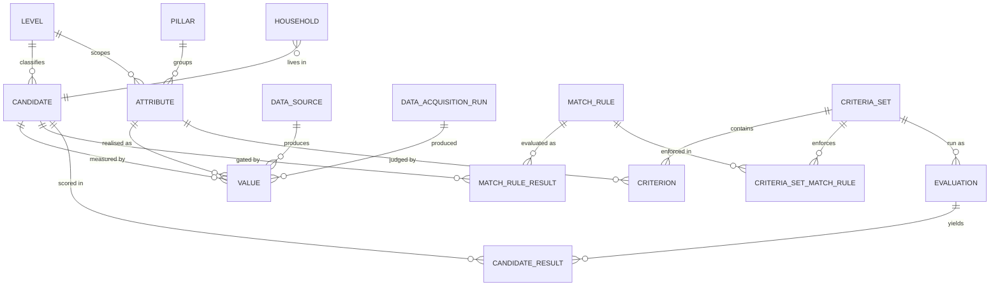

# Requirements — Starnest

Version 1. The requirements and the ontology, and the authority for both.

**Everything here is a requirement.** section 1.3 records *sequencing* — what arrives in v1 and what
follows — and nothing else. A feature marked post-MVP is deferred, never rejected: it is
expected to be built, and its requirements are stated here in full so that deferring it costs
no design work later.

> **Every term used here is defined in Appendix A — Glossary.** If a word looks like it is
> doing specific work, it is, and the glossary says exactly what. Appendix B records each
> decision with its rationale.

---

## 1. Purpose and scope

A local, single-user web application that helps a couple decide where to live. It evaluates
candidate locations against a weighted, user-configurable criteria set, ranks them, compares
them head to head, and explains every number it displays.

| | |
|---|---|
| **Geography** | EU/EEA + United Kingdom + Switzerland **to begin with**. The scope is a configuration list, not an assumption: extending to the Americas, Africa or Asia must be a matter of seeding more countries and connecting sources that cover them, never a change to the model |
| **Horizon** | Open-ended. The chosen place may be home for life. Any requirement framed around a fixed number of years is wrong. |
| **Household** | Two adults, both working in tech (engineering and product). **Children are in scope** — see section 6.8. |
| **Home country** | Set in section 3.9, currently Romania. Citizenship, currently Romanian and therefore EU, drives the free-movement filter |
| **Deployment** | Runs locally in a browser. Single user, no authentication, no multi-tenancy. |

### 1.1 What the app is for

Turning an unmanageable question — *where should we live?* — into an inspectable one. The
app's value is not the ranking; it is that every figure behind the ranking can be traced to a
source, a date, and a method.

### 1.2 The home country's dual role

The **home country** (section 3.9 — currently Romania) is **both a candidate and the baseline**. It is
matched and scored like any other country, so "stay put" remains a measurable option rather
than an assumption. It is additionally the default comparison anchor: any criterion may display
a delta against home alongside its raw value.

### 1.3 Scope of v1

**v1 covers the country level only, with the full feature set applied to it.** Everything in
this document is a requirement; this section says only what arrives first.

**In v1:**

- The household record, configured first
- **Local employment as the working assumption** — see below
- The country attribute catalog, with pillars
- Criteria sets: weights, directions, scales, matching thresholds — switchable
- Match rules, and the two country-level compound rules of section 7.4
- The country seed list
- Structured data acquisition, with runs, cost control and selective retry
- Evaluation: per-attribute normalisation, weight redistribution, coverage and confidence
- Non-match reporting, with reasons
- The ranking dashboard, with per-attribute drill-down and full provenance
- Comparison of a focus country against comparators
- External scores displayed alongside

**The v1 working assumption is local employment**, not remote work. Both of you find roles in
the destination. This is not a scoping cut so much as a statement of what the default criteria
set optimises for, and it has consequences worth seeing plainly:

- The `career` pillar is load-bearing at both levels — 14% of the country score.
- `two_role_feasibility` (section 7.3) is the gate that matters most: a place must plausibly support
  **two** tech roles, and product roles are the scarcer half.
- Small localities are penalised in a way they would not be under remote work, because the
  local market has to be real.

> **The risk this exposes, stated rather than buried.** The two heaviest attributes in the
> career pillar — `tech_software_jobs` and `tech_product_jobs`, 44% of it between them — have no
> confirmed source (section 9). Local employment is therefore the v1 assumption whose evidence base is
> weakest. section 5.3's redistribution handles it correctly (the weight moves to attributes that do
> have data, and coverage falls to disclose it), but a country ranked on a hollow career pillar
> should be read with that in mind.

A **`remote-only` criteria set is post-MVP** — the same 74 attributes, re-weighted, with
`connectivity` raised and `career` largely excluded. It needs no new attributes and no new
machinery, which is precisely why it can wait: it is a different opinion about the same data
(section 3.4), not a different application.

**After v1:** the whole of the **city level** — cities, the city attribute catalog, city
nomination, and the LLM-plus-search data acquisition path the city attributes depend on; the pillar
expansions flagged in section 7 (health, seasonal climate, crime detail, rent outside the centre); the
remaining prose-bound attributes (section 9); and these, which carry requirements of their own rather
than being bare names:

| Feature | What it must do |
|---|---|
| `relocation_window` | The match rule asking whether the move can be **completed** within the time available — not how long you stay. A candidate fails if a long-lead blocker (a visa queue, a quota wait, a notice period, a school year) pushes the earliest feasible arrival beyond the configured window. Deferred because free movement makes it vacuous for 30 of the 32 seeded countries, and the UK and Swiss cases are already caught by their own rules; its unique value is capturing *your* constraints rather than the destination's |
| Nomination and approval | How a candidate enters other than from the seed list: LLM proposal, manual add, top-N by population, and the `proposed → approved / rejected` state that implies (section 6.1). v1 seeds from configuration and needs none of it |
| Personal annotations | Free notes on a candidate — impressions, whether you have visited |
| Gradient maps | A map coloured by a chosen numeric attribute. **Generatable for any numeric attribute in the catalog**, never fixed to one — that generality is the feature |
| Favourites | Marking a candidate. Separate lists per level |
| Saved criteria sets | Already satisfied — `CriteriaSet` (section 3.4) is a standalone reusable object usable in any evaluation or comparison, not tied to one candidate |
| Saved comparisons | A focus candidate + comparators + a reference to the settings used, saved under a name. **Frozen at the values held when saved**, so editing the settings afterwards does not silently change it, with an explicit action to re-run against current settings. The one deliberate exception to section 8.5's "comparisons are always live" |

> The country level is the right first slice: it exercises nearly every load-bearing abstraction —
> `Candidate`, pillars and criteria as data, normalisation, redistribution, coverage,
> confidence, filters, provenance, comparison — while needing no city nomination and almost no
> LLM. The city level then adds *sources and rows*, not new machinery, which is the test of whether
> the design was right.

---

### 1.4 Household parameters

Several attributes are meaningless in the abstract and mean something only **relative to this
household** — income, size, target spend, rent ceiling, home country and city, citizenship.
They are configuration about *you*, not data about any candidate, and they are the **first thing
configured** when the application is opened.

They form a single entity, **`Household`**, whose fields are listed once in **section 3.9**. They are
named here because a reader meets their effects long before reaching the ontology: the home
country is the comparison baseline, and the number of adults and children decides which rent
figure is even the right one to look at.

> **"Budget" means household money throughout this document.** The ceiling on what an
> data acquisition run may cost in API calls is the **spend cap** (section 6.3) — a different word for a
> deliberately different thing.

Without these, `city.cost_of_living_monthly` is an absolute figure that says nothing about whether
*you* can afford to live there. `city.purchasing_power` and `country.house_price_to_income_ratio` use
population-average income, which answers a different question.

## 2. Roles

**User** (day-to-day). Works entirely inside a `CriteriaSet` (section 3.4): includes and excludes
attributes from scoring, adjusts pillar and criterion weights, sets directions, scales and
matching thresholds, overrides match-rule results, enters values manually, triggers runs, and
reads results.

**Developer / administrator.** Adds **attributes** to the catalog, connects data sources, and
edits the bootstrap configuration — by editing config files and code directly.

> **The split is the objective/subjective line of section 3.0, expressed as permissions.** The user
> owns every criterion — what a thing is worth, which way is good, where the line falls. The
> administrator owns every attribute — what is measured, in what unit, from which source, and
> how fast it goes stale. Neither reaches into the other's half, which is why the user can never
> put the catalog into an inconsistent state.

**There is deliberately no admin interface.** Adding an attribute or a data source is a
developer action performed in config, not a user action performed in a screen. Do not build
one.

---

## 3. Ontology

The data model is a first-class design concern, not an implementation detail. It must remain
changeable: adding or removing a field, changing what an attribute measures, or swapping how a
criterion is evaluated must be a configuration change, not a rewrite. `arch.md` decides how
these entities are modelled and stored; `devplan.md` must keep them extensible.

### 3.0 The three ideas the model rests on

Keeping these apart is what makes everything else in this document work:

- **An `Attribute`** is something knowable about a place — rent, population, homicide rate,
  timezone. **Objective.** The same for everyone who asks.
- **A `Value`** is what that attribute actually *is*: for one candidate, from one source, on one
  date. Lisbon's two-bedroom rent, per Numbeo, in July 2026.
- **A `Criterion`** is a rule *you* impose — *this attribute*, toward *this goal*, against
  *this limit*, worth *this much*. **Subjective.** Yours, and legitimately different from
  another person's.

> **Why three and not two.** An everyday criterion sentence — "rent must be under €1,500, and
> rent matters a lot to me" — contains three separable things: a **subject** (rent), a **rule**
> (under €1,500, less is better, weighted heavily), and a **measurement** (Lisbon is €1,410).
> Earlier drafts fused the subject with the measurement, called that pair a "criterion", and
> put the rule in a separate settings record. That split the sentence in the wrong place. The
> subject is a fact about the world; the rule is a fact about you. Fusing them is exactly how
> one person's taste gets encoded as objective truth.

**One consequence is worth stating on its own: descriptive facts are not a separate kind of
thing.** Population is an `Attribute` with no `Criterion` attached — nothing judges it, so it
is displayed and never scored. Attach a criterion to it and city size becomes scored, with no
new fetch, no new table, and no migration. There is no separate facts entity, and there never
needed to be one.

#### How to read the diagrams

Every line is a foreign key. The symbol at each end says how many rows may sit on that side:

| Symbol | At that end there is | Read as |
|---|---|---|
| `\|\|` | exactly one | mandatory, single |
| `o\|` | zero or one | optional, single |
| `}o` | zero or more | optional, many |
| `}\|` | one or more | mandatory, many |

So `LEVEL ||--o{ CANDIDATE` reads: **one** level classifies **zero or more** candidates, and
every candidate belongs to **exactly one** level.

**Two naming rules hold throughout**, and they are what make the diagram readable without a key:

- **A foreign key is named after the table it points at.** `VALUE.data_source`, not
  `VALUE.source`. Where a table points at itself, the role is prefixed:
  `CANDIDATE.parent_candidate`.
- **A field name must say what it holds, in the reader's language.** Two or three words are
  preferred over one, and a name that needs a footnote is renamed instead of footnoted.
  A **single abstract word is not acceptable**: `falloff`, `mode`, `scale`, `status` and `kind`
  were all in an earlier draft and are now `zero_score_below`, `containment_rule`,
  `normalisation_method`, `usage_status` and `source_kind`. A single word is allowed in exactly
  two cases — a **foreign key named after its table** (`attribute`, `candidate`, `pillar`), and
  a **term defined in the glossary** (`score`, `coverage`, `weight`, `goal`, `rank`). Anything
  else spells itself out.
- **There are no JSON columns.** Anything that would be an object or a list is its own table —
  thresholds, scale anchors, source-priority overrides, citizenships, allowed labels. The point
  of a schema is that the database can check it; a JSON blob moves the checking back into
  application code and hides it from every query.

Composite natural keys (a criterion is one attribute within one criteria set) are enforced as
`UNIQUE` constraints over a surrogate `id`, per `arch.md` 3.2. Typed child tables for `VALUE`
and for attribute type parameters follow the pattern in `arch.md` 3.3 and are omitted here to
keep the shape legible.

**The model is shown twice — once small, once complete.** The **overview** below establishes
the shape and the one rule that governs it; the **complete model** that follows carries every
table, every field and every relation, and is the one to consult when a detail matters. The
overview is a strict subset: every relation in it also appears in the complete model.

#### Overview — the shape of the model

> **The one structural rule the whole model exists to protect.** `ATTRIBUTE`, `VALUE`,
> `MATCH_RULE_RESULT` and everything feeding them are **the world as it is**. `CRITERION`,
> `CRITERIA_SET`, `EVALUATION` and `CANDIDATE_RESULT` are **what you make of it**. Every arrow
> between the two halves runs from world to judgement — a criterion reads an attribute, an
> evaluation reads values. **None runs back.** No value knows which criteria set is active; no
> candidate stores a score. That absence is what section 5.6 means by keeping data acquisition and scoring
> separate, and it is why switching from `alex` to `partner` can never trigger a fetch.

#### The complete model

All 31 tables and all 48 relations. Dense by design — the overview above is the map.

```mermaid
erDiagram
    LEVEL {
        text id PK
        int depth_order
        text parent_level FK
    }
    VALUE_TYPE {
        text id PK
    }
    CANDIDATE {
        text id PK
        text name
        text level FK
        text parent_level FK
        text parent_candidate FK
    }
    PILLAR {
        text id PK
        text name
        text description
    }
    ATTRIBUTE {
        text id PK
        text pillar FK
        text level FK
        text value_type FK
        text breakdown_scheme FK
        text name
        text description
        interval max_age
        bool manual_entry
    }
    ATTRIBUTE_ALLOWED_RANGE {
        text attribute FK
        numeric min_value
        numeric max_value
    }
    ATTRIBUTE_ALLOWED_LABEL {
        text attribute FK
        text label
    }
    ATTRIBUTE_SOURCE_PRIORITY {
        text attribute FK
        text data_source FK
        int rank
    }
    BREAKDOWN_SCHEME {
        text id PK
    }
    BREAKDOWN_OPTION {
        text id PK
        text breakdown_scheme FK
    }
    FX_RATE {
        text base_currency
        text quote_currency
        date rate_date
        numeric rate
        text data_source FK
    }
    DATA_SOURCE {
        text id PK
        text name
        text source_kind
        int default_priority
        text reliability_tier
    }
    VALUE {
        bigint id PK
        text candidate FK
        text attribute FK
        text value_type FK
        text data_source FK
        text breakdown_option FK
        bigint data_acquisition_run FK
        date reference_period_start
        date reference_period_end
        timestamptz retrieval_date
        text confidence_level
        text rejection_reason
        text quote
    }
    VALUE_CITATION {
        bigint value FK
        text url
    }
    DATA_ACQUISITION_RUN {
        bigint id PK
        timestamptz started_at
        timestamptz finished_at
        text triggered_by
        text run_status
        text level FK
        int llm_call_count
        numeric cost_eur
    }
    DATA_ACQUISITION_RUN_CANDIDATE {
        bigint data_acquisition_run FK
        text candidate FK
    }
    DATA_ACQUISITION_RUN_ATTRIBUTE {
        bigint data_acquisition_run FK
        text attribute FK
    }
    DATA_ACQUISITION_FAILURE {
        bigint data_acquisition_run FK
        text candidate FK
        text attribute FK
        text error_message
    }
    MATCH_RULE {
        text id PK
        text level FK
        text name
    }
    MATCH_RULE_RESULT {
        text match_rule FK
        text candidate FK
        text data_source FK
        text match_result
        text reason
        date reference_period_start
        date reference_period_end
        timestamptz retrieval_date
        text override_reason
        timestamptz override_date
    }
    EXTERNAL_SCORE {
        bigint id PK
        text candidate FK
        text data_source FK
        numeric published_value
        text published_scale
        int published_rank
        int published_rank_of
        date reference_period_start
        date reference_period_end
        timestamptz retrieval_date
        text methodology_url
        text caveats
    }
    HOUSEHOLD {
        int id PK
        text home_country_candidate FK
        text home_city_candidate FK
        numeric net_income
        int number_adults
        int number_children
        numeric target_monthly_spend
        numeric max_rent
    }
    HOUSEHOLD_CITIZENSHIP {
        int household FK
        text candidate FK
    }
    CRITERIA_SET {
        text id PK
        text name
    }
    PILLAR_WEIGHT {
        text criteria_set FK
        text pillar FK
        text level FK
        numeric weight
        bool weight_locked
    }
    CRITERION {
        bigint id PK
        text criteria_set FK
        text attribute FK
        text value_type FK
        text breakdown_option FK
        bool is_scored
        numeric weight
        bool weight_locked
        text goal
        numeric target_range_min
        numeric target_range_max
        numeric zero_score_below
        numeric zero_score_above
        text normalisation_method
        text reducer_mode
        bool blocks_if_missing
    }
    CRITERION_SCALE_ANCHOR {
        bigint criterion FK
        numeric input_value
        int score
    }
    CRITERION_THRESHOLD_RANGE {
        bigint criterion FK
        numeric min_value
        numeric max_value
    }
    CRITERION_THRESHOLD_LABEL {
        bigint criterion FK
        text label
        text containment_rule
    }
    CRITERION_THRESHOLD_BOOLEAN {
        bigint criterion FK
        bool required_value
    }
    CRITERION_THRESHOLD_SHARE {
        bigint criterion FK
        text label
        numeric min_share
        numeric max_share
    }
    CRITERIA_SET_MATCH_RULE {
        text criteria_set FK
        text match_rule FK
        bool is_enforced
    }
    EVALUATION {
        bigint id PK
        text criteria_set FK
        text level FK
        timestamptz computed_at
    }
    CANDIDATE_RESULT {
        bigint id PK
        bigint evaluation FK
        text candidate FK
        int score
        numeric coverage
        text match_status
        bool parent_not_matching
        int rank
    }
    EVALUATION_CRITERION {
        bigint evaluation FK
        text attribute FK
        text pillar FK
        bool is_scored
        numeric weight
        numeric pillar_weight
        text goal
        numeric target_range_min
        numeric target_range_max
        numeric zero_score_below
        numeric zero_score_above
        text normalisation_method
        text breakdown_option
        text reducer_mode
        bool blocks_if_missing
    }
    CANDIDATE_ATTRIBUTE_SCORE {
        bigint candidate_result FK
        text attribute FK
        bigint used_value FK
        int normalised_score
        numeric effective_weight
        numeric contribution
    }
    NON_MATCH_REASON {
        bigint candidate_result FK
        bigint criterion FK
        text match_rule FK
        text compound_rule FK
        text reason_detail
    }
    HOUSEHOLD_FIELD {
        text id PK
    }
    COMPOUND_RULE {
        text id PK
        text name
        text level FK
        text shape
        text outcome
        numeric threshold_min
        numeric threshold_max
    }
    COMPOUND_RULE_INPUT {
        text compound_rule FK
        text shape
        int input_order
        text attribute FK
        text household_field FK
    }
    COMPOUND_RULE_CONDITION {
        text compound_rule FK
        text shape
        int ordinal
        text attribute FK
        numeric threshold_min
        numeric threshold_max
    }
    MATCH_RULE_RESULT_CITATION {
        text match_rule FK
        text candidate FK
        text url
    }
    EVALUATION_SCALE_ANCHOR {
        bigint evaluation FK
        text attribute FK
        numeric input_value
        int score
    }
    CRITERIA_SET_COMPOUND_RULE {
        text criteria_set FK
        text compound_rule FK
        bool is_applied
    }
    CANDIDATE_WARNING {
        bigint candidate_result FK
        text compound_rule FK
        text detail
    }
    SETTINGS {
        int id PK
        numeric min_coverage
        int score_scale_max
        int comparator_limit
        numeric run_spend_cap_eur
    }

    LEVEL ||--o{ CANDIDATE : classifies
    LEVEL ||--o{ LEVEL : "nests under"
    LEVEL ||--o{ PILLAR_WEIGHT : scopes
    LEVEL ||--o{ DATA_ACQUISITION_RUN : scopes
    LEVEL ||--o{ ATTRIBUTE : scopes
    LEVEL ||--o{ MATCH_RULE : scopes
    LEVEL ||--o{ EVALUATION : "is evaluated at"
    CANDIDATE ||--o{ CANDIDATE : "parent of"
    PILLAR ||--o{ ATTRIBUTE : groups
    VALUE_TYPE ||--o{ ATTRIBUTE : types
    VALUE_TYPE ||--o{ VALUE : "shapes"
    VALUE_TYPE ||--o{ CRITERION : "shapes"
    BREAKDOWN_SCHEME ||--o{ BREAKDOWN_OPTION : enumerates
    BREAKDOWN_SCHEME ||--o{ ATTRIBUTE : "breaks down"
    ATTRIBUTE ||--o| ATTRIBUTE_ALLOWED_RANGE : validates
    ATTRIBUTE ||--o{ ATTRIBUTE_ALLOWED_LABEL : validates
    ATTRIBUTE ||--o{ ATTRIBUTE_SOURCE_PRIORITY : overrides
    DATA_SOURCE ||--o{ ATTRIBUTE_SOURCE_PRIORITY : "is ranked in"
    ATTRIBUTE ||--o{ VALUE : "realised as"
    CANDIDATE ||--o{ VALUE : "measured by"
    DATA_SOURCE ||--o{ VALUE : produces
    DATA_SOURCE ||--o{ FX_RATE : publishes
    BREAKDOWN_OPTION ||--o{ VALUE : "distinguishes"
    DATA_ACQUISITION_RUN ||--o{ VALUE : produced
    VALUE ||--o{ VALUE_CITATION : "evidenced by"
    DATA_ACQUISITION_RUN ||--o{ DATA_ACQUISITION_FAILURE : recorded
    DATA_ACQUISITION_RUN ||--o{ DATA_ACQUISITION_RUN_CANDIDATE : planned
    CANDIDATE ||--o{ DATA_ACQUISITION_RUN_CANDIDATE : "is planned in"
    DATA_ACQUISITION_RUN ||--o{ DATA_ACQUISITION_RUN_ATTRIBUTE : planned
    ATTRIBUTE ||--o{ DATA_ACQUISITION_RUN_ATTRIBUTE : "is planned in"
    CANDIDATE ||--o{ DATA_ACQUISITION_FAILURE : "failed for"
    ATTRIBUTE ||--o{ DATA_ACQUISITION_FAILURE : "failed on"
    MATCH_RULE ||--o{ MATCH_RULE_RESULT : "evaluated as"
    CANDIDATE ||--o{ MATCH_RULE_RESULT : "gated by"
    DATA_SOURCE ||--o{ MATCH_RULE_RESULT : evidences
    MATCH_RULE ||--o{ MATCH_RULE_RESULT_CITATION : cited
    CANDIDATE ||--o{ MATCH_RULE_RESULT_CITATION : cited
    COMPOUND_RULE ||--o{ COMPOUND_RULE_CONDITION : tests
    ATTRIBUTE ||--o{ COMPOUND_RULE_CONDITION : "is tested by"
    EVALUATION ||--o{ EVALUATION_SCALE_ANCHOR : freezes
    ATTRIBUTE ||--o{ EVALUATION_SCALE_ANCHOR : "is anchored by"
    CANDIDATE ||--o{ EXTERNAL_SCORE : "rated by"
    DATA_SOURCE ||--o{ EXTERNAL_SCORE : publishes
    HOUSEHOLD }o--|| CANDIDATE : "lives in"
    HOUSEHOLD ||--o{ HOUSEHOLD_CITIZENSHIP : holds
    CANDIDATE ||--o{ HOUSEHOLD_CITIZENSHIP : "granted by"
    CRITERIA_SET ||--o{ PILLAR_WEIGHT : assigns
    PILLAR ||--o{ PILLAR_WEIGHT : "weighted by"
    CRITERIA_SET ||--o{ CRITERION : contains
    ATTRIBUTE ||--o{ CRITERION : "judged by"
    BREAKDOWN_OPTION ||--o{ CRITERION : "selected by"
    CRITERION ||--o{ CRITERION_SCALE_ANCHOR : "scaled by"
    CRITERION ||--o| CRITERION_THRESHOLD_RANGE : "bounded by"
    CRITERION ||--o{ CRITERION_THRESHOLD_LABEL : "bounded by"
    CRITERION ||--o| CRITERION_THRESHOLD_BOOLEAN : "bounded by"
    CRITERION ||--o{ CRITERION_THRESHOLD_SHARE : "bounded by"
    LEVEL ||--o{ COMPOUND_RULE : scopes
    COMPOUND_RULE ||--o{ COMPOUND_RULE_INPUT : reads
    ATTRIBUTE ||--o{ COMPOUND_RULE_INPUT : "read by"
    HOUSEHOLD_FIELD ||--o{ COMPOUND_RULE_INPUT : "read by"
    CRITERIA_SET ||--o{ CRITERIA_SET_COMPOUND_RULE : applies
    COMPOUND_RULE ||--o{ CRITERIA_SET_COMPOUND_RULE : "applied in"
    CANDIDATE_RESULT ||--o{ CANDIDATE_WARNING : flagged
    COMPOUND_RULE ||--o{ CANDIDATE_WARNING : raised
    COMPOUND_RULE ||--o{ NON_MATCH_REASON : "reason from"
    CRITERIA_SET ||--o{ CRITERIA_SET_MATCH_RULE : enforces
    MATCH_RULE ||--o{ CRITERIA_SET_MATCH_RULE : "enforced in"
    CRITERIA_SET ||--o{ EVALUATION : "run as"
    EVALUATION ||--o{ EVALUATION_CRITERION : "froze"
    ATTRIBUTE ||--o{ EVALUATION_CRITERION : "weighted in"
    PILLAR ||--o{ EVALUATION_CRITERION : "grouped in"
    EVALUATION ||--o{ CANDIDATE_RESULT : yields
    CANDIDATE ||--o{ CANDIDATE_RESULT : "scored in"
    CANDIDATE_RESULT ||--o{ CANDIDATE_ATTRIBUTE_SCORE : "broken down by"
    ATTRIBUTE ||--o{ CANDIDATE_ATTRIBUTE_SCORE : "scored in"
    VALUE ||--o{ CANDIDATE_ATTRIBUTE_SCORE : "was used for"
    CANDIDATE_RESULT ||--o{ NON_MATCH_REASON : explained
    CRITERION ||--o{ NON_MATCH_REASON : "reason from"
    MATCH_RULE ||--o{ NON_MATCH_REASON : "reason from"
```

#### Every relation, and why it exists

**Levels and places**

| Relation | What it does | Why it exists |
|---|---|---|
| `LEVEL \|\|--o{ CANDIDATE` | Every candidate is a country or a city | Levels are rows, not an enum, so a third one is a config change (section 3.1) |
| `LEVEL \|\|--o{ PILLAR_WEIGHT` | A pillar's weight is declared per level | The pillar itself is level-agnostic (section 3.2). `housing` is one concern; what it is *worth* differs by level, and weights sum to 100% within a level |
| `LEVEL \|\|--o{ DATA_ACQUISITION_RUN` | A run addresses one level | Part of the run's planned scope (section 3.8) |
| `LEVEL \|\|--o{ ATTRIBUTE` | Attributes are declared per level | `country.safety` and `city.safety` are different questions with different sources |
| `LEVEL \|\|--o{ MATCH_RULE` | Gates are declared per level | A visa is national; `two_role_feasibility` is local |
| `LEVEL \|\|--o{ EVALUATION` | An evaluation runs at one level | Comparisons never mix levels (section 8.5); this enforces it in the schema |
| `LEVEL \|\|--o{ LEVEL` | Which level nests under which | `city` nests under `country`; `country` under nothing. Combined with the pair `(level, parent_level)` on a candidate, this makes a city parented to a city **impossible to insert** rather than merely wrong |
| `CANDIDATE \|\|--o{ CANDIDATE` | A city points at its country | Gives the parent chain that `parent_not_matching` and the context column depend on |

**The attribute catalog**

| Relation | What it does | Why it exists |
|---|---|---|
| `PILLAR \|\|--o{ ATTRIBUTE` | Each attribute sits in one vertical | Weights normalise within a pillar; the pillar is where that grouping lives |
| `VALUE_TYPE \|\|--o{ ATTRIBUTE` | Declares the semantic type | Determines the legal scales, the threshold shape, and what a value stores (section 3.3a) |
| `BREAKDOWN_SCHEME \|\|--o{ BREAKDOWN_OPTION` | Enumerates `one_bedroom`, `two_bedroom`, … | A controlled vocabulary, so a typo cannot invent an option |
| `BREAKDOWN_SCHEME \|\|--o{ ATTRIBUTE` | Declares what an attribute is broken down by | Optional: most attributes point at nothing and hold one value |
| `ATTRIBUTE \|\|--o\| ATTRIBUTE_ALLOWED_RANGE` | Per-attribute numeric validation | Rent declares `> 0`; temperature allows negatives. At most one row per attribute |
| `ATTRIBUTE \|\|--o{ ATTRIBUTE_ALLOWED_LABEL` | Per-attribute vocabulary validation | A `LabelSet` may only carry labels declared here |
| `ATTRIBUTE \|\|--o{ ATTRIBUTE_SOURCE_PRIORITY` | Overrides the global source order | Numbeo outranks Eurostat on rent; the reverse holds elsewhere (section 6.6) |
| `DATA_SOURCE \|\|--o{ ATTRIBUTE_SOURCE_PRIORITY` | The other half of that override | The junction is a table, not a JSON list, so "which attributes prefer this source?" is a query |

**Measurements**

| Relation | What it does | Why it exists |
|---|---|---|
| `ATTRIBUTE \|\|--o{ VALUE` | A value measures one attribute | The value's type, unit and validation all come from here. The key is **composite** — `(attribute, value_type)` — so the database refuses a value whose payload shape contradicts what the attribute declared |
| `VALUE_TYPE \|\|--o{ VALUE` | The value restates its own type | Denormalised on purpose: it is what lets the composite key above be checked, and what pins each typed child table to the right parent |
| `CANDIDATE \|\|--o{ VALUE` | A value is about one place | |
| `DATA_SOURCE \|\|--o{ FX_RATE` | Who published the exchange rate | The rate was the one number in the system without a source. It is also shared: one rate per currency pair per day, so two values converted hours apart use the same figure |
| `DATA_SOURCE \|\|--o{ VALUE` | Records who said it | Provenance is mandatory (section 10), and priority needs the source to choose an active value |
| `BREAKDOWN_OPTION \|\|--o{ VALUE` | Which case this figure describes | Null for ordinary attributes. This is what lets all three rents be stored at once, so changing household size needs no re-fetch (section 3.3b) |
| `VALUE \|\|--o{ VALUE_CITATION` | The URLs behind the figure | A list, therefore a table. This is where an LLM-sourced value records the pages it actually read (section 6.10) |
| `DATA_ACQUISITION_RUN \|\|--o{ VALUE` | Which run produced it | Makes selective retry and "what changed since last run" possible |

> **Together these four foreign keys are the natural key of a value**: candidate, attribute,
> data source, breakdown option, plus the reference period. The same figure from a second source is a
> second row, never an overwrite (section 3.6).

**Data acquisition**

| Relation | What it does | Why it exists |
|---|---|---|
| `DATA_ACQUISITION_RUN \|\|--o{ DATA_ACQUISITION_FAILURE` | Failures attach to their run | A run continues past failures (section 6.4); they must be recorded, not raised |
| `DATA_ACQUISITION_RUN \|\|--o{ DATA_ACQUISITION_RUN_CANDIDATE` | Which candidates the run *planned* to cover | Planned, not achieved: selective retry needs the intent, and a run that failed entirely would otherwise report no scope at all |
| `CANDIDATE \|\|--o{ DATA_ACQUISITION_RUN_CANDIDATE` | The other half | |
| `DATA_ACQUISITION_RUN \|\|--o{ DATA_ACQUISITION_RUN_ATTRIBUTE` | Which attributes the run planned to fetch | Together with the candidates and the level, this is the whole scope — normalised rather than a JSON column (section 3.0) |
| `ATTRIBUTE \|\|--o{ DATA_ACQUISITION_RUN_ATTRIBUTE` | The other half | |
| `CANDIDATE \|\|--o{ DATA_ACQUISITION_FAILURE` | Which place failed | |
| `ATTRIBUTE \|\|--o{ DATA_ACQUISITION_FAILURE` | Which attribute failed | Together with the candidate, this is exactly the retry unit — retry what failed, nothing else |

**Gates**

| Relation | What it does | Why it exists |
|---|---|---|
| `MATCH_RULE \|\|--o{ MATCH_RULE_RESULT` | One rule, many candidates | |
| `CANDIDATE \|\|--o{ MATCH_RULE_RESULT` | One candidate, many rules | The result is a **fact about the world** — whether a visa route exists — so it lives on the objective side, like a value |
| `MATCH_RULE \|\|--o{ MATCH_RULE_RESULT_CITATION` | The pages a gate's verdict was read from | A `MATCH_RULE_RESULT` is decided by manual or LLM-assisted research (section 6.9), which must show its sources exactly as a value does. The citation's key is the pair `(match_rule, candidate)` — the result's own key — so the diagram shows both halves rather than one line to the result |
| `CANDIDATE \|\|--o{ MATCH_RULE_RESULT_CITATION` | The other half of that pair | |
| `COMPOUND_RULE \|\|--o{ COMPOUND_RULE_CONDITION` | The conditions an `AllConditionsHold` rule ANDs | Each names one attribute and its own band, in that attribute's own unit (section 3.7a). A rule carries conditions or inputs, never both |
| `ATTRIBUTE \|\|--o{ COMPOUND_RULE_CONDITION` | The other half | |
| `EVALUATION \|\|--o{ EVALUATION_SCALE_ANCHOR` | The anchors frozen at the moment the evaluation ran | Without them a saved evaluation shows scores its own drill-down can no longer reproduce, once the anchors are revised (Q188, Q193). Keyed on the evaluation and attribute rather than a criterion, because the criterion it was copied from stays editable and may since have been deleted |
| `ATTRIBUTE \|\|--o{ EVALUATION_SCALE_ANCHOR` | The other half | |
| `DATA_SOURCE \|\|--o{ MATCH_RULE_RESULT` | Where the judgement came from | Usually `manual` or `llm`; a gate needs provenance as much as a number does |
| `LEVEL \|\|--o{ COMPOUND_RULE` | Compound rules are declared per level | Like attributes and match rules |
| `COMPOUND_RULE \|\|--o{ COMPOUND_RULE_INPUT` | What the rule reads, in order | Order matters: a ratio of A to B is not a ratio of B to A |
| `ATTRIBUTE \|\|--o{ COMPOUND_RULE_INPUT` | An input that is a measured attribute | May be an attribute of the **parent** candidate — a city rule may read a country attribute |
| `HOUSEHOLD_FIELD \|\|--o{ COMPOUND_RULE_INPUT` | An input that is a household number | A controlled vocabulary, so a rule cannot name a household field that does not exist |
| `CRITERIA_SET \|\|--o{ CRITERIA_SET_COMPOUND_RULE` | Which compound rules a set applies | Whether rent-against-spend concerns you is a preference, exactly as with match rules |
| `COMPOUND_RULE \|\|--o{ CRITERIA_SET_COMPOUND_RULE` | The other half | |
| `CANDIDATE_RESULT \|\|--o{ CANDIDATE_WARNING` | Warnings raised for this candidate | Stored with the evaluation for the same reason its scores are: a saved result must not change |
| `COMPOUND_RULE \|\|--o{ CANDIDATE_WARNING` | Which rule raised it | |
| `COMPOUND_RULE \|\|--o{ NON_MATCH_REASON` | A compound rule whose outcome is a non-match | The third of three ways a candidate can fail to match; exactly one is set per row |
| `CRITERIA_SET \|\|--o{ CRITERIA_SET_MATCH_RULE` | A criteria set chooses which gates it enforces | **This is the relation that was missing.** Whether a UK visa route exists is objective; whether you treat its absence as disqualifying is yours. A `remote-only` set may not enforce `two_role_feasibility` at all |
| `MATCH_RULE \|\|--o{ CRITERIA_SET_MATCH_RULE` | The other half | Gives match rules the same objective/subjective split attributes already have: `ATTRIBUTE : CRITERION` is exactly `MATCH_RULE : CRITERIA_SET_MATCH_RULE` |

**Outside opinions**

| Relation | What it does | Why it exists |
|---|---|---|
| `CANDIDATE \|\|--o{ EXTERNAL_SCORE` | Published scores about a place | |
| `DATA_SOURCE \|\|--o{ EXTERNAL_SCORE` | Who published it | Providers *are* sources — Numbeo supplies both values and a composite. One table for both means one reliability tier and one place to record a paywall or a discontinuation |

**The household**

| Relation | What it does | Why it exists |
|---|---|---|
| `HOUSEHOLD }o--\|\| CANDIDATE` | `home_country_candidate` and `home_city_candidate` | The home country is **also a candidate** (section 1.2) — scored like any other, so "stay put" stays measurable. It is a foreign key, not a text field, which is what makes the Δ-vs-home column a join |
| `HOUSEHOLD \|\|--o{ HOUSEHOLD_CITIZENSHIP` | Which citizenships you hold | A list, therefore a table |
| `CANDIDATE \|\|--o{ HOUSEHOLD_CITIZENSHIP` | Citizenship of a country | Lets `eu_free_movement` be evaluated by a join rather than by parsing a string |

> **The household has no link to criteria, and that is deliberate.** An earlier draft drew one,
> labelled "supplies defaults to". It was wrong: no foreign key exists. The household is a
> single row the engine *reads* when choosing a default breakdown option or raising a rent warning. A
> relation would have implied a stored dependency that does not exist and would have to be
> maintained.

**Criteria sets**

| Relation | What it does | Why it exists |
|---|---|---|
| `CRITERIA_SET \|\|--o{ PILLAR_WEIGHT` | Pillar weights belong to a set, not to the pillar | `alex` and `partner` weight `career` differently over the same eleven pillars |
| `PILLAR \|\|--o{ PILLAR_WEIGHT` | The other half | |
| `CRITERIA_SET \|\|--o{ CRITERION` | A set is its criteria | |
| `VALUE_TYPE \|\|--o{ CRITERION` | The criterion restates the attribute's type | The same mechanism as on `VALUE`: it makes `(attribute, value_type)` a composite key here too, so each threshold child can pin its own type and a `LabelSet` attribute cannot be given a numeric range |
| `ATTRIBUTE \|\|--o{ CRITERION` | A criterion judges exactly one attribute | The central relation of the model. Many criteria may judge one attribute — one per set — and an attribute with **no** criterion is descriptive and never scored (section 3.3) |
| `BREAKDOWN_OPTION \|\|--o{ CRITERION` | Which option this criterion scores | A *preference*: two bedrooms today, three tomorrow, recalculated with no re-fetch |
| `CRITERION \|\|--o{ CRITERION_SCALE_ANCHOR` | The `fixed` scale's anchor points | Was `scale_params` JSON. As rows, "500 EUR → 100, 2500 EUR → 0" is inspectable and checkable |
| `CRITERION \|\|--o\| CRITERION_THRESHOLD_RANGE` | Numeric matching threshold | Was `matching_threshold` JSON. Four typed children replace it, mirroring how `VALUE` is typed |
| `CRITERION \|\|--o{ CRITERION_THRESHOLD_LABEL` | Must-contain / must-not-contain | Many rows, one per label |
| `CRITERION \|\|--o\| CRITERION_THRESHOLD_BOOLEAN` | Must equal | |
| `CRITERION \|\|--o{ CRITERION_THRESHOLD_SHARE` | Min or max share of a named label | For `ShareComposition` |

> **Exactly one threshold child may exist for a criterion, and which one is decided by the
> attribute's value type.** That is a constraint the database can check, and it is precisely
> what a JSON column would have hidden.

**Evaluation and results**

| Relation | What it does | Why it exists |
|---|---|---|
| `CRITERIA_SET \|\|--o{ EVALUATION` | An evaluation applies one set | |
| `EVALUATION \|\|--o{ EVALUATION_CRITERION` | A frozen copy of the criteria the evaluation used | A criteria set stays editable; an evaluation must not change under you. The snapshot also records **which attributes were in scope**, so a coverage figure from March still means what it meant in March after the catalog grows |
| `ATTRIBUTE \|\|--o{ EVALUATION_CRITERION` | Which attribute each frozen criterion judged | |
| `PILLAR \|\|--o{ EVALUATION_CRITERION` | Its pillar and that pillar's weight at the time | Pillar weights are as editable as criterion weights, so both are frozen |
| `EVALUATION \|\|--o{ CANDIDATE_RESULT` | One row per candidate per evaluation | |
| `CANDIDATE \|\|--o{ CANDIDATE_RESULT` | The place being scored | Keeping the result here rather than on the candidate is what makes "how do these two sets rank the same countries?" a query instead of a re-run |
| `CANDIDATE_RESULT \|\|--o{ CANDIDATE_ATTRIBUTE_SCORE` | The per-attribute detail behind the total | Stored, not recomputed. The criteria snapshot freezes the weights but not the *code* that applies them; storing the results makes a saved evaluation read identically however the scoring engine later changes |
| `ATTRIBUTE \|\|--o{ CANDIDATE_ATTRIBUTE_SCORE` | Which attribute each row scores | |
| `VALUE \|\|--o{ CANDIDATE_ATTRIBUTE_SCORE` | Exactly which measurement was used | Closes the provenance chain: from a total score, to one attribute's contribution, to the single value behind it, to its source and dates |
| `CANDIDATE_RESULT \|\|--o{ NON_MATCH_REASON` | Why it did not match | A list, therefore a table. Both mechanisms feed one surface (section 5.2) |
| `CRITERION \|\|--o{ NON_MATCH_REASON` | A threshold was crossed | Exactly one of the two is set on each row |
| `MATCH_RULE \|\|--o{ NON_MATCH_REASON` | A gate failed | |

### 3.1 Candidate

A place under evaluation.

| Field | Notes |
|---|---|
| `id` | `<level>.<name>` — `country.portugal`, `city.portugal.lisbon`. Globally unique and **immutable** |
| `name` | The short display label — "Portugal", "Lisbon". Structural, so a ranking row needs no join. The **official** name and local alternates remain descriptive attributes (section 3.3), sourced and dated like any other fact |
| `level` | A reference to a `Level` record — **not a hardcoded pair**, see below |
| `parent_level` | The level the parent must be at, taken from `LEVEL.parent_level` |
| `parent_candidate` | The containing candidate. Null at the top level |

"City" means any locality regardless of size — a village of 4,000 is as valid a Candidate as a
capital.

**Everything else a candidate carries lives elsewhere, deliberately.** What is known about it
is a set of `Value` rows against attributes (section 3.3). What it *scores*, whether it matches, and
whether its parent matched all belong to an `Evaluation` (section 3.4a) — every one of them depends on
which criteria set was used, and storing them here would mean one set's answer silently
overwriting another's.

> **`parent_not_matching` is not a property of the place either**, though an earlier draft put
> it here. Whether Portugal matches depends on the criteria set; under `alex` it may match and
> under `partner` it may not, so the same city would need two different values of the flag at
> once. It belongs to the result, not the candidate.

> **The hierarchy is enforced, not assumed.** `LEVEL` records which level nests under which, and
> a candidate carries the pair `(level, parent_level)`. A city recorded as the parent of another
> city is refused on insert rather than discovered later — which matters because candidates are
> seeded by migration, where such a mistake is easy and silent.

**Levels are ordered records, not an enum.** The application ships with two — `country`
(ordinal 1) and `city` (ordinal 2) — and v1 uses only the first. The requirement is **not** that
further levels be built; it is that nothing in the code may assume there are exactly two. A
level is a row with an ordinal, and a candidate points at one and at its parent.

> **Why this costs nothing now and buys the option later.** `county` between country and city,
> or `neighbourhood` below city, would then be a configuration row plus an attribute catalog —
> the same shape as adding a country. Hardcoding `country | city` as an enum, by contrast,
> scatters the assumption through scoring, filtering, comparison and the interface, where it
> becomes expensive to remove. **No third level is in scope**, for v1 or for the work
> immediately after it. This is a constraint on how the two are written, nothing more.

**Nomination and approval are deferred.** How a candidate enters the set — a seed list, an LLM
proposal, a manual add, population ranking — and any approval state that implies are **post-MVP**
(section 6.1). Everything in v1 arrives from the config seed list, which needs neither field.

### 3.2 Pillar

A load-bearing vertical of a life: `economics`, `housing`, `career`, `safety`, `health`,
`climate`, `connectivity`, `nature`, `culture`, `governance`, `family`. The same eleven apply
at every level.

Identifier, display name, description.

> **Pillar is the only word this document uses for the concept.** Competing products call the
> same construct a dimension (WhereNext), a category, a topic, or a domain. Those names appear
> here exactly once — in this sentence — so that a reader coming from one of them can make the
> connection. **They are never used interchangeably with "pillar" anywhere else**, because a
> synonym leaves the reader wondering whether a second, subtly different concept has been
> introduced. The Legatum Prosperity Index uses "pillar" for the same construct.

Weights attach to pillars, but a pillar's weight is a property of a **criteria set** (section 3.4),
not of the pillar itself. The pillar merely says which vertical a thing belongs to.

> **A pillar carries no level, and that is the point.** `housing` is one concern, asked at
> whatever scale you are looking; only what it is *worth* differs, and a weight is already a
> property of a criteria set rather than of the pillar. So the level sits on
> `PILLAR_WEIGHT` — one row for housing at country level, another for housing at city level,
> against the same single pillar row. Making the pillar itself level-scoped would mean eleven
> duplicated names and descriptions per level, free to drift apart, and would have made
> `city.housing` unrepresentable at all. Decided 2026-08-30 (Appendix B, Q187).

### 3.3 Attribute

**Something knowable about a candidate.** Rent, population, homicide rate, timezone, coastline
length. An attribute is objective: it says what is measured, in what unit, from which sources,
and how fast it goes stale. It says **nothing** about whether more is better, what would be
unacceptable, or how much it matters — all of that is a `Criterion` (section 3.4).

**Identifier convention: `<level>.<name>`.** The level is part of the identity because
cross-level concepts are separate attributes and the prefix is what keeps them apart —
`country.tech_software_jobs` and `city.tech_software_jobs` measure different things. It also
retires the ad-hoc `_local` and `_national` suffixes that had been applied only where a
collision happened to be noticed.

**The pillar is deliberately not in the identifier.** Pillar assignment may change; identity may
not. Encoding the pillar would make every reorganisation a retire-and-recreate. Growth within a
pillar needs no numbering scheme — names do not run out.

*(Match rules, section 7.3, keep unprefixed identifiers: they are a separate, small namespace with no
collisions with the attribute catalog.)*

| Field | Notes |
|---|---|
| `id` | `<level>.<name>`, e.g. `city.rent_centre`. Globally unique and **immutable** |
| `name`, `description` | Human-readable label and definition |
| `pillar` | Its vertical. **Null for attributes that ship with no criterion** — see below |
| `level` | The level it applies at — the same axis as `Candidate.level` |
| `value_type` | One of the ten types in section 3.3a. Determines what a `Value` carries, how it normalises, how it displays, what a matching threshold means, and what is validated |
| type parameters | Type-specific declaration — the unit for a `Quantity`, the provider bounds for an `Index`, the basis for a `Ratio`. **Typed child tables**, one per value type, following the pattern `Value` uses (`arch.md` 3.3) — never a JSON column |
| allowed range, allowed labels | Per-attribute validation beyond what the type enforces — section 3.3a. Child tables `attribute_allowed_range` and `attribute_allowed_label` |
| `max_age` | How quickly this kind of data goes stale (section 3.6). **Objective** — rent ages in months whoever is asking |
| source priority override | Optional replacement for the global source order (section 6.6). Child table `attribute_source_priority`, one row per source with its rank. **Objective** — an admin quality judgement; section 2 says users do not connect sources |
| `breakdown_scheme` | Optional. If set, this attribute is **broken down** and holds several values at once, one per option — section 3.3b |
| `manual_entry` | Whether a value for this attribute may be typed by hand. **Defaults to forbidden** — section 6.5 |

Attributes describing the same concept at different levels are **separate attributes** with
separate identifiers, sources and scales. `country.safety` and `city.safety` are unrelated
records; they are different questions, not one question at two zoom levels.

> **There is no `value_source` field any more, and no need for one.** It previously let a
> criterion borrow a number from the facts entity so it would not be fetched twice. With facts
> and measurements unified as attributes, a criterion simply names the attribute it judges.
> One less indirection, one less way to get it wrong.

#### Attributes that ship with no criterion

These are the descriptive ones — the equivalent of a Wikipedia infobox. They carry `pillar:
null` and no criterion references them, so they are **displayed and never scored**. They exist
to make a row legible and to give context when reading a score. Attaching a criterion to any of
them later is a config change and nothing more.

They carry provenance on the same terms as any other value (section 3.6), but source priority rarely
applies: a descriptive attribute normally has one authoritative source rather than competing
ones.

**Country.** Official name; ISO 3166 two-letter and three-letter codes; capital; population;
area; population density; **official language(s)** and **recognised regional or minority
languages**; **religious composition**; **ethnic composition**; demonym; government type;
currency; timezone(s); EU / EEA / Schengen / eurozone membership; administrative subdivision
scheme; climate zones present; driving side; calling code; internet TLD. Context figures: GDP
per capita (PPP), HDI, Gini coefficient.

**City.** Name and common alternates; administrative parent chain (region, province,
department); population, city proper and metropolitan; population density; area; elevation
minimum, maximum and mean; coordinates; timezone; **languages spoken locally** where these
differ from the national picture; demonym; founded or historical note; coastal or landlocked;
**subdivisions** — count and names, e.g. Paris's 20 arrondissements; nearest major airport and
distance to it.

**Natural landscape (country):** bordering seas; coastline length; highest peak with name and
elevation; principal mountain ranges; major rivers; largest lakes; national parks — count and
names; biomes or ecoregions present.

**Natural landscape (city):** nearest coast — sea name and distance; nearest mountain range —
name, distance, highest peak; nearest significant lake or river — name and distance; nearest
protected area — name, designation and distance; terrain character.

*Sources: Wikidata, GeoNames, Eurostat, national censuses, CIA World Factbook, Pew Research for
religious composition.*

> These are **descriptions, not judgements**. "Calanques National Park, 2 km" belongs here; a
> nature score belongs in section 7. Nothing here asserts that a place is good.

> **Some of them are share breakdowns, not single numbers.** Religious and ethnic composition
> are label-to-share distributions ("Catholic 79%, none 14%, other 7%") — the
> `ShareComposition` type of section 3.3a. That is fine while nothing scores them. If a criterion ever
> judges one, it must reduce the distribution to a single number first — largest-group share,
> or a diversity index — and the type system is what forces that choice to be made explicitly.

**Subdivisions are descriptive only.** They are listed as attributes of a city and are never
scored, ranked, or evaluated separately. Where safety or cost varies sharply between districts,
that belongs in the notes on the relevant criterion — not in a new level, which section 3.1 rules out
of scope.

### 3.3a The value type system

Every attribute declares a **value type**. The type is semantic, not structural: rent and
temperature are both numbers and behave nothing alike. The type determines four things —
**what a `Value` stores**, **which normalisation methods are legal**, **how it displays**, and
**what a matching threshold means**.

| Type | A `Value` carries | Legal scales | Example attributes |
|---|---|---|---|
| `Monetary` | amount, currency, amount in EUR, fx rate, fx rate date | `fixed` | rent, cost of living, price/m², childcare cost |
| `Quantity` | magnitude, unit (a dimension: °C, km, m, hours, Mbps, µg/m³, km², years, days) | `fixed`, `percentile` | temperature, distances, sunshine, internet speed, air quality, naturalisation years, statutory leave |
| `Count` | integer, optional basis (per capita, per km²) | `fixed`, `percentile` | job counts, protected areas, subdivisions |
| `Ratio` | value 0–100, and **what it is a share of** | `fixed`, `percentile`, `as_is` | tech employment share, forest cover, overcrowding rate |
| `Index` | value, **provider**, **scale minimum and maximum**, polarity | `as_is` (rescaled from declared bounds), `percentile` | safety index, WGI stability, EF EPI, MIPEX, HDI |
| `LabelSet` | list of labels, optional controlled vocabulary | none — scored by set membership or count | Köppen zone, international employers, tax treaties |
| `ShareComposition` | label → share pairs summing to 100 | none directly — must be reduced first | religious composition, ethnic composition |
| `Boolean` | true / false | none — scored by mapping | dual citizenship permitted, coastal |
| `AssignedScore` | value, range, **who assigned it** (llm / human), rationale | `as_is` | LLM-scored qualitative criteria |
| `Text` | prose, citations | none — never scored directly | supporting evidence |

**Why this matters beyond tidiness:**

- **Normalisation legality.** An `Index` arrives with provider-defined bounds — World Bank
  governance indicators run −2.5 to 2.5, Numbeo indices 0–100 — so it rescales deterministically
  and needs no user anchors. A `Monetary` does need anchors, because "expensive" is an opinion
  (section 3.4). Offering `fixed` uniformly would invite hand-set anchors for a scale that is already
  known.
- **Comparison safety.** A delta between two values is meaningful only if they share a type
  **and** a unit or currency. That is the correctness condition for section 8.5, and only the type
  system can express it.
- **Conversion.** `Monetary` converts through an fx rate with its own date; `Quantity` converts
  through unit factors; `Index` rescales through declared bounds. Three different operations
  that a single "numeric" type cannot distinguish.
- **Reduction.** `ShareComposition` cannot be scored as-is. A criterion judging one must first reduce
  it to a number — largest-group share, or a diversity index — and the type system is what
  forces that to be explicit rather than accidental.

Adding a type is a developer change; adding an attribute **of an existing type** stays a pure
data change.

#### Validation

The type system carries validation in two layers.

**Type-implicit — always enforced, derived from the type itself:**

| Type | Always true |
|---|---|
| `Monetary` | Carries a currency; amount is finite |
| `Quantity` | Carries a unit belonging to the criterion's declared dimension |
| `Count` | Non-negative integer |
| `Ratio` | Within 0–100; declares what it is a share of |
| `Index` | Within the declared `scale_min`–`scale_max`; names its provider |
| `LabelSet` | Labels drawn from the controlled vocabulary, where one is declared |
| `ShareComposition` | Shares are non-negative and sum to 100 within tolerance |
| `Boolean` | True or false only |
| `AssignedScore` | Within the declared range; records who assigned it |

**Attribute-explicit — declared per attribute, in `allowed_range` or `allowed_labels`:**

Non-negativity is **not** a `Monetary` type rule — net income after tax or a budget balance may
legitimately be negative. Every monetary attribute in this catalog is a cost or a benefit, so
each declares `> 0` for itself. Likewise `country.avg_annual_temperature` declares a plausible −20 to
40 °C, while nothing about `Quantity` forbids negatives.

> **Validation is not a matching threshold.** A **matching threshold** says the value is real
> and unacceptable — the candidate does not match (section 5.2). **Validation** says the value is not
> credible — it is a data error. Conflating them lets a scraper bug silently rule out a country.

**On a validation failure**, consistent with *no value is ever discarded* (section 3.6):

- the value is **stored and marked rejected**, with the reason — never silently dropped;
- it does **not** become the active value and does **not** count toward coverage (section 5.3);
- the `DataAcquisitionRun` records it as a failure for that candidate and attribute, so selective retry
  (section 6.4) can pick it up;
- if a lower-priority source holds a valid value, that one becomes active instead.

### 3.3b Multi-value attributes

Some attributes are not one number. Rent in Lisbon is roughly €1,100 for a one-bedroom flat,
€1,410 for a two-bedroom and €1,900 for a three-bedroom — none of these is history, they are all
current, and together they describe the attribute. Such an attribute declares a
**`breakdown_scheme`**: the controlled vocabulary its options come from.

> **"Broken down by" is the phrase Eurostat and the OECD already use** for exactly this —
> population broken down by age group, rent broken down by dwelling size. Naming it the same way
> means the schema reads like the sources the adapters fetch from. The scheme is *what it is
> broken down by* (`bedroom_count`); an option is *one case* within it (`two_bedroom`).

| Attribute | `breakdown_scheme` | Breakdown options |
|---|---|---|
| `city.rent_centre` | `bedroom_count` | `one_bedroom`, `two_bedroom`, `three_bedroom`, `four_plus_bedroom` |
| `city.cost_of_living_monthly` | `occupancy` | `one_person`, `two_people`, `three_people`, `four_plus_people` |

Breakdown schemes are controlled vocabularies and live in reference tables like everything else.

**Scoring needs one number, so a reducer picks it.** Two kinds:

- **`select`** — one option applies to you. Rent, cost of living, childcare by age band. The
  default reads the household parameters of section 3.9, so a two-person household selects
  `two_bedroom` with nothing configured.
- **`aggregate`** — no single option applies and the shape across all of them is what matters.
  Monthly temperature would be the example: you do not pick a month, you ask how many fall in a
  comfortable range. *(No criterion uses this yet.)*

**The selection is part of the criterion, and changing it recalculates instantly.** The
attribute supplies a default drawn from the household parameters; the criterion overrides it. Select a two-bedroom today, run tomorrow with a
three-bedroom, and the ranking moves immediately — **with no re-fetch**, because every key is
already stored. Two criteria sets may disagree: one selecting `two_bedroom` and another
`three_bedroom`, with the comparison showing where that alone changes the answer.

> **This is why reduction cannot happen when data is fetched.** An adapter that fetched all
> three rents and stored only the selected one would make changing your household size — a
> *preference* — require re-fetching every city. That violates section 5.6 and would cost real money.
> Worse, it would make the simulation impossible: asking for a three-bedroom needs that figure
> already stored.
>
> It is also why a breakdown option must never be baked into an identifier. An attribute named
> for one bedroom count would freeze a preference into an identity.

### 3.4 CriteriaSet and Criterion

**A `Criterion` is a rule you impose on one attribute.** It is the subjective half of the model,
and it is the only place a preference may live.

| Field | Notes |
|---|---|
| `criteria_set` | The set this criterion belongs to |
| `attribute` | The attribute this rule judges. Exactly one |
| `value_type` | The attribute's declared type, restated for the same reason a value restates it (section 3.6) — it makes the link to the attribute a composite key, so the threshold child must match the type |
| `is_scored` | Whether this criterion counts toward the score at all |
| `weight` | Sub-weight within its attribute's pillar |
| `weight_locked` | Pins the weight against proportional rebalancing |
| `goal` | `minimise` \| `maximise` \| `target_range` — **personal**, see below |
| `target_range_min`, `target_range_max` | For `goal: target_range`: the band that scores 100. One person's ideal temperature is not another's |
| `zero_score_below`, `zero_score_above` | Where the score reaches 0 outside that band, **in the attribute's own unit**. Linear between the band edge and this point |
| `normalisation_method` | `fixed` (default) \| `percentile` \| `as_is` — section 5.1 |
| `reducer_mode`, `breakdown_option` | For a broken-down attribute (section 3.3b): `select` one option — named in `breakdown_option` — or `aggregate` across all of them. Defaults from the household; override it to simulate |
| `blocks_if_missing` | If true, a missing value makes the candidate unscoreable — section 5.3 |

**The scale anchors and the matching threshold are child rows, not columns**, because both vary
in shape:

| Table | Holds | For |
|---|---|---|
| `criterion_scale_anchor` | An input value and the score it maps to | The `fixed` scale — "500 EUR → 100, 2500 EUR → 0" |
| `criterion_threshold_range` | `min_value`, `max_value` | `Monetary`, `Quantity`, `Count`, `Ratio`, `Index`, `AssignedScore` |
| `criterion_threshold_label` | A label and `must_contain` / `must_not_contain` | `LabelSet` |
| `criterion_threshold_boolean` | The required value | `Boolean` |
| `criterion_threshold_share` | A label with a minimum or maximum share | `ShareComposition` |

**Exactly one threshold kind may apply**, decided by the attribute's value type — a constraint
the database checks, through the same composite key that governs values (section 3.6, `arch.md` 3.3b). Both were single JSON columns in an earlier draft; that hid the shape from
every query and moved validation back into application code.

> **`is_scored` and `blocks_if_missing` answer different questions**, and their earlier names —
> `included` and `required` — sounded close enough to be confused. `is_scored: false` means *you
> decided this does not apply*, so its weight is redistributed and **coverage is unaffected**.
> `blocks_if_missing: true` means *if this is scored but absent, do not produce a total at all*.
> One is an opinion about relevance, the other is a floor on evidence (section 5.3).

**A `CriteriaSet` is a named collection of criteria**, plus the pillar weights for each level
(`pillar_weight`, one row per pillar).
It is selectable at any moment, and one primitive serves two purposes:

- **Work-format scenarios** — `local-employment` (the v1 default, section 1.3) versus `remote-only`
  (post-MVP). The difference decides whether a village is absurd or ideal.
- **Per-person sets** — `alex`, `partner`. Not merely differing emphasis: the two of you may
  want *opposite directions* on the same attribute, and this is where that is expressed.

**The application ships one default criteria set**, holding a criterion for every attribute that
should be scored out of the box. The catalog in section 7 *is* that set. Any other criteria set
is created by **duplicating it in full** — every criterion row is copied — after which the two
are independent.

> **A criteria set is a full copy, not a sparse overlay, and the arithmetic leaves no choice.**
> An earlier draft said a set "inherits from the default for anything it does not override". That
> cannot hold: weights sum to 100 within a pillar, so raising one criterion from 22% to 40% is
> only meaningful if its siblings fall to compensate. A set storing the single override would
> carry 40% plus five inherited weights totalling 78%, and sum to 118%. Rebalancing is exactly
> what the override *means*, and it necessarily touches the siblings — so they must be the set's
> own rows.
>
> **What this costs, stated plainly:** adding an attribute to the catalog does not appear in
> existing sets automatically. A catalog migration that adds one must also decide what every
> existing set does with it — the honest default being weight 0, included but contributing
> nothing until you say otherwise. That is a real obligation on catalog migrations, and it is
> cheaper than an invariant that cannot be satisfied.

> **This is where the earlier draft was wrong, and why it is worth the rename.** What this
> document previously called a "criterion" was really an attribute — the subject, with no rule
> attached — and what it called a `CriterionSetting` was the actual criterion in the ordinary
> sense of the word. The weights in section 7 were written as though they were properties of the thing
> being measured. They never were: they are one shipped opinion about it, and yours and
> your partner's differ over the same 74 attributes.

**Adjusting a weight.** Weights must always sum to 100 — within a level across pillars, and
within a pillar across criteria. Moving one weight **auto-rebalances the others
proportionally**, so a criteria set is never left in an invalid state.

Every weight carries a **lock**. Locked weights hold their value and are excluded from
rebalancing; the change is absorbed entirely by the unlocked ones. This makes the constraint
explicit: you pin what you have decided and let the rest move.

> **Edge case that must be handled:** if every other weight in a pillar is locked, there is
> nowhere for a change to be absorbed. The interface must refuse the adjustment and say which
> locks block it, rather than silently breaking the sum or ignoring the drag.

> **Why `goal` is a preference, not a fact.** `city.expat_community_size` is the clearest case —
> a large expat community is a soft landing to one person and a bubble to avoid to another.
> `country.avg_annual_temperature` is another: the ideal range is whatever *you* find pleasant.
> `city.heritage_and_culture_density` a third — museums and festivals to one reader, tourist
> crowds to another. Fixing this on the attribute would silently encode one person's taste as
> objective truth.
>
> The field was called `direction` while its values were `lower_is_better` and
> `higher_is_better`. That name never covered the third case: a target range is not a direction.
> `goal` — minimise, maximise, or hit a range — covers all three without straining.

Switching criteria sets **recalculates from stored data with no re-fetch** (section 5.6). Nothing in a
criteria set touches data acquisition: the measured values are shared, only their reading changes.

### 3.4a Evaluation

**An `Evaluation` is one criteria set run against the candidates at one level, producing a
ranking.** It is the word this document uses for that operation, and for its result.

> **What a saved evaluation freezes, and why it is more than the weights.**
> `candidate_attribute_score.used_value` already pins the exact measurement each score came
> from, and values are immutable, so the *evidence* side needs nothing further. The
> *interpretation* side does: `evaluation_criterion` carries the goal, the target range, the
> reducer and the breakdown option, and `evaluation_scale_anchor` carries the anchors as they
> stood. Q188 guarantees the anchors will be revised at least once, after the first real run.
> Without this, every evaluation saved before that revision would display a score its own
> drill-down could no longer account for — and accounting for every number it shows is what
> this application is for.

| Field | Notes |
|---|---|
| `criteria_set`, `level` | What was run, against which level |
| `computed_at` | When |
| per candidate | A `candidate_result` row: `score`, `rank`, `coverage`, `match_status` (`matching` \| `not_matching` \| `insufficient_data`), `parent_not_matching` |
| per non-match | A `non_match_reason` row per rule not met, naming either the criterion or the match rule |

**This entity exists to answer a question the earlier model got wrong: which facts about a
candidate depend on whose criteria you used?**

- **Independent of any criteria set** — the candidate's identity, level, parent, and every
  attribute value ever fetched for it. Lisbon's rent is Lisbon's rent.
- **Belonging to an evaluation** — score, rank, coverage, match status, `parent_not_matching`,
  and why it did not match. Every one changes the moment you switch from `alex` to `partner`,
  and none is a property of the place.

> **Coverage is evaluation-scoped, and this is worth being precise about**, because two
> different things could reasonably be called coverage:
>
> - **Coverage** (section 5.3) is *the share of **active weight** backed by data*. It depends on which
>   criteria are scored and how they are weighted, so it belongs to the result. Excluding a
>   criterion changes it; so does moving a weight.
> - **Completeness** — how many of a candidate's attributes have any value at all — is
>   independent of every criteria set. It is **derived from the `VALUE` rows and not stored**,
>   because storing a number that is a `COUNT` away would be a cache with no invalidation rule.
>
> The floor in section 5.3 is on coverage, not completeness: a candidate can be 90% complete and still
> fall below the floor if the missing tenth is what you weighted most.

**An evaluation is written only when you keep one.** Adjusting a weight recalculates in memory
and instantly (section 5.6); nothing is stored. An `Evaluation` row appears when you deliberately save a
result — so every one that exists is one you wanted, and the history is meaningful rather than a
trail of near-identical snapshots from an afternoon of moving sliders.

**Each saved evaluation stores its per-attribute detail**, one `candidate_attribute_score` row
per candidate and attribute: the value used, its normalised score, its effective weight after
redistribution, and its contribution to the total.

> **Why store what could be recomputed.** The criteria snapshot freezes the weights and the
> anchors — but not the *code* that applies them. Correct a rounding error in normalisation next
> year and every past evaluation would silently re-derive different numbers while still presenting
> itself as March's result. Storing the outcome ends that. It also closes the provenance chain:
> from a total, to one attribute's contribution, to the exact value behind it, to that value's
> source and dates.
>
> The cost is about 1,300 rows per saved country-level evaluation — half the size of the entire
> `value` table, but trivial in absolute terms precisely *because* evaluations are deliberate.
> Persisting one per recalculation would have made this ruinous, which is why the two decisions
> belong together.

**An evaluation freezes the criteria it used.** A `CriteriaSet` stays editable — that is the
point of saving one and returning to it — but an evaluation must not change underneath you. Each
carries an `evaluation_criterion` row per criterion: the attribute, its pillar, whether it was
scored, its weight, its pillar's weight, its goal and normalisation method.

That snapshot also settles a subtler problem. **Coverage is a share of active weight, so it is
only meaningful against the catalog it was computed from.** Add six attributes next month and an
old evaluation's "71% coverage" would silently mean something else. Because the snapshot records
which criteria were in scope, the figure keeps its meaning, and two evaluations can be compared
without checking whether the catalog moved between them.

Storing `score` or `match_status` on the Candidate would mean one criteria set's answer silently
overwriting another's — switching from `alex` to `partner` would destroy the previous answer
rather than produce a second one — and a saved evaluation would have nowhere to live. An evaluation is cheap — it is pure arithmetic over stored values (section 5.6)
— so keeping several is a matter of retaining rows, not of re-fetching anything.

### 3.5 DataSource

Where values come from. Manual entry is a source like any other (section 6.5), and so is the LLM
(section 6.10).

| Field | Notes |
|---|---|
| `id`, `name` | Identifier and display name |
| `source_kind` | `structured` \| `llm` \| `manual` |
| `default_priority` | Rank in the global source order (section 6.6), which any attribute may override |
| `reliability_tier` | The tier confidence is derived from (section 5.7) |

A `DataSource` also publishes `ExternalScore` rows (section 3.5a), which is why providers such as
WhereNext and Mercer are rows in this table rather than names in a text column.

### 3.5a ExternalScore

A score or rank published by an **outside index**, displayed beside the Starnest score and
**never fed into it**. The model is a film page showing its own rating with Rotten Tomatoes
and Metacritic alongside: several opinions, visibly separate, produced by different people
using different methods.

| Field | Notes |
|---|---|
| `candidate`, `data_source` | What it is about, and who published it. The provider is a **foreign key to `DATA_SOURCE`**, not a name — Numbeo supplies both values and a composite, and one row for it means one reliability tier and one place to record a paywall |
| `published_value` | The published number |
| `published_scale` | What the number means — `0-100`, `0-10`, `rank`, `index` |
| `published_rank`, `published_rank_of` | Where the provider publishes a position rather than a score — 12th of 95 |
| `reference_period_start`, `reference_period_end`, `retrieval_date` | Same date rules as any value (section 3.6) |
| `methodology_url` | So the reader can see how it was built |
| `caveats` | Paywalled, discontinued, known quirks |

**Which published figure is current is derived, not stored** — the most recent per candidate and
provider, on the same principle as the active value (section 3.6). Numbeo republishes annually; older
editions are retained and shown as history rather than deleted or silently replaced.

**Hard rule: an `ExternalScore` must never enter the weighted calculation.** It is a second
opinion, not an input. Ingesting one would import that provider's weights and normalisation,
contradicting *nothing hardcoded* and the principle that the criteria are the user's.

It is a **separate entity, not a `Value` with a flag** — a flag gets forgotten in a join and
silently ends up inside a sum.

**The general rule this creates:** *raw indicators become attributes; composite scores become
ExternalScores.* Eurostat's life-satisfaction survey figure is an attribute; the World Happiness
Report's weighted composite of six factors is an ExternalScore. The test is whether someone
else has already applied weights to it.

**Providers to carry:** WhereNext composite (country), OECD Better Life Index (country),
EIU Global Liveability (city), Mercer Quality of Living rank (city), Numbeo Quality of Life
(both), World Happiness Report (country).

### 3.6 Value

A single measurement of one attribute for one candidate from one source. **Values are never
overwritten and never discarded.**

**Every `Value` carries these**, whatever its type:

| Field | Notes |
|---|---|
| `candidate`, `attribute`, `data_source` | What this measures and where it came from |
| `value_type` | The attribute's declared type, **restated here**. Redundant by design: it makes `(attribute, value_type)` a composite foreign key, so a value can never carry a payload of the wrong shape — see below |
| `reference_period_start`, `reference_period_end` | **What period the data describes** — two dates, not one. "Average temperature 2025" is a year; "rent, July 2026" a month; an fx rate a single day, where start and end are equal. A single point date could not express which of the three it was, so the pair is stored and both are displayed |
| `breakdown_option` | Which case this figure describes, for a broken-down attribute (section 3.3b). Null otherwise |
| `retrieval_date` | **When the app fetched it** |
| `confidence_level` | `absolute` \| `high` \| `medium` \| `low` — section 5.7. Derived, with a manual override retained alongside |
| `rejection_reason` | Set when the value failed validation (section 3.3a); null otherwise. **The only lifecycle state stored on a value** — see below |
| `quote` | Supporting text or summary, where applicable |
| citations | Source URLs. Child table `value_citation`, one row per URL — a list, therefore a table |
| `data_acquisition_run` | The run that produced it (section 3.8) |

**The rest depends on the attribute's `value_type`** (section 3.3a). A monetary value carries a
currency and an fx rate; a temperature carries a unit; a population carries neither. These are
**not nullable columns on one row** — the payload is typed:

| Type | Payload |
|---|---|
| `Monetary` | `amount`, `currency`, `amount_eur`, `fx_rate`, `fx_rate_date` |
| `Quantity` | `magnitude`, `unit` |
| `Count` | `count`, optional `basis` |
| `Ratio` | `value`, `basis` |
| `Index` | `value`, `provider`, `scale_min`, `scale_max` |
| `LabelSet` | `labels[]` |
| `ShareComposition` | `shares[]` as label → percentage |
| `Boolean` | `value` |
| `AssignedScore` | `value`, `range`, `assigned_by`, `rationale` |
| `Text` | `body` |

> `arch.md` decides how this is stored. The requirement is that **a value never carries fields
> its type has no meaning for**, and that this is enforced **by the database rather than by
> application code**.
>
> **Why the type is stored twice.** The attribute already declares it, so repeating it on the
> value looks redundant — and it is, deliberately. It is what allows the link to the attribute
> to be a two-column foreign key, `(attribute, value_type)`. The catalog holds exactly one row
> for `city.rent_centre` and it says `Monetary`, so a value claiming
> `(city.rent_centre, Count)` matches nothing and is rejected on insert. Each typed payload
> table then pins its own type, so only the monetary payload can attach to a monetary value.
>
> **What this prevents is a plausible wrong answer, not a crash.** Zurich's rent written as a
> `Count` would be the bare number 2900, with no currency, so the conversion to EUR would never
> run. The ranking would then compare 2900 against Lisbon's 1410 and report a gap that is simply
> wrong — with every provenance field correctly filled in, and nothing looking broken. That is
> the failure section 10 forbids, and it is worth a redundant column to make it impossible.

**The two dates are distinct and must never be merged, conflated, or displayed as one.**

**Choosing the active value.** Where several sources hold a value for the same attribute and
candidate, exactly one is **active** — the one scoring uses. It is chosen by this rule, in
order:

1. Discard values that failed validation (section 3.3a).
2. **Fresh beats stale** — a value older than the attribute's `max_age` drops below every
   fresh value, whatever its source's rank.
3. **Source priority** — the attribute's ordering, falling back to the global default (section 6.6).
4. **Confidence** breaks ties within the same priority (section 5.7).
5. Most recently retrieved wins any remaining tie.

**Being active is computed, never stored.** The rule above is evaluated when values are read,
so a new value arriving, or a change to `max_age` or to source priority, changes the answer
immediately and everywhere. There is no status column to keep in step.

> **Why this matters more than it looks.** An earlier draft stored `usage_status` as
> `active | superseded | rejected`. That is a cached decision, and it had no stated owner: nobody
> was responsible for recomputing it when a fresher value arrived or when `max_age` was
> shortened. A stale `active` flag does not fail loudly — it silently scores the wrong number
> with correct-looking provenance. Deriving it removes the entire failure class.

**Rejection is different and is stored**, in `rejection_reason`, because a validation failure is
a *fact about that value* rather than a comparison with others (section 3.3a). A rejected value never
becomes active and never counts toward coverage; it stays visible with its reason.

**Every value from every source remains stored and visible** — this rule only decides which is
read.

> **Source priority and confidence answer different questions and neither replaces the other.**
> Priority is a standing editorial judgement about *which source to believe for this
> measurement*; it can encode knowledge confidence cannot see — Numbeo beats national
> statistics for city rent, despite being the less reliable source in general. Confidence
> grades *one particular number*, and three of its four inputs (age, geographic fit, whether it
> was derived) are only knowable per value.

### 3.7 MatchRule

A named yes/no gate attached to no attribute, distinct from a criterion's `matching_threshold`
(section 5.2). Visa pathways, quota availability, two-role feasibility: things that decide
eligibility but are not measurements of the place.

**The rule** is the gate itself, declared once:

| Field | Notes |
|---|---|
| `id`, `name` | Identifier and display name |
| `level` | Which level it applies at |

**The result** (`match_rule_result`) is one rule's answer for one candidate:

| Field | Notes |
|---|---|
| `match_rule`, `candidate` | Which gate, which place |
| `match_result` | `matching` \| `not_matching` \| `unknown` |
| `reason` | Why, in words |
| `data_source` | Where the judgement came from — usually `manual` or `llm` (section 6.10) |
| `reference_period_start`, `reference_period_end` | What period the judgement holds for. A Swiss quota is annual; a visa route holds until the rules change |
| `retrieval_date` | When it was last checked |
| `override_reason`, `override_date` | Set when the result is overridden |

> **A gate ages like any other finding.** section 10's two-date rule has no exceptions: a UK Skilled
> Worker verdict researched in 2026 and still displayed in 2028 is worse than no verdict, because
> it looks current. The reference period lets the interface mark an expired judgement and prompt
> a re-check, and it is why an annual quota can be stated as the annual fact it is.

**Whether a rule is enforced is not stored here.** That belongs to a criteria set
(`criteria_set_match_rule`, section 3.4): the existence of a visa route is a fact, but treating its
absence as disqualifying is a preference.

> **A gate shows its sources, like any other finding.** `uk_skilled_worker` and
> `ch_eu_efta_quota` are decided by reading official pages (section 6.9), sometimes with LLM
> assistance (section 6.10). Those pages are stored as `match_rule_result_citation` rows — the
> same obligation `value_citation` places on a measurement. A verdict whose reasoning cannot be
> retraced is an opinion, and this application does not display opinions as findings.

### 3.7a CompoundRule

**A rule over more than one input.** Some things are only visible when two figures are read
together, and no criterion can express them, because a criterion judges exactly one attribute.

Rent is the standing example. Lisbon at €1,410 may clear a €2,000 ceiling comfortably — but if
the household's total target spend is €2,500, that rent consumes 56% of everything, and nothing
else in the model would say so.

| Field | Notes |
|---|---|
| `id`, `name`, `level` | Identifier, display label, and which level it applies at |
| `shape` | Which **rule shape** performs the comparison — see below |
| `outcome` | `warning` \| `not_matching` |
| `threshold_min`, `threshold_max` | The shape's numeric parameters, where the shape takes them at rule level. Which are required depends on the shape, and a constraint enforces it |
| inputs | `compound_rule_input` rows, **in order**: each names either an attribute or a household field |
| conditions | `compound_rule_condition` rows for `AllConditionsHold`: each names one attribute and its own band |

**The comparison is code; the rule is data.** This is the archetype and instantiation split
(`arch.md` 1) applied to rules. A handful of **shapes** are implemented in code because they
carry behaviour; each rule is a row naming a shape, its inputs and its thresholds.

| Shape | Reads | Fires when |
|---|---|---|
| `ShareOfHouseholdField` | one attribute, one household field | the attribute exceeds `threshold_max` as a share of the field |
| `SumBelowFloor` | several attributes | their sum falls below `threshold_min` |
| `AllConditionsHold` | any number of attributes, one condition each | **every** condition holds — each attribute's value lies inside its own band, in its own unit |

> **Why the comparison itself is not stored.** Columns for an operator and an aggregation would
> be a small expression language, which section 3.0's guardrail exists to prevent — and the first rule
> needing an "or" breaks the grammar. Naming a shape keeps every stored value a parameter and
> never an instruction. Adding a rule of a known shape is a row; adding a new kind of comparison
> is code, which it genuinely is.

> **`AllConditionsHold` replaced a shape that was mathematically wrong.** An earlier draft had
> `RatioBetweenAttributes` — two attributes, fires when their ratio leaves a band — and assigned
> all three rules to it. It does not work, for reasons that are about arithmetic rather than
> taste:
>
> - **Celsius is an interval scale, not a ratio scale.** 0 °C is not "no temperature", so a
>   ratio of Celsius values means nothing. `mild_now_brutal_later` divided degrees by a count of
>   days, which is not a quantity in any unit, and Norway and Finland sit near 1–2 °C, where
>   that ratio explodes and then changes sign.
> - **`cheap_but_taxed` divided an index by a percentage**, which has no economic meaning either.
> - **All three rules were conjunctions all along.** "A comfortable annual mean hides a projected
>   summer that is not" is *mean within a band* **and** *heat days above a floor* — two
>   independent tests, each in its own unit. No single ratio can say it.
>
> `AllConditionsHold` takes **any number** of conditions rather than exactly two, deliberately:
> a two-condition shape would be outgrown by the first rule needing a third. **AND is the only
> connective, and it is implicit in the shape's name** — there is no operator column, no
> connective column and no nesting, because that is the expression language the guardrail above
> forbids. A rule needing "or" is two rules, or a new shape.

**Inputs may cross levels.** A city rule may read an attribute of its parent country — a large
expat community inside a country with low openness to foreigners is worth flagging, and neither
figure says it alone.

**The outcome is a parameter, and that unifies two things.** With `outcome: warning` the rule
flags without ruling anything out and never touches the score (section 5.3). With
`outcome: not_matching` it is a computed gate. `two_role_feasibility` — two job counts against a
floor — is exactly that, and belongs here rather than in section 3.7 once its attributes have a source;
section 3.7 keeps the rules that carry a judgement with nothing to compute.

**Which rules a criteria set applies is a preference**, held in `criteria_set_compound_rule`, on
the same footing as match-rule enforcement. You may want the rent warning while Partner does not.

**Both mechanisms speak one vocabulary.** A criterion's `matching_threshold` and a `MatchRule`
are different mechanisms — one reads a measured value, the other carries a judgement — but they
answer the same question and report the same three outcomes. There is no separate "verdict",
"eligibility", "qualification" or "elimination" vocabulary anywhere in this application.

**Overrides are permitted and audited.** An overridden rule attaches a visible marker that
travels with the candidate everywhere it appears.

### 3.8 DataAcquisitionRun

**One programmatic pass that fetches data from sources and writes `Value` rows.** Nothing else
is a run — the word was ambiguous and is now narrow:

| It **is** | It is **not** |
|---|---|
| A batch fetch over a set of candidates and attributes, through adapters | A user session or anything a user "does" |
| Possibly including LLM calls, as one source among several (section 6.10) | An `Evaluation` (section 3.4a) — scoring is pure arithmetic over stored rows, costs nothing, and touches no source |
| The unit of cost, progress and retry | A single LLM call. One run may make hundreds, or none at all |

| Field | Notes |
|---|---|
| `started_at`, `finished_at` | Wall-clock bounds |
| `triggered_by` | Who or what started it — for now always a person pressing Run |
| `run_status` | `running` \| `completed` \| `halted_on_spend_cap` \| `failed` |
| `llm_call_count`, `cost_eur` | What it spent. Zero for a run touching only structured sources |
| `level` | The level the run addresses. Part of its scope |

**The scope is structure, not a note.** A run records the level it addressed, plus the
candidates and attributes it was asked to cover, as
`data_acquisition_run_candidate` and `data_acquisition_run_attribute` rows.

> **It records what was *planned*, not what was achieved.** Selective retry and the dry-run
> estimate (section 6.3) both need the intent. Deriving the scope from the values a run wrote would
> report an empty scope for a run that failed entirely — precisely the case where knowing what
> it was meant to do matters most. A JSON column was the alternative and is ruled out by section 3.0.

**Failures are rows, not a blob.** Each `data_acquisition_failure` records the run, the
candidate, the attribute and the error, which is exactly the unit selective retry needs: retry what failed, nothing else (section 6.4).

Values link back to the run that produced them, which is what makes retry and
"what changed since last run" possible.

### 3.9 Household

**Configuration about *you*, not about any candidate.** A single record, and the **first thing
configured when the application is opened** — several attributes are meaningless until it exists.

| Field | Meaning |
|---|---|
| `net_income` | Estimated monthly net income for the household, in EUR |
| `number_adults` | How many adults. Currently 2 |
| `number_children` | How many children under 18. Sets dwelling size, cost basket, and whether the `family` pillar is scored against a real need |
| `target_monthly_spend` | Guideline ceiling on total household spend. Provisionally 2,000–3,000 EUR/month |
| `max_rent` | Rent ceiling. Provisionally 2,000 EUR/month |
| `home_country_candidate` | Where you live now — a foreign key to a Candidate, currently `country.romania` |
| `home_city_candidate` | The reference city for travel connections. Currently `city.romania.bucharest` |
| citizenship | Which citizenships the household holds — child table `household_citizenship`, one row per country. Currently Romanian, therefore EU |

It is an entity rather than a scattering of settings because it is **read from three different
places**, and a change to it must reach all three at once:

- **Criterion defaults** — `number_adults` plus `number_children` picks the default rent
  breakdown option and cost basket (section 3.3b).
- **Cross-attribute warnings** — rent read against `target_monthly_spend` (section 5.3).
- **Match rules and comparison** — `citizenship` decides free movement, `home_country` is the
  comparison baseline and the other party to a tax treaty, `home_city` is the destination for
  flight connections.

> **The home country is a parameter, not a constant.** Writing "Romania" into an attribute
> identifier or a match rule would be the same mistake as writing the application's name into a
> module — see section 10. Everything in this record is equally replaceable: a different household with
> different citizenship should need no code change.

section 1.4 introduces these from the user's point of view; this is the entity behind them.

### 3.10 Settings

Application-wide values that are neither about a place nor about the household. A single row,
like `Household`, and edited in the Settings tab (section 8.2).

| Field | Notes |
|---|---|
| `min_coverage` | The floor below which a candidate is insufficient-data rather than scored (section 5.3). Provisionally 60 |
| `score_scale_max` | The top of the score range. Provisionally 100 |
| `comparator_limit` | How many comparators one comparison may hold (section 8.5). Provisionally 5 |
| `run_spend_cap_eur` | The ceiling on what one data acquisition run may cost (section 6.3) |

> **These are typed columns rather than a key/value table.** A `setting_key`/`setting_value`
> pair would make every one of them text, so nothing could check that `min_coverage` is a
> percentage or that `comparator_limit` is a positive integer — the same objection as JSON
> columns (section 3.0). Adding a setting is a one-column migration, and settings are added rarely.

---

## 4. Two-level evaluation

**Country level.** Cheap evaluation across all candidate countries using structured
sources. Countries below the **country match threshold** do not have cities extracted.

**City level.** Detailed evaluation of cities within matching countries, using
structured and LLM-assisted sources.

Both levels run on the same machinery. Scoring, filtering, active-value selection and comparison are
written once against `Candidate` and must not be duplicated per level. What differs is the
**data**: each level has its own attribute catalog and its own weights, each summing to 100%
independently of the other.

**A city's score never inherits arithmetic from its country's score.** The country score
appears alongside the city for context — so a strong city in a weak country is visible — but
is never added into the city total. National factors are already represented by city-level
criteria; adding the country score would count them twice.

---

## 5. Scoring

### 5.1 Normalisation

Values arrive in incompatible units — EUR per month, degrees, hours, indices, assigned
scores. Each criterion in the active `CriteriaSet` declares a scaling method, defaulting to the
one in the shipped default set:

- **`fixed`** (default) — anchor values map to the score range, linearly between. A
  candidate's score for that criterion is **stable**: it does not change when another
  candidate is added or removed.
- **`percentile`** — rank within the current candidate set. For attributes where only relative
  standing is meaningful.
- **`as_is`** — the value is already on the score scale.

The criterion also declares its **`goal`**: `minimise`, `maximise`, or `target_range`.

> **A target range is four numbers, all in the attribute's own unit** — not a band plus an
> abstract decay rate. `country.avg_annual_temperature` might carry
> `target_range_min: 18`, `target_range_max: 26`, `zero_score_below: 5`,
> `zero_score_above: 38`: everything between 18 and 26 °C scores 100, the score falls linearly
> to 0 by 5 °C and by 38 °C, and every figure is a temperature you can sanity-check by eye.
> This is the same idea as `criterion_scale_anchor` — a value mapped to a score — rather than a
> second mechanism. This is a **preference, not a property of the
attribute** (section 3.4) — two criteria sets may score the same measured value in opposite directions.

**Band labels.** A criterion may declare labels against its scoring anchors, so a number
displays as a word without ceasing to be a number. `country.economic_outlook` shows *growth*
for 1.9% per year; `city.rent_centre` could show *affordable* or *stretching*. The value
stored is always the figure — bands are a reading of it, not a replacement for it, and they
travel with the anchors on the criterion.

**Score scale: 0–100, configurable.** Per-attribute scores and total scores share one range, and
are **displayed as integers** — 86, not 86.4.

**Rounding happens only at display.** All intermediate arithmetic — normalising each value,
applying weights, redistributing weight for missing data — carries full precision. Rounding 41
criterion scores to integers before weighting would accumulate error into the total and could
reorder candidates separated by less than a point.

### 5.2 Matching — two mechanisms, one report

**A `matching_threshold` on a criterion** lives in the active `CriteriaSet` (section 3.4); its
semantics follow the attribute's value type:

| Value type | `matching_threshold` semantics |
|---|---|
| `Monetary`, `Quantity`, `Count`, `Ratio`, `Index`, `AssignedScore` | An acceptable range `[X, Y]` in the type's own unit |
| `LabelSet` | Must contain / must not contain given labels |
| `ShareComposition` | A minimum or maximum share for a named label |
| `Boolean` | Must equal |
| `Text` | No matching threshold |

**MatchRules** (section 3.7) are named gates attached to no attribute — visa pathways, quota
availability, two-role feasibility. They carry judgement rather than measurement, and are
typically sourced manually or with LLM assistance.

Both mechanisms produce the same outcome, and **both feed a single "why does this not match"
surface**, so the user never has to look in two places to learn why a candidate is out.

### 5.3 Missing data

**Never fabricate a score from missing data.**

When an attribute has no value, its criterion's weight is **redistributed proportionally**
across the criteria whose attributes do have values, and the candidate displays a **coverage
percentage** — the
share of active weight actually backed by data. Small, sparsely-documented localities are not
penalised for being under-documented; the uncertainty is disclosed rather than converted into
a low score.

Two independent floors mark a candidate **insufficient data** rather than producing a total:

- **`min_coverage`** — a configurable percentage of active weight that must be backed by data.
  **Provisionally 60%**, to be revisited once a real run shows what coverage actually looks like.
- **`blocks_if_missing`** — any criterion may carry it; a missing value on one makes the
  candidate unscoreable regardless of overall coverage. section 7.4 lists the seven that do.

Redistribution is computed at scoring time from what data exists. **It must never be written
back into the stored weights.**

**Warnings are not non-matches.** Some rules flag a candidate without ruling it out. Rent
is the standing example: `city.rent_centre` has its own matching threshold, but rent is *also* judged
**relative to `target_monthly_spend`** (section 3.9). Rent that consumes most of the household's total
spend is flagged as a warning even when it clears its own matching threshold in isolation, because the
two figures only mean anything read together.

A warning shows on the candidate and in the drill-down. It never changes the score and never
makes a candidate not match. Each one raised is stored as a `candidate_warning` row against the
evaluation's result, for the same reason the per-attribute scores are (section 3.4a): a saved result
must read the same later.

Rules of this kind are **compound rules** (section 3.7a) — a named shape, its inputs and its
thresholds. Which of them a criteria set applies is a preference, so a warning you find useful
need not appear for someone else.

**Excluding a criterion is not the same as missing data.** An excluded criterion (`included:
false`, section 3.4) renormalises the remaining weights and **does not count against coverage** —
nothing is missing, you decided it does not apply. Missing data redistributes weight *and*
reduces coverage, because something you wanted is absent. Treating them alike would report a
deliberately slimmed criteria set as poorly covered.

### 5.4 Non-matching candidates stay visible

Candidates that do not match **remain visible**, with the reason shown, and **retain their
computed score**, displayed greyed out. A candidate that would have ranked first but failed a
single visa gate is worth seeing as exactly that — it tells you what a rule is costing you.

A city may be added and evaluated even though its country does not match, or was never
evaluated at all. Such a city is flagged **`parent_not_matching`** and the interface says so in
those words — the city itself may match perfectly well, and that distinction is the point.

### 5.5 Currency

**`Monetary` values only** (section 3.3a) are stored native and converted. The published figure is
retained exactly as issued; a EUR equivalent is stored alongside it, referencing the **exchange
rate that was used** — a row in its own right, carrying the currency pair, the date, the rate and
**the source that published it**.

> **The rate is data, not an implementation detail.** Storing it per value would leave the one
> number in the system without provenance, and would let two values converted hours apart on the
> same day carry different rates — making a cost comparison quietly wrong. One rate per pair per
> day, sourced and dated, keeps every conversion internally consistent and auditable. Scoring uses the converted value. Both are displayed, and the original remains
auditable against its source.

Other types convert differently or not at all: a `Quantity` converts through unit factors, an
`Index` rescales from its declared bounds, and a `Count` converts not at all. Currency
handling applies to exactly one type, which is why it does not live on every value.

### 5.6 Data acquisition and scoring are separate

**Adjusting a weight, matching threshold, criterion selection or `CriteriaSet` recalculates instantly from
stored data.** Score recalculation must never trigger a fetch. Re-fetching is always explicit
(section 6).

---

### 5.7 Per-value confidence

Every stored value carries a **confidence** level, distinct from coverage. Coverage says *how
much* of the active weight is backed by data; confidence says *what that data is worth*. A
candidate can reach 100% coverage entirely on extrapolation, and coverage alone would not
show it.

| Level | Meaning | Typical origin |
|---|---|---|
| `absolute` | Definitionally true, not a measurement | ISO codes, coordinates, timezone, area |
| `high` | Official statistic, directly measured, within `max_age` | Eurostat, World Bank, OECD, WHO, UNODC, Open-Meteo |
| `medium` | A real measurement, degraded — stale, a proxy, coarser geography, or crowdsourced | Past-`max_age` official data; a regional average applied to a town; Numbeo |
| `low` | Inferred rather than measured | LLM extrapolation, derivation from a related figure, rough manual estimate |

Most descriptive attributes (section 3.3) are `absolute`; almost no measured `Value` ever is — the
best a measurement achieves is `high`.

**Confidence is derived, not typed.** It is computed from the source's reliability tier, then
downgraded for age beyond `max_age`, for geography coarser than the candidate, and for values
derived rather than directly reported. A manual override may be recorded and is **retained
alongside** the derived value, like every other competing value in the system.

**Manual entry is the exception** and defaults to `medium`. It cannot be derived from a source
tier, because the tier says nothing useful: a researched visa result read off an official page
deserves `high`, while a rough rent estimate deserves `low`, and both are `source: manual`.
Set it per value; the default is a deliberately unflattering middle.

**What confidence affects:**

- **Display.** Shown beside every figure, and summarised per candidate — "64% coverage, of
  which 20% high, 55% medium, 25% low".
- **Source priority.** Higher confidence wins ties in the priority order (section 6.6), extending
  the existing `max_age` promotion rule.

**What it must not affect:** the score arithmetic. Low-confidence values are **not** discounted
or shrunk toward the mean. Uncertainty is disclosed, never absorbed into the number — the same
principle as section 5.3.

---

## 6. Data acquisition

### 6.1 Candidate nomination

**v1 uses the config seed list alone.** The three other mechanisms, and the approval state they
require, are **post-MVP** (section 1.3) — they add ways in without changing what happens after, so
deferring them costs nothing structurally.

Four mechanisms, designed to coexist:

- **Config seed list** — candidates as data, per country. How deliberate picks such as Cassis
  or Annecy enter.
- **LLM proposal** — for a matching country, propose localities suited to the household.
  Proposals require approval before they are evaluated, and the model proposes **names only,
  never values** (section 6.10).
- **Manual add** — type a name; it enters immediately as `approved`.
- **Top N by population** — automatic from a population dataset. **N defaults to 5** per
  matching country, configurable.

The country list auto-seeds with the full geographic scope — **EU 27 + Iceland, Norway,
Liechtenstein + United Kingdom + Switzerland**, 32 countries.

**Pruning a seeded country is not a deletion.** It is the `not_manually_excluded` match rule
(section 7.3), recorded per candidate with a reason and a date. This costs no new structure and gets
three things for free: the candidate keeps its score and stays visible in the non-matching
section, the reason travels with it, and **whether the exclusion applies is a property of the
criteria set** — you may rule out a country that Partner still wants scored.

> **Ruling a place out is a preference, not a fact about the place.** A flag on the candidate
> would assert that nobody could consider it, which is a judgement wearing a fact's clothing, and
> would sit on the objective side of a line the model otherwise holds strictly (section 3.0).

**Adding a country must be first-class, reusable functionality**, not a one-off script: name
the country, and both its descriptive and its measured attribute values are acquired through
the normal adapters. This shares its shape with adding a city — the same nomination then
data acquisition sequence at a different level — and the two should share implementation wherever
the level abstraction allows.

### 6.2 Triggering a fetch

Fetching is explicit and scoped — by level, by candidate, by criterion, or any combination.
Nothing re-fetches automatically as a side effect of any other action.

### 6.3 Cost control

Before a run, display the **planned call count and an estimated cost**, and require
confirmation. During a run, halt at a **configurable spend cap**, retaining everything
completed so far.

### 6.4 Partial failure

A run **continues past failures**. Per-candidate errors attach to the Run record, and a
single action retries **only what failed**. Sparse coverage for small localities makes routine
failure normal; aborting a whole run on one bad response is not viable.

### 6.5 Manual entry

Manual entry is a real source, carrying source, reference date, retrieval date and a free-text
note, and ranked in the priority order like any other — so an early estimate can later be
superseded by a real dataset without being deleted.

**It is not permitted everywhere.** Values come from data sources; typing one by hand is the
exception, and an attribute must **declare** that it allows this (`manual_entry`, section 3.3). The
default is forbidden, and the interface offers no way to type a value for an attribute that has
not declared it.

> **Why restrict it at all.** An open manual-entry field is the fastest route to exactly the
> failure section 10 forbids: a plausible number with no measurement behind it, indistinguishable in
> the ranking from a real one. Confidence grading discloses the weakness but does not prevent
> it. Making the permission explicit means a hand-typed value can only appear where someone
> decided, in configuration, that no automated source exists.

**The subset that allows it, at country level** — four attributes, each because no automated
source answers them today:

| Attribute | Why |
|---|---|
| `country.tech_software_jobs`, `country.tech_product_jobs` | Source unresolved (section 9) |
| `country.remote_work_tax_treaty` | Treaty lists are published but not offered as a queryable dataset |
| `country.international_employers` | LLM-proposed, explicitly user-overridable, both values retained |

**Match rules are different and are manual by nature.** The UK Skilled Worker pathway, the Swiss
EU/EFTA quota and `two_role_feasibility` (section 7.3) are judgements, not
measurements; no fetcher exists or should. The `manual_entry` restriction governs **attributes**
only.

### 6.6 Source priority

**The global default order**, highest priority first:

1. **Official international statistics** — Eurostat, OECD, World Bank, IMF, WHO, UNODC
2. **National authorities** — statistics offices, tax authorities, regulators, land registries
3. **Crowdsourced datasets** — Numbeo and equivalents
4. **LLM with web search** (section 6.10)
5. **Manual entry**, where the attribute permits it (section 6.5)

**Any attribute may override it** — a national tax authority should outrank Eurostat on
effective income tax, while Numbeo should outrank both on city rent, which no official source
publishes at that granularity.

**An override is partial, and resolves this way:** the sources it names take the order it gives
them, and **every other source keeps its global order beneath them**. So an override for
`city.rent_centre` of `[numbeo, national_statistics]` yields
`numbeo > national_statistics > eurostat > llm > manual`.

> This keeps an override a short statement about the sources you actually have an opinion on,
> and means connecting a new adapter never requires revisiting existing overrides — the new
> source simply enters at its global rank, below anything explicitly promoted.

> **Manual ranks last deliberately.** A typed value is a placeholder for a source that does not
> exist yet; the moment one does, it should win automatically, and the manual figure should
> remain stored and visible as the superseded estimate it always was (section 3.6). This is the
> opposite of treating manual entry as authoritative because a human typed it.

Each attribute declares a **`max_age`**. Past that age, the next source in priority order is
promoted automatically. Rent ages in months; a climate zone ages in decades.

### 6.7 Sources are plug-ins

Every data source is a **plug-in behind a common interface**, not a branch inside a fetcher.
Adding a source must mean writing one new adapter and registering it in configuration — never
editing the data acquisition core, the scoring engine, or any existing adapter.

An adapter declares which criteria it can answer, at which levels, its reliability tier
(section 5.7), its rate limits, and whether it is a bulk download or a per-candidate query
(`datasources.md` 7). The same requirement applies to the attribute catalog itself: this
catalog will grow, and growth must stay a data-and-adapter change.

### 6.8 Children in scope

Children are in scope. Their presence adds the criteria
in the `family` pillar at both levels (section 7) — national school system quality, parental leave
and child benefits at country level; schooling options, paediatric access and childcare at city
level — and shifts the weight of several existing criteria.

### 6.9 Administrative procedures are documented, not unknowable

`country.naturalisation_pathway`, `country.residency_admin_ease`, `country.pension_portability` and `city.admin_ease`
are not subjective. Each is a **published administrative procedure** — requirements, steps,
timeline, fees — on an official national or municipal website. They were previously grouped
with the prose-bound criteria; that was a mistake of framing, not of measurement.

They therefore share **one source adapter** (section 6.7): fetch the official page, extract the
documented requirements and timeline, and derive a score from them. Four criteria, one
plug-in, and the extracted requirement list is retained as the supporting evidence behind the
number.

**The rubric** — each criterion scores 0–100 from documented attributes, so the number is
reproducible from the evidence rather than impressionistic:

| Criterion | Scored from |
|---|---|
| `country.residency_admin_ease` | Number of separate agencies involved, in-person appointments required, statutory processing time, available in English, available online |
| `city.admin_ease` | The same five attributes, at municipal level |
| `country.naturalisation_pathway` | Years of residence required, language level demanded, civics test, **whether dual citizenship with the home country is permitted** |
| `country.pension_portability` | Aggregation under EU Regulation 883/2004, years to vest locally, existence of a bilateral totalisation agreement |

> `country.pension_portability` will barely discriminate across EU and EEA states, where Regulation
> 883/2004 applies uniformly. It earns its 5% only for the UK, where post-Brexit arrangements
> differ. Worth revisiting after the first run.

### 6.10 Where the LLM is used, and where it is not

**This application is data-first, and must stay that way.** A language model introduces
variability: the same question asked twice can return different numbers, and nothing about the
answer says which sources it rested on. That is the opposite of what section 1.1 promises. The
inventory below is therefore **exhaustive** — if a use is not listed here, it is not permitted,
and adding one is a deliberate decision recorded in this section rather than a convenience
adopted mid-implementation.

| # | Where | What it produces | Confidence | Level |
|---|---|---|---|---|
| 1 | **Fallback source for a measurable attribute** — no dataset covers this candidate | A number, with the sources it read | `low` | Both |
| 2 | `country.international_employers`, `city.international_employers` | An `AssignedScore` plus the employer list behind it, user-overridable, both retained | `low` | Both |
| 3 | **Match rule research** — visa pathways, quotas, timing (section 7.3) | A proposed result and reason, citing official pages, **always confirmed by a human** before it stands | `low` until confirmed | Country |
| 4 | **Candidate nomination** — proposing cities in a matching country | A list of names for approval, never a value | n/a | City, post-MVP |

**Where the LLM is explicitly not used:**

- **Scoring arithmetic.** Normalisation, weighting, redistribution, coverage and ranking are
  deterministic (section 5).
- **Comparison synthesis.** Templated from weighted contributions (section 8.5) — deterministic,
  instant, free, and identical on every reopen.
- **Anything a structured source already answers.** Use 1 is a *fallback*, never a shortcut. If
  an adapter covers the attribute for that candidate, the model is not asked.

#### The LLM is a source, subject to every rule sources obey

It is a `DataSource` of `kind: llm` (section 3.5) and enjoys no exemptions:

- **It is a wrapper over other sources, and must name them.** A model with web search reads
  real pages. Those pages are the actual provenance, and every one it used is **stored and
  displayed** alongside the value, exactly as a structured source's URL would be. A number with
  no retrievable source behind it is not acceptable output.
- **It ranks last by default** in the source priority order (section 6.6). Any structured source that
  can answer supersedes it automatically, and the LLM value stays stored, visible, and
  superseded rather than deleted.
- **Its values default to `low` confidence** (section 5.7) — inferred rather than measured — and that
  grade is visible next to every figure it produced.
- **It never enters the score with special treatment.** A `low`-confidence value is not
  discounted or shrunk toward the mean (section 5.7); it counts exactly as much as its weight says, and
  the uncertainty is disclosed rather than absorbed.

> **The test to apply when tempted.** If the answer could be obtained from a dataset, it must
> be. The model earns its place only where the alternative is *no data at all* — and there, its
> honest `low` grade beside a real citation is better than a blank cell. It is never a way to
> avoid writing an adapter.

---

## 7. Attribute catalog and the default criteria set

**This section is two things at once, and the distinction matters** (section 3.4). The rows are
**attributes** — what is measured, its value type, its sources. The **weights** are not
properties of those attributes: they are the **shipped default `CriteriaSet`**, one opinion
about them. Yours and your partner's will differ over the same rows, and neither changes what is
measured.

**Pillars are parallel across the two levels** — the same named concerns at both levels,
each holding whichever criteria apply there. Weights remain fully independent per level, each
summing to 100%. Both levels are user-adjustable: unlike the OECD Better Life Index, which
locks indicator weights, the sole user here chose every criterion and understands what it means.

Every pillar now exists at both levels. `work-life balance` criteria sit only at country level,
since working-hours culture and statutory leave are national law.

| Pillar | Country | City |
|---|---|---|
| `economics` | ✓ | ✓ |
| `housing` | ✓ | ✓ |
| `career` | ✓ | ✓ |
| `safety` | ✓ | ✓ |
| `health` | ✓ | ✓ |
| `climate` | ✓ | ✓ |
| `connectivity` | ✓ | ✓ |
| `nature` | ✓ | ✓ |
| `culture` | ✓ | ✓ |
| `governance` | ✓ | ✓ |
| `family` | ✓ | ✓ |

**All weights are provisional**, and live in the shipped default `CriteriaSet` (section 3.4), not on
the attributes — as do direction, matching thresholds and scale anchors. The **value type**
(section 3.3a) is a property of the attribute and appears here. **C** marks a coordinate-bound source that works at any settlement size, **R** a
registry-bound one with a population floor (`datasources.md` 3).

### 7.1 Country level

#### Economics — 14%

| Attribute | Weight | Value type | Sources |
|---|---|---|---|
| `country.cost_of_living_index` | 35% | **Index** — Eurostat PLI, EU27 = 100 | Eurostat price level indices, World Bank ICP |
| `country.income_tax_effective` | 30% | **Ratio** — share of gross income | OECD Tax Database, national tax authorities |
| `country.remote_work_tax_treaty` | 20% | **LabelSet** — treaty partners; must include `home_country` | OECD treaty database, manual |
| `country.economic_outlook` | 15% | **Quantity** — projected GDP growth, % per year | IMF *World Economic Outlook*, European Commission forecasts, World Bank Global Economic Prospects |

> **We do not compute trends.** The IMF, the European Commission and the World Bank already
> publish projections with far more analysis behind them than we could justify. This criterion
> stores their number and reads it through **band labels** (section 5.1) — under −2% *strong decline*,
> −2 to 0 *decline*, 0 to 1.5% *stagnation*, 1.5 to 3% *growth*, above 3% *strong growth*.
> Storing the figure rather than the band keeps the precision and the provenance; the band is
> what you actually read.

#### Housing — 10%

| Attribute | Weight | Value type | Sources |
|---|---|---|---|
| `country.house_price_to_income_ratio` | 40% | **Ratio** — price ÷ annual income | Eurostat, OECD Affordable Housing Database |
| `country.housing_cost_overburden_rate` | 35% | **Ratio** — share of households | Eurostat `ilc_lvho07a` |
| `country.overcrowding_rate` | 25% | **Ratio** — share of households | Eurostat `ilc_lvho05a` |

#### Career & work — 14%

| Attribute | Weight | Value type | Sources |
|---|---|---|---|
| `country.tech_software_jobs` | 22% | **Count** — open postings | Job-posting counts — **source unresolved, see `datasources.md` 11** |
| `country.tech_product_jobs` | 22% | **Count** — open postings | Job-posting counts — same source |
| `country.international_employers` | 18% | **LabelSet** — named firms | LLM + search, company sites |
| `country.average_working_hours` | 15% | **Quantity** — hours/week | OECD Employment Database, Eurostat `lfsa_ewhun2` |
| `country.tech_employment_share` | 13% | **Ratio** — share of workforce | Eurostat ICT/high-tech employment, ILO |
| `country.statutory_paid_leave` | 10% | **Quantity** — days/year | OECD, EU Working Time Directive, national law |

> **Four measures, four different questions** — they look redundant and are not:
>
> - `country.tech_software_jobs` / `country.tech_product_jobs` — **flow**: how many roles are open *now*, and
>   how badly product roles trail engineering ones.
> - `country.international_employers` — **type, not volume**: do firms that hire foreigners, work in
>   English and handle relocation operate here? A country with 5,000 postings all at local
>   firms in the local language is far less employable than one with 500 at international
>   firms, and no count reveals that.
> - `country.tech_employment_share` — **stock**: how mature and resilient the sector is, rather than
>   how it is hiring this quarter. It is also the **only tech-market criterion with a confirmed
>   source**, so if the job-posting source falls through, section 5.3 redistributes the counts' weight
>   onto it and the pillar still functions.
>
> The two job counts appear at country level as well as city level. Since v1 covers only the
> country level (section 1.3), omitting them would leave the product-role scarcity invisible.

#### Safety & stability — 12%

| Attribute | Weight | Value type | Sources |
|---|---|---|---|
| `country.crime_safety_index` | 50% | **Index** — Numbeo 0–100 | UNODC homicide, Eurostat crime |
| `country.political_economic_stability` | 50% | **Index** — World Bank WGI −2.5–2.5 | World Bank Governance Indicators |

#### Health — 9%

| Attribute | Weight | Value type | Sources |
|---|---|---|---|
| `country.healthcare_system_quality` | 100% | **Index** — WHO UHC 0–100 | WHO Global Health Observatory, OECD Health Statistics |

#### Climate & environment — 7%

| Attribute | Weight | Value type | Sources |
|---|---|---|---|
| `country.climate_zone` | 30% | **LabelSet** — Köppen codes | Köppen classification |
| `country.avg_annual_temperature` | 25% | **Quantity** — °C | Open-Meteo archive **(C)** |
| `country.annual_sunshine_hours` | 25% | **Quantity** — hours/year | Open-Meteo, from radiation **(C)** |
| `country.projected_summer_heat_days` | 20% | **Quantity** — days above 35 °C projected for 2050, SSP2-4.5 | Copernicus CDS climate projections |

#### Connectivity — 8%

| Attribute | Weight | Value type | Sources |
|---|---|---|---|
| `country.rail_network_density` | 30% | **Quantity** — km of line per 1,000 km² | Eurostat rail infrastructure statistics |
| `country.international_air_connectivity` | 25% | **Count** — international destinations served | Eurostat air transport, OpenFlights, airport authorities |
| `country.broadband_coverage` | 25% | **Ratio** — share of households with high-speed or fibre access | Eurostat DESI, national regulators |
| `country.road_network_quality` | 20% | **Quantity** — km of motorway per 1,000 km² | Eurostat road transport statistics |

> Each pairs with a city criterion without duplicating it, on the `safety_national` /
> `city.safety` pattern: national broadband coverage **sets the ceiling**, while Ookla tiles report what
> a given street actually gets; `country.international_air_connectivity` asks whether the country
> connects to the world, while `city.flights_to_home` asks whether you can get home from *this*
> town; intercity rail is a different question from local trams. Rail matters most for the
> stated goal of living without a car — `city.public_transport` covers moving *within* a city, and
> nothing else covers reaching the rest of the country.

#### Nature & landscape — 8%

| Attribute | Weight | Value type | Sources |
|---|---|---|---|
| `country.natural_diversity` | 25% | **Count** — 0–6, feature types present | **Derived**, see below |
| `country.protected_land_share` | 25% | **Ratio** — share of territory | WDPA / Protected Planet, Eurostat |
| `country.coastline_access` | 20% | **Quantity** — km coast per 1000 km² | Natural Earth, Eurostat — length relative to area |
| `country.forest_cover` | 15% | **Ratio** — share of land area | FAO, Corine Land Cover |
| `country.elevation_range` | 15% | **Quantity** — m | Copernicus DEM — relief variety |

> A large country can host sea, high mountains, lakes and forest **simultaneously**, and that
> combination is the thing worth measuring. `country.natural_diversity` measures coexistence rather
> than presence, separating Austria and Spain from the Netherlands and Denmark.
>
> **Computed** as the count of these six conditions that hold, giving 0–6:
> coastline length > 0, terrain above 1,500 m, a lake larger than 100 km², a river longer
> than 500 km, forest cover above 20%, three or more distinct Köppen zones.
> Each input is already fetched for another criterion or fact, so this adds no new source.

#### Culture & community — 6%

| Attribute | Weight | Value type | Sources |
|---|---|---|---|
| `country.life_satisfaction` | 40% | **Quantity** — Cantril ladder 0–10 | Eurostat `ilc_pw01` *(survey figure, not the World Happiness composite — section 3.5a)* |
| `country.openness_to_foreigners` | 35% | **Index** — MIPEX 0–100 | MIPEX, Eurobarometer, InterNations |
| `country.english_proficiency` | 25% | **Index** — EF EPI 0–800 | EF English Proficiency Index |

#### Governance & administration — 8%

| Attribute | Weight | Value type | Sources |
|---|---|---|---|
| `country.rule_of_law` | 25% | **Index** — World Bank WGI −2.5–2.5 | World Bank Governance Indicators, V-Dem |
| `country.naturalisation_pathway` | 25% | **Quantity** — years of residence | **Official administrative sources** — published requirements, steps, timeline and fees; difficulty derived. See section 6.9 |
| `country.control_of_corruption` | 20% | **Index** — World Bank WGI −2.5–2.5 | World Bank WGI, Transparency International |
| `country.residency_admin_ease` | 15% | **AssignedScore** — 0–100, rubric in section 6.9 | **Official administrative sources**; World Bank B-READY where covered |
| `country.press_freedom` | 10% | **Index** — RSF 0–100 | Reporters Without Borders |
| `country.pension_portability` | 5% | **AssignedScore** — 0–100, rubric in section 6.9 | **Official administrative sources** — EU social-security coordination rules |

#### Family & education — 4%

| Attribute | Weight | Value type | Sources |
|---|---|---|---|
| `country.school_system_quality` | 45% | **Index** — OECD PISA mean score | OECD PISA, UNESCO |
| `country.parental_leave_policy` | 30% | **Quantity** — weeks paid | OECD Family Database |
| `country.child_benefit_policy` | 25% | **Monetary** — EUR/month per child | OECD, national social-security bodies |

### 7.2 City level

#### Economics — 10%

| Attribute | Weight | Value type | Sources |
|---|---|---|---|
| `city.cost_of_living_monthly` | 60% | **Monetary** — EUR/month, multi-value, keyed by `occupancy` | Numbeo **(R)**, LLM fallback |
| `city.purchasing_power` | 40% | **Index** — Numbeo 0–100+ | Numbeo **(R)**, Eurostat Urban Audit **(R)** |

#### Housing — 15%

| Attribute | Weight | Value type | Sources |
|---|---|---|---|
| `city.rent_centre` | 45% | **Monetary** — EUR/month, multi-value, keyed by `bedroom_count` | Numbeo **(R)**, national listings, LLM |
| `city.property_purchase_price_m2` | 35% | **Monetary** — EUR/m² | National land registries, Eurostat **(R)** |
| `city.rooms_per_person` | 10% | **Quantity** — rooms | Eurostat Urban Audit **(R)** |
| `city.overcrowding_rate` | 10% | **Ratio** — share of households overcrowded | Eurostat Urban Audit **(R)** |

> **Housing is under-specified and grows after v1.** `city.rent_centre` needs two companions:
> **`city.rent_outside_centre`**, which Numbeo publishes on the same terms and which is often
> the figure that actually decides affordability; and **`city.rent_satellite`** — the towns just
> beyond the boundary that people commute from. The second has **no identified source**: Numbeo
> stops at the city, and this is really the neighbourhood level arriving early (section 3.1). Listed so
> the gap is visible rather than assumed away.

#### Career & work — 14%

| Attribute | Weight | Value type | Sources |
|---|---|---|---|
| `city.tech_software_jobs` | 35% | **Count** — open postings | Job-posting counts — **source unresolved, see `datasources.md` 11** |
| `city.tech_product_jobs` | 35% | **Count** — open postings | Job-posting counts — same source |
| `city.international_employers` | 30% | **LabelSet** — named firms with a local office | LLM + search, company sites — named international employers with an office in *this* city |

> **Two counts, one shape.** `city.tech_software_jobs` and `city.tech_product_jobs` are deliberately
> symmetric: the same query against the same source, differing only in role family. Product
> roles are a small fraction of engineering roles in any market, so a city can be comfortable
> for one person and hostile for the other — and only counting both separately reveals it.
> The **ratio between them** is worth displaying even though it is not itself a criterion.
>
> One anchor worth naming specifically: **a Microsoft or Azure office**, since Alex works there
> now and an internal transfer is the lowest-friction relocation path available. It contributes
> positively and never causes a non-match — a bonus, not a requirement.
>
> **Anchors versus counts.** `city.international_employers` is the city-level pair of
> `country.international_employers` (section 7.1) — the same question, city-resolved: which relocation-friendly,
> English-working employers actually have an office *here*. A city with one big office and
> nothing else is fragile; a city with two hundred small local firms is resilient but may never
> sponsor a foreigner. The counts measure volume, the list measures who.

> Under a `remote-only` criteria set this pillar is down-weighted and `connectivity`
> up-weighted. That is the mechanism, but it is worth stating what it means: **for a village,
> this pillar is asking a different question.** Cassis has a local tech market of approximately
> zero, so remote work is not one option among several — it is the premise. The criteria then
> effectively measure whether the place supports working remotely, which is why a village can
> score at all here rather than being ruled out by arithmetic.

#### Safety & stability — 7%

| Attribute | Weight | Value type | Sources |
|---|---|---|---|
| `city.safety` | 100% | **Index** — Numbeo 0–100 | Eurostat Urban Audit **(R)**, Numbeo **(R)**, regional police |

> **One crowdsourced index carrying an entire pillar is a placeholder.** Numbeo's safety index is
> perception, not incidence, and a single number cannot distinguish a city with pickpocketing
> from one with violent crime. After v1 this decomposes into recorded rates — **violent crime**,
> **burglary**, **vehicle crime** — from Eurostat's `crim_` series and national police statistics,
> with the perception index retained beside them rather than replaced: how safe a place feels and
> how safe it is are both real, and they disagree in interesting ways.

#### Health — 7%

| Attribute | Weight | Value type | Sources |
|---|---|---|---|
| `city.healthcare_access` | 60% | **Quantity** — km to nearest hospital | Overpass, distance to hospital **(C)** |
| `city.paediatric_healthcare_access` | 40% | **Quantity** — km to nearest paediatric facility | Overpass **(C)**, national health registries |

> **Health is the thinnest pillar in the catalog, and is known to be inadequate.** Distance to a
> hospital says nothing about what care costs or whether it is any good. After v1 this needs, at
> minimum: the **cost of private health insurance** for a household of this size; **what public
> insurance covers**, preventive care in particular; and a **public-versus-private quality
> comparison** rather than one composite standing in for both. The country level has the same
> problem — one WHO index is a placeholder, not an answer. Requires source research first: these
> are exactly the attributes where a plausible LLM number would be worse than a blank (section 6.10).

#### Climate & environment — 9%

| Attribute | Weight | Value type | Sources |
|---|---|---|---|
| `city.temperature` | 30% | **Quantity** — °C | Open-Meteo **(C)** |
| `city.sunshine_hours` | 25% | **Quantity** — hours/year | Open-Meteo **(C)** |
| `city.air_quality` | 45% | **Quantity** — µg/m³ PM2.5 | OpenAQ, EEA nearest station **(C)** |

> **`city.temperature` is an annual mean, which hides the thing you actually care about.** After
> v1 it becomes **seasonal** — a mean per season, as a multi-value attribute keyed by `season`
> (section 3.3b), so a mild-summer, harsh-winter city stops looking identical to an even one. Two more
> belong here: **precipitation** — rainfall and rain-days per year, with storm frequency — and
> **humidity**, which decides whether a given temperature is pleasant. Open-Meteo publishes all
> three at coordinate level **(C)**, so the source is settled and only the modelling is deferred.

#### Connectivity — 10%

| Attribute | Weight | Value type | Sources |
|---|---|---|---|
| `city.internet_quality` | 30% | **Quantity** — Mbps | Ookla Open Data, ~610 m tiles **(C)** |
| `city.public_transport` | 25% | **Index** — Numbeo 0–100 | Overpass **(C)**, Urban Audit |
| `city.flights_to_home` | 25% | **Count** — direct routes per week to `home_city` (section 3.9) | Flight APIs, manual, via the `nearest_airport` attribute |
| `city.proximity_to_hub` | 20% | **Quantity** — km | Computed from coordinates **(C)** |

#### Nature & landscape — 12%

All criteria are **coordinate-bound**: they compute for a village as readily as for a capital.
This is the pillar where a small town can genuinely outscore a city, and where the data
exists to demonstrate it. Distances use a **saturating** scale — steep near zero, flat past the
point where further distance stops mattering.

| Attribute | Weight | Value type | Sources |
|---|---|---|---|
| `city.distance_to_sea` | 18% | **Quantity** — km | OSM / Natural Earth coastline **(C)** |
| `city.distance_to_mountains` | 15% | **Quantity** — km | Copernicus DEM, terrain above threshold **(C)** |
| `city.hiking_trail_density` | 15% | **Quantity** — km of marked trail per 25 km radius | OSM Overpass marked hiking routes **(C)** |
| `city.distance_to_inland_water` | 12% | **Quantity** — km | OSM lakes and rivers, size-filtered **(C)** |
| `city.distance_to_protected_area` | 6% | **Quantity** — km | WDPA / Protected Planet **(C)** |
| `city.protected_area_extent` | 6% | **Ratio** — share of land within a 50 km radius that is protected | WDPA / Protected Planet **(C)** |
| `city.bathing_water_quality` | 10% | **Ratio** — share of beaches rated excellent | EEA Bathing Water Directive dataset |
| `city.night_sky_brightness` | 10% | **Quantity** — mcd/m² | VIIRS, World Atlas of Artificial Night Sky Brightness **(C)** |
| `city.forest_cover` | 8% | **Ratio** — share of land within radius | Corine Land Cover within radius **(C)** |

> `city.hiking_trail_density` measures whether you can actually walk; `city.distance_to_mountains` alone
> does not. `city.bathing_water_quality` separates 20 km from the sea from 20 km from water you
> would swim in.

#### Culture & community — 8%

| Attribute | Weight | Value type | Sources |
|---|---|---|---|
| `city.heritage_and_culture_density` | 60% | **Count** — sites and venues within radius | UNESCO, monument registers, Overpass museum/cinema counts **(C)** |
| `city.expat_community_size` | 40% | **Ratio** — foreign-born share of population | Eurostat Urban Audit foreign-born **(R)** |

#### Governance & administration — 2%

| Attribute | Weight | Value type | Sources |
|---|---|---|---|
| `city.admin_ease` | 100% | **AssignedScore** — 0–100, derived from procedure | **Official administrative sources** — municipal service pages. See section 6.9 |

#### Family & education — 6%

| Attribute | Weight | Value type | Sources |
|---|---|---|---|
| `city.schooling_options` | 60% | **Count** — schools within radius | Overpass **(C)**, national education registries |
| `city.childcare_cost_availability` | 40% | **Monetary** — EUR/month full-time | Eurostat **(R)**, national statistics |

---

### 7.3 Match rule catalog

The named gates of section 3.7, as distinct from a criterion's `matching_threshold`. Each carries a result, a
reason, a source and an optional audited override. **A candidate failing any of these is
not matching regardless of score** — and stays visible, with its score, showing why (section 5.4).

| Match rule | Level | Matches when | Source |
|---|---|---|---|
| `eu_free_movement` | country | The candidate is an EU or EEA state, and the household's `citizenship` (section 3.9) carries free movement there. Automatic while that citizenship is EU | Definitional, from the descriptive attributes (section 3.3) |
| `uk_skilled_worker` | country | A realistic Skilled Worker route exists: sponsorship available in the local market, or the salary threshold met | Manual, LLM-assisted (section 6.9) |
| `ch_eu_efta_quota` | country | The annual Swiss EU/EFTA permit quota has capacity for this household | Manual, LLM-assisted (section 6.9) |
| `not_manually_excluded` | both | You have not ruled this candidate out by hand. The seeded country list is broad by design (section 6.1), and pruning it is a **preference**: `alex` may enforce this rule while `partner` does not, and the excluded candidate stays visible with its score and your stated reason | Manual |
| `two_role_feasibility` | **city** | The local market can plausibly support **two** tech roles — engineering *and* product | **Manual** for now — you judge each city. Becomes derived from `city.tech_software_jobs` and `city.tech_product_jobs` against a configurable floor once those have a source (section 9) |

> **`two_role_feasibility` is the one that cannot be replaced by a criterion.** A strong
> national tech market does not mean a specific small city has room for two people, and product
> roles are the scarcer half. Scored criteria can only lower a total; this is an eligibility
> question, and it needs to be able to make a candidate not match.
>
> **Only `eu_free_movement` is trivially satisfiable in v1**, and it passes automatically for 30
> of the 32 seeded countries. The UK and Swiss filters are the reason the v1 seed was widened
> beyond the EU (section 6.1) — without them the mechanism would ship untested.

### 7.4 Compound rule catalog

The rules of section 3.7a. Each names a shape, its inputs in order, and its thresholds; the shape
supplies the comparison.

| Rule | Level | Shape | Reads | Fires when | Outcome |
|---|---|---|---|---|---|
| `mild_now_brutal_later` | country | `AllConditionsHold` | `country.avg_annual_temperature` within a comfortable band, **and** `country.projected_summer_heat_days` above a floor | A comfortable annual mean hides a projected summer that is not. **Both bands TBD** | warning |
| `cheap_but_taxed` | country | `AllConditionsHold` | `country.cost_of_living_index` below a ceiling, **and** `country.income_tax_effective` above a floor | Low prices are offset by an effective tax rate that removes the advantage. **Both bands TBD** | warning |
| `rent_vs_spend` | city | `ShareOfHouseholdField` | `city.rent_centre`, `household.target_monthly_spend` | Rent consumes more than `threshold_max` of total household spend. Provisionally 0.40 | warning |
| `cost_of_living_vs_income` | city | `ShareOfHouseholdField` | `city.cost_of_living_monthly`, `household.net_income` | Total living costs consume more than `threshold_max` of net income. Provisionally 0.60 | warning |
| `expat_bubble` | city | `AllConditionsHold` | `city.expat_community_size` above a floor, **and** `country.openness_to_foreigners` below a ceiling — **an input from the parent country** | A large expat community sits inside a country with low openness. **Both bands TBD** | warning |
| `two_role_feasibility` | city | `SumBelowFloor` | `city.tech_software_jobs`, `city.tech_product_jobs` | The two counts together fall below a floor. **Stays a manual match rule (section 7.3) until those attributes have a source** (section 9) | not matching |

> **`two_role_feasibility` is one rule in two catalogs, and only one of them is real.** In the
> MVP it exists **solely as the manual match rule of section 7.3** — no `compound_rule` row is
> seeded, and none should be. The row above records the shape it will take *if and when*
> `tech_software_jobs` and `tech_product_jobs` acquire a source, at which point a migration
> moves it. Listing it here is a plan, not a duplicate: `NON_MATCH_REASON` allows a match rule
> or a compound rule and not both, so two live rows would be a contradiction rather than
> redundancy.

**Two are in v1** — `mild_now_brutal_later` and `cheap_but_taxed` — because v1 is country-level
and those are the only country-level rules. They are also the point: two instances are what will
show whether the three shapes are right, and zero would not.

> **Every threshold here is provisional**, like every weight in section 7.1. A ratio that reads well in
> the abstract usually turns out wrong against real figures, and these have not met any yet.

### 7.5 Required attributes in the default criteria set

`blocks_if_missing` (section 5.3) is a criterion flag: a missing value on one makes the candidate
**insufficient data** rather than producing a total, regardless of overall coverage. It is
deliberately sparse — every flag is a way for a candidate to drop out on a data gap rather than
on merit.

**Seven at country level**, chosen on two conditions together: the score means little without
them, *and* the source covers all 32 seeded countries, so a gap signals a broken fetch rather
than a genuinely undocumented place.

| Attribute | Share of the country score | Why |
|---|---|---|
| `country.cost_of_living_index` | 4.9% | Affordability is the question the app exists to answer |
| `country.income_tax_effective` | 4.2% | Net income is unknowable without it |
| `country.house_price_to_income_ratio` | 4.0% | The housing pillar's anchor |
| `country.crime_safety_index` | 6.0% | Half the safety pillar |
| `country.political_economic_stability` | 6.0% | The other half; WGI covers every country, so absence means failure |
| `country.healthcare_system_quality` | 9.0% | The **entire** health pillar — missing it means health silently contributes nothing |
| `country.rule_of_law` | 2.0% | Governance anchor, and complete in WGI |

Together **36.1% of the country score**. A candidate missing any one of them is reported as
insufficient data with that attribute named.

> **Nothing in the `career` pillar is required, deliberately** — even though section 1.3 makes local
> employment the v1 assumption and career therefore matters. Its two heaviest attributes have no
> confirmed source (section 9), and flagging an attribute as required when you already expect it to be
> missing would mark every country insufficient-data on day one. Revisit once the source is
> settled.

> **Agreed 2026-08-30.** They live in the shipped default criteria set like every other
> criterion, so changing one is a config edit, and a different criteria set may require an
> entirely different list. Worth revisiting once a real run shows which attributes actually come
> back empty.

---

## 8. User interface

**Four tabs plus a persistent sidebar.** The sidebar carries controls that are relevant
everywhere; each tab owns one stage of the workflow and nests its detail views inside.

### 8.1 Sidebar — always visible

- Application display name, read from configuration (section 10)
- **Active criteria set** selector (section 3.4)
- **Level toggle** — country or city
- Candidate counts: total, matching, not matching, insufficient data
- Last run summary and a link to run history

### 8.2 Tab 1 — Configure

- **Criteria and weights.** The two-level tree, with sliders at both levels and a live
  indicator that each level sums to 100%. Each weight has a **lock toggle** — locked weights
  are excluded from proportional rebalancing (section 3.4). Criteria can be included or excluded from
  scoring; an excluded criterion renormalises the remaining weights and does **not** count
  against coverage, unlike missing data (section 5.3).
- **Criteria sets.** Create, duplicate, rename, switch. Each holds inclusion, weights,
  goals, ideal ranges, scales and matching thresholds.

  > **Comparing two criteria sets side by side is post-MVP.** It was written here without ever
  > being asked for, and it is not needed: what gets compared is candidates against candidates
  > (section 8.5), not opinions against opinions.
- **Matching thresholds and match rules.** Per-criterion thresholds, typed by the attribute's
  value type; named match rules with their results, sources and overrides.
- **Source priority.** The global default order, plus per-attribute overrides and `max_age`
  (section 3.3 — both objective, so neither varies by criteria set).
- **Candidates.** The seed list, the LLM proposal approval queue, manual add, and pruning of
  auto-seeded countries.
- **Household.** The parameters of section 3.9 — income, size, target spend, rent ceiling, home
  country and city, citizenship. **Prompted first on a fresh installation**, because several
  attributes mean nothing without them and the defaults for rent breakdowns and cost baskets are
  read from here.
- **Settings.** Score scale, `min_coverage`, comparator limit and run spend cap.

### 8.3 Tab 2 — Run

- **Scope selector** — level, which candidates, which criteria.
- **Dry-run estimate** — planned call count and cost range, with explicit confirmation.
- **Spend cap** for this run (section 6.3).
- **Live progress**, per candidate and per criterion.
- **Failures** with their errors and a one-click retry of only the failed items.
- **Run history** — every persisted Run with its cost, scope and outcome.

### 8.4 Tab 3 — Rank

The main results view.

- **Ranking table** — candidates by total score, with coverage percentage and status. When
  viewing cities, the parent country's score appears as a context column. A Δ-vs-home
  column is available on any criterion.
- **Non-matching section** — always present, never hidden. Greyed rows showing the retained
  score, which rule was not met, and any override marker.
- **Attribute drill-down** — select one attribute and see every candidate on it alone: raw
  value, active source, reference date, retrieval date.
- **Candidate detail** — the descriptive attributes (section 3.3) first, then every scored attribute
  with its full provenance, showing **all** stored source values rather than only the active
  one, plus match-rule results and any overrides. Values produced by the LLM show the pages the
  model actually read (section 6.10), not merely that a model was involved.
- **External scores** (section 3.5a) — published scores and ranks from outside indices, shown in a
  visually distinct panel that makes clear they are *other people's opinions*, not inputs.
  Each displays the provider, the number, its scale, both dates, and a link to the
  methodology. Never summed, never averaged with the Starnest score.

### 8.5 Tab 4 — Compare

- One **focus** candidate plus up to N **comparators**, all at the same level. Levels are
  never mixed within a comparison.
- **Aggregate score delta** against each comparator, shown above the detail.
- **Per-attribute table** — raw value of focus, raw value of each comparator, signed delta,
  and the **weighted contribution** of that delta.
- **Synthesis** — top three advantages and disadvantages per pair, derived from weighted
  contribution rather than raw delta, and **templated from the numbers** rather than
  LLM-written: deterministic, instant, and identical on every reopen.
- Comparisons are **always live** — changing a weight updates them immediately.

**The comparator limit is 5 by default and must be configurable**, never hardcoded.

---

## 9. Open items

- **Prose-bound attributes — largely resolved.** `general_atmosphere` is **dropped**: too vague
  to define, let alone measure. `local_tech_market` and `product_role_availability` were replaced
  by the countable `tech_software_jobs` and `tech_product_jobs`. The administrative attributes
  moved to documented official sources (section 6.9). What remains is
  `country.international_employers` and `city.international_employers`, both of which use **LLM
  proposal with user override, both values retained**.
- **Job-posting source unresolved.** The `tech_software_jobs` and `tech_product_jobs`
  attributes, at both levels, have a settled shape but no confirmed source. See
  `datasources.md` 11 — the blocking question is EU country coverage. **The attributes stay in
  the catalog**, permitting manual entry (section 6.5); `two_role_feasibility` is **manual until they
  have a source**, rather than being derived from values that do not exist. An attribute with no
  adapter simply has no values, which section 5.3 already handles.
- **Provisional values**, all to be revised after a first real run: every weight in section 7, the
  country match threshold, the ~2000–3000 EUR/month household budget guideline, the
  2000 EUR rent ceiling, the 60% `min_coverage` floor, and every `scale_params` and
  `matching_threshold` marked TBD.
- **The `blocks_if_missing` selection is agreed but unvalidated** (section 7.5) — seven country
  attributes, 36.1% of the score, chosen on plausibility rather than on observed coverage.
  Revisit after a real run; `career` deliberately has none until its source question is settled.
- **No type for genuinely ordinal data.** One value from an ordered list where the order
  carries meaning — a credit rating (AAA, AA, A), or the EEA's bathing-water classes
  (excellent, good, sufficient, poor). `LabelSet` is an unordered set of several labels;
  `Index` requires a number. Nothing in the catalog needs it today —
  `city.bathing_water_quality` is stored as the share rated excellent — so adding an `Ordinal`
  type is deferred until something actually does.
- **Per-attribute source priority overrides are not yet enumerated.** The global order is set
  (section 6.6) and two overrides are named there as examples. The full list can only be written as
  concrete adapters are connected; `datasources.md` supplies the ingredients.
- **Several numbers for one attribute**, in either of two distinct forms — a time series (the
  same measurement across years) or a multi-value attribute (rent for one, two and three
  bedrooms, all current at once). Neither is in v1. `arch.md` 3.3a explains why they need
  different mechanisms and why neither requires a schema change later.
- **Post-v1 pillar expansions**, stated in place in section 7 rather than here: health beyond a single
  index, seasonal climate with precipitation and humidity, crime decomposed from the perception
  index, and rent outside the centre. Each needs source research before it can be specified.

---

## 10. Cross-cutting constraints

- **Nothing hardcoded.** The attribute catalog, pillars, weights, matching thresholds, scale parameters,
  source priorities, candidate seed lists and inclusion rules all live in data loaded at
  startup. Adding a criterion is a data change, not a logic change. No literal criterion name
  or weight appears in application code.
- **Data acquisition and scoring are separate operations** (section 5.6).
- **Raw values are stored separately from computed scores**, with timestamps.
- **No value is ever discarded** (section 3.6).
- **Two distinct dates per value**, never conflated (section 3.6).
- **Full provenance on every displayed number** — source, reference date, retrieval date, and
  a quote or summary where applicable.
- **Data quality is the product.** The application's worth rests entirely on the numbers being
  real. **Raw indicators only** — published composite scores are never ingested as inputs, only
  displayed alongside as `ExternalScore` (section 3.5a). We do not recycle another product's
  interpretation; we take the underlying measurement and apply our own. Where no credible
  measurement exists, the honest answer is "insufficient data" (section 5.3), never a plausible-looking
  number.
- **No authentication, no authorisation, no accounts, no multi-tenancy** — not in v1, not
  after it. One household runs this locally. Any requirement that presumes a second user, a
  permission, or a login is out of scope by construction.
- **All code, identifiers, comments and UI text are in English.**
- **The application name lives in configuration** as a single display parameter used only for
  presentation. It must never appear in package, module, class, table or config-key names.

---

## Appendix A — Glossary

Every term this document relies on, defined once. **Where two words could mean the same thing,
only one of them is used** — the retired alternatives are listed in the last table so a reader
coming from an earlier draft, or from a competing product, can make the connection without
wondering whether a second concept is hiding behind the second word.

### What is being evaluated

| Term | Definition |
|---|---|
| **Candidate** | A place under evaluation. Identified as `country.portugal` or `city.portugal.lisbon`; ISO codes are attributes, not identifiers. The engine's word — the interface says "country" and "city". `Candidate` is what makes scoring, matching and comparison writable once instead of once per level |
| **Level** | Which tier of place a candidate is: `country` or `city`. An ordered record, not a hardcoded pair — nothing in the code may assume there are exactly two (section 3.1). Replaces the earlier word "phase", which named the same axis a second time |
| **Household** | The single record describing *you*: income, size, target spend, rent ceiling, home country and city, citizenship. Configuration about the asker, not about any candidate. Configured first; without it, cost attributes are absolute figures that say nothing about affordability |

### What can be known about a place

| Term | Definition |
|---|---|
| **Attribute** | Something knowable about a candidate — rent, population, homicide rate, timezone. **Objective**, the same for everyone. Belongs to one pillar at one level, identified `<level>.<name>`. Says *what is measured*; says nothing about whether more is better or how much it matters. An attribute with no criterion attached is descriptive and never scored |
| **Pillar** | A load-bearing vertical of a life: economics, housing, career, safety, health, climate, connectivity, nature, culture, governance, family. Eleven at each level. **The only word used for this concept** |
| **Value type** | The semantic type of an attribute's measurement: `Monetary`, `Quantity`, `Count`, `Ratio`, `Index`, `LabelSet`, `ShareComposition`, `Boolean`, `AssignedScore`, `Text`. Determines what a value stores, which normalisations are legal, how it displays, and what a matching threshold means. Immutable — changing it means creating a new attribute |
| **Value** | One measurement: of one attribute, for one candidate, from one source, fetched at one moment. Numbeo's Lisbon rent is one value; a manual estimate is another; Numbeo's figure from three months ago is a third. Nothing is ever overwritten |
| **Active value** | Where several sources hold a value for the same attribute and candidate, the one scoring actually uses. All the others stay stored and visible |
| **Breakdown scheme** | What an attribute is broken down by, when it holds several values at once: `bedroom_count`, `occupancy`, `season`. The phrase Eurostat and the OECD use for the same idea |
| **Breakdown option** | One case within a scheme — `two_bedroom`. Every value of a broken-down attribute carries one. Not history: all options are current at the same moment |
| **Reference period / retrieval date** | The two dates every value carries, **never merged**. The reference period is what span the data describes; the retrieval date is when the app fetched it |
| **Confidence** | What one particular value is worth: `absolute`, `high`, `medium`, `low`. Derived from the source's tier, the value's age, its geographic fit, and whether it was reported or inferred. Grades *values*; source priority grades *sources* |
| **Validation** | A check that a value is *credible*. A rent of −500, or a ratio of 140%, is a data error. Failing validation rejects the value and flags the source. **Not** a matching threshold |

### Where data comes from

| Term | Definition |
|---|---|
| **DataSource** | Where values come from: `structured` (an API or dataset), `llm` (model plus web search), or `manual` (typed by you). Manual entry is first-class and ranked like any other |
| **Adapter** | The plug-in that fetches from one source. Declares which attributes it serves, at which levels, its rate limits, and whether it is a bulk download or a per-candidate call. Adding a source means writing one adapter, never editing the data acquisition core |
| **Manual entry** | A value typed by hand rather than fetched. Permitted only where an attribute declares `manual_entry` (section 6.5), ranked **last** in priority, and always superseded automatically once a real source appears. Match rules are manual by nature and are not governed by this restriction |
| **Source priority** | The configured ordering deciding which value is active. A standing editorial judgement per attribute: Numbeo outranks national statistics for city rent, despite being less reliable in general |
| **DataAcquisitionRun** | One programmatic fetch that writes values: when it ran, what it touched, what it cost, what failed. **Not** a user session, **not** a scoring pass — that is an Evaluation, which touches no source — and **not** a single LLM call. Values link back to the run that produced them, which is what makes selective retry possible |
| **Spend cap** | The ceiling on what one data acquisition run may cost in API calls. Distinct from household money, which is what section 3.9 means by budget |

### What it is worth to you

| Term | Definition |
|---|---|
| **Criterion** | A rule you impose on one attribute: this direction, this limit, this weight. **Subjective** — yours, and legitimately different from someone else's. The measured value is not part of it |
| **CriteriaSet** | A named collection of criteria plus the pillar weights: `alex`, `partner`, `remote-only`, `local-employment`. The application ships one default; others inherit from it for anything they do not override |
| **Weight** | How much a pillar or criterion contributes. Sums to 100 within a level and within a pillar. Moving one rebalances the others proportionally |
| **Lock** | Pins a weight so rebalancing skips it. Makes "I have decided this one" explicit |
| **Goal** | What you want from an attribute: `minimise`, `maximise`, or `target_range`. A **preference, not a fact** — a large expat community is a soft landing to one person and a bubble to another. Named `goal` rather than `direction` because a target range is not a direction |
| **`is_scored` / `blocks_if_missing`** | Two different questions on a criterion. `is_scored: false` means you decided it does not apply — weight is redistributed, coverage unaffected. `blocks_if_missing: true` means that if it *is* scored and absent, no total is produced at all |
| **Reducer** | How a broken-down attribute becomes one number: `select` one option, or `aggregate` across them. A setting — change it and the ranking recalculates with no re-fetch, which is what makes simulation possible |

### Matching, and what comes out

| Term | Definition |
|---|---|
| **Match** | The single vocabulary for whether a candidate satisfies your rules. A candidate is `matching`, `not_matching`, or `insufficient_data`. **No other word is used for this** — not qualified, not eliminated, not screened, not passed |
| **Matching threshold** | A criterion's line past which a candidate does not match. The value is real; you have decided it is unacceptable |
| **MatchRule** | A named yes/no gate attached to no attribute: a visa pathway, a quota, whether a market can support two roles. Carries a result, a reason, a source, and an optional audited override. The other mechanism that produces a non-match |
| **`parent_not_matching`** | A candidate evaluated although its parent does not match — a city worth looking at in a country that failed. Flagged in exactly those words, never hidden |
| **CompoundRule** | A rule over more than one input — attributes, household fields, or an attribute of the parent country. Names a **shape** implemented in code, its inputs in order, and its thresholds. Its outcome is either a warning or a non-match, which is what lets one mechanism cover a rent alarm and a computed gate |
| **Rule shape** | The comparison a compound rule performs, implemented in code because it is behaviour: `ShareOfHouseholdField`, `SumBelowFloor`, `AllConditionsHold`. Adding a rule of a known shape is data; adding a shape is a release |
| **Warning** | A compound rule outcome that flags a candidate without ruling it out — rent read against total household spend. Never changes the score, and stored with the evaluation that raised it |
| **Evaluation** | One criteria set run against the candidates at one level, producing a ranking. **Score, coverage, match status and rank belong to an evaluation, not to the candidate** — they change when you switch criteria sets, and none of them is a property of the place |
| **Score** | 0–100. Full precision internally, integers only at display |
| **Coverage** | What percentage of a candidate's active weight is actually backed by data. Cassis at 64% coverage has a third of its criteria unmeasured |
| **Insufficient data** | A candidate below the coverage floor, or missing a `blocks_if_missing` criterion. No total is produced; per-attribute values still show |
| **ExternalScore** | A published score or rank from an outside index (WhereNext, OECD Better Life Index, EIU, Mercer, Numbeo). Displayed **beside** the Starnest score, never fed into it — the way a film page shows Rotten Tomatoes next to its own rating |

### Screens

| Term | Definition |
|---|---|
| **Ranking** | Candidates by total score, with coverage, match status, and non-matching ones still listed |
| **Drill-down** | One attribute across every candidate: raw value, source, both dates |
| **Focus and comparators** | In a comparison, the candidate under examination and the ones it is measured against. Both are Candidates; these name their roles |

### Words this document does not use

Each was in an earlier draft or is standard in a competing product. They are listed once, here,
and appear nowhere else.

| Retired word | Use instead | Why it went |
|---|---|---|
| Target | Candidate | Also named a role in comparisons |
| Phase | Level | Named the same axis a second time |
| Category, dimension, group, domain, umbrella | Pillar | Four synonyms for one concept; "dimension" implies an axis, "category" belongs on a retail shelf |
| Profile | CriteriaSet, or Household | Meant two unrelated things — a candidate's facts and a user's settings |
| CandidateFacts | Attribute | Facts and measurements were never different kinds of thing; population is an attribute with no criterion attached |
| CriteriaSettings, CriterionSetting | CriteriaSet, Criterion | A criterion *is* the rule; calling the rule a "setting" left "criterion" naming the subject instead |
| Qualified, eliminated, screened, passed, failed, verdict | Matching, not matching | Six words for one binary |
| Eligibility filter | MatchRule | Third word for the same gate |
| Bypassed screening | `parent_not_matching` | Says what is true rather than what was skipped |
| Key domain, variants | Breakdown scheme, breakdown option | `key_domain` said neither what a key was nor what a domain was; `variants` never said variant *of what* |
| Passthrough | `as_is` | Described a pipe, not a scaling method |
| Ideal band, `ideal_range` | `target_range` | "Band" has too many other readings, and a target range is not a direction — see `direction` below |
| Natural setting | Natural landscape | Collided with "criteria setting" |
| Composition | `ShareComposition` | The percentage nature was not visible in the name |
| Budget (for run cost) | Spend cap | Collided with household money |

---

## Appendix B — decision log

Answers from the clarification pass, with rationale. Recorded so future readers see *why*,
not only *what*.

| # | Decision | Rationale |
|---|---|---|
| Q1 | Two-level criteria | Pillar weights stay intact while each bullet remains independently sourced and provenance-tracked |
| Q2 | Exactly two levels | Implied by Q1; no deeper nesting in the model |
| Q3 | Cross-level concepts are separate criteria | Local safety is a different question from national safety, not the same one zoomed in |
| Q4 | `goal` per criterion, three modes | Minimise and maximise alone cannot express "warm but not too hot" |
| Q5 | Normalisation per criterion, in config | Fixed bands keep a score stable over time; percentile suits criteria where only relative standing matters |
| Q6 | Redistribute weight, show coverage | Zero-filling would bury exactly the small, under-documented towns that are wanted candidates |
| Q7 | Coverage floor *and* `blocks_if_missing` flags | They catch different failures: general sparsity versus a specific essential unknown |
| Q8 | Scale 0–100, integer | Criterion inputs and totals share one range; whole numbers read faster than one-decimal fractions |
| Q9 | Country score displayed, never added | National factors already appear in city-level criteria; adding them again double-counts |
| Q10 | Filters and thresholds are two mechanisms, one report | Filters carry judgement, results, sources and overrides that a threshold does not |
| Q11+Q19 | Manual entry is a first-class source | Visa pathways and quotas have no fetcher; an early estimate must be supersedable, not deleted |
| Q12 | Overrides permitted, audited | A manual judgement may later be revised; layering a decision beats rewriting the record |
| Q13 | Non-matching candidates keep their score | Shows what a rule is costing you |
| Q14 | Country list auto-seeded, prunable | Exclusions are configuration, not deletion |
| Q15 | All four nomination mechanisms | Population ranking alone cannot reach a village of 7,000 |
| Q16 | A city may be evaluated although its country does not match | Supports investigating somewhere you just heard about; flagged `parent_not_matching` |
| Q17 | Source priority per criterion | Different sources are authoritative for different kinds of data |
| Q18 | Per-attribute `max_age` | Rent ages in months, climate zones in decades. Objective, so it sits on the attribute, not the criterion |
| Q20 | **Deferred** | See section 9 |
| Q21 | Runs are persisted objects | Gives cost, failures and retry somewhere to live, and enables score-over-time |
| Q22 | Dry-run estimate plus spend cap | The estimate catches mistakes before they cost; the cap catches what the estimate got wrong |
| Q23 | Continue, record, retry selectively | Sparse coverage makes routine failure normal |
| Q24 | Templated synthesis | Content is fully determined by the arithmetic; an LLM would only rephrase it, at cost and non-deterministically |
| Q25 | Comparisons always live | Matches the confirmed live-recalculation requirement |
| Q26+Q27 | Named criteria sets, one primitive for both uses | Work-format scenarios and per-person preferences are the same object |
| Q28 | Six long-horizon criteria added | The horizon is open-ended; children are in scope |
| Q29 | Native and converted values stored | The published figure must stay auditable against its source |
| Q30 | Romania is baseline and candidate | Staying put is a real option and deserves measuring |
| Q31 | Factual attributes on the Candidate, referenceable | Stored once; scoring city size later needs no second fetch |
| Q32 | Subdivisions descriptive only | A third tier would break the two-level architecture |
| Q33 | Catalog at name/type/direction/source/weight detail | Scale bands and thresholds can only be set sensibly after real data |
| Q34 | Four tabs plus sidebar | One tab per stage of the workflow; newer surfaces nest inside |
| Q35 | Per-value confidence: display and source priority only | Coverage says how much data exists; confidence says what it is worth. Discounting the score would absorb uncertainty rather than disclose it |
| Q36 | Confidence derived from source, age and geography, with override | Reuses `max_age` and `DataSource.kind`; no field anyone must remember to fill |
| Q37 | `country.openness_to_foreigners` moved to country level | MIPEX, Eurobarometer and InterNations are country-level only |
| Q38 | Numbeo scraped first, API later if warranted | Personal, non-commercial use; `robots.txt` restricts only `/heavy_crawling.any`. Its coverage floor is ~150k population either way, so paying buys the same gap |
| Q39 | Pillars are parallel across levels | One structure to learn; criteria sets stay legible across levels; fixes a pillar that bundled healthcare with bureaucracy |
| Q40 | Country-level education and family policy added | Children are in scope and national school system quality is not substitutable by local school counts |
| Q41 | `country.english_proficiency` moved to country level | Same reasoning as `country.openness_to_foreigners` — EF EPI is country-level |
| Q42 | External scores displayed, never computed with | The IMDb model — show other indices as second opinions. Ingesting them would import their weights |
| Q43 | Raw indicators become criteria; composites become ExternalScores | A general rule: the test is whether someone else already applied weights |
| Q44 | Four benchmark gaps added | Work–life balance, subjective wellbeing, governance/rights, housing quality — each present in at least two of OECD, EIU, Mercer, Eurostat |
| Q45 | Housing split from economics | OECD and Mercer both treat it separately; price and quality are different questions |
| Q46 | Governance folded into `admin`, renamed | Both concern how the state treats you; keeps the pillar count down |
| Q47 | Both weight levels stay user-adjustable | OECD locks indicators because it serves the anonymous public; here the sole user chose every criterion |
| Q48 | `nature` promoted to its own pillar, both levels | It was buried in culture at a 3.5% effective weight; nature is not culture, and it is the one pillar where small towns win on computable data |
| Q49 | Distance criteria use a saturating scale | 5 km vs 15 km to the sea matters; 200 km vs 250 km does not |
| Q50 | Country nature measures *diversity*, not presence | A large country can hold sea, mountains, lakes and forest at once; coexistence is what is worth screening |
| Q51 | Descriptive attributes gain a natural-landscape section | Descriptions inform, criteria judge — "Calanques, 2 km" is context, "nature 8.7" is a score |
| Q52 | Data sources are plug-ins behind a common interface | Adding a source must be one adapter plus config, never an edit to the data acquisition core |
| Q75 | `connectivity` added at country level | National infrastructure — intercity rail, motorways, international air, broadband coverage — is a country-level fact that nothing measured. Each criterion pairs with a city one rather than duplicating it |
| Q73 | Validation has two layers: type-implicit and criterion-explicit | Non-negativity is not a `Monetary` rule — net income can be negative — so it is declared per criterion; a `Ratio` being 0–100 is inherent to the type |
| Q74 | Validation failure is distinct from a matching-threshold failure | A matching threshold makes a candidate not match; a validation failure rejects an implausible value and flags the source. Conflating them lets a scraper bug rule out a country |
| Q70 | A semantic value type system replaces the shape-based `type` | Rent and temperature are both "numeric" and behave nothing alike; shape cannot distinguish currency conversion from unit conversion from index rescaling |
| Q71 | `Value` is common fields plus a typed payload | A population should not carry a null `fx_rate`. A value must never hold fields its type has no meaning for |
| Q72 | The type constrains which normalisation methods are legal | An `Index` has provider-declared bounds and rescales deterministically; only `Monetary` genuinely needs user-set anchors |
| Q67 | `CandidateProfile` retired | "Profile" implied an assessment and collided with the settings entity. Superseded entirely by Q98 |
| Q68 | `CriteriaProfile` retired | Ambiguous between description and configuration. Superseded by Q98 |
| Q69 | Facts extended with languages, religion and ethnic composition | Wikipedia-infobox parity; languages and social composition bear directly on whether a place is livable for a foreigner |
| Q64 | What is measured and what it is worth are separate entities | Conflating them encodes one person's taste as objective truth. The split was right; the names were wrong until Q98 |
| Q65 | `goal`, the ideal band, scale, anchors, thresholds, `blocks_if_missing` and `is_scored` all live on the criterion | Which way is "good" can be personal — a large expat community is a soft landing or a bubble depending on who is asking |
| Q66 | `max_age` and `source_priority_override` sit on the Attribute | Objective: rent ages in months whoever is asking, and source authority is an admin judgement, not a user preference |
| Q62 | `country.international_employers` / `city.international_employers` as a matched pair | One concept at two levels, previously named as if it were two. Matches the `safety_national` / `city.safety` shape |
| Q63 | `country.tech_employment_share` kept at low weight | Stock, not flow — and the only tech-market criterion with a confirmed source, so it absorbs the counts' weight if that source fails |
| Q61 | `tech_software_jobs` and `tech_product_jobs` replace `local_tech_market` and `product_role_availability` | Symmetric counts from one source beat a count plus a vaguely-scoped "market"; the ratio between them exposes a city comfortable for one person and hostile to the other |
| Q54 | `general_atmosphere` dropped | Too vague to define or measure; no countable proxy and no clear meaning |
| Q55 | `local_tech_market` redefined as a count | Market *breadth* is countable from job boards and registries; the 1–10 rating was a vibe |
| Q56 | Anchors and breadth kept as separate criteria | One large employer and two hundred small ones are different risks; a single number hides which |
| Q57 | Administrative criteria use official sources, one shared adapter | Naturalisation, residency, pensions and local admin are published procedures, not unknowables |
| Q58 | v1 covers the country level only, full features | Exercises every load-bearing abstraction; the city level then adds sources and rows, not machinery |
| Q59 | Country seed is the full EU/EEA + UK + CH scope, 32 countries | EU-only would leave the named match rules with no candidates to act on, shipping the mechanism untested — and the UK and Switzerland are genuine candidates whose absence would make the first ranking incomplete |
| Q96 | The home country and city are parameters, not constants | "Romania" was written into a criterion identifier, a filter, a treaty rule and the comparison baseline. Hardcoding your own origin is the same mistake as hardcoding the application's name |
| Q97 | `city.flights_to_romania` → `city.flights_to_home` | The destination is configuration; the criterion is "can we get back easily" |
| Q92 | Multi-value criteria: one criterion, several keyed values (section 3.3b) | Rent by bedroom count and cost of living by household size are all current at once, not history. Twelve criteria in the catalog could use this |
| Q93 | Reduction happens at scoring, never when data is fetched | Reducing at fetch would make changing household size require re-fetching every city — violating section 5.6 and costing money. It would also make simulation impossible: running with a three-bedroom needs that figure already stored |
| Q94 | The key selection is a setting, defaulting from household parameters | Right without configuration, overridable to simulate, and two settings records may select different keys |
| Q95 | `city.rent_2br_centre` → `city.rent_centre`; `city.cost_of_living_2p_monthly` → `city.cost_of_living_monthly` | Both froze a preference into an identity, and both abbreviated it — `2br` meant two-bedroom |
| Q89 | `country.economic_outlook` added, storing IMF's projected growth figure | The IMF, EC and World Bank already publish projections with real analysis behind them; computing our own trend would be worse work duplicated |
| Q90 | Band labels display a number as a word | Five outlook bands are a reading of a numeric scale, not a separate type. Storing the figure keeps precision and provenance |
| Q91 | No `Ordinal` type yet | Genuinely ordered non-numeric data would need one, but nothing in the catalog does. Recorded as a gap rather than added speculatively |
| Q87 | Criterion IDs are `<level>.<name>` | `tech_software_jobs` existed at both levels with one ID — either a collision or a Q3 violation. The level prefix makes IDs globally unique and retires the inconsistent `_local`/`_national` suffixes |
| Q88 | The pillar is not in the ID | Pillar assignment may change and identity may not; encoding it would make every reorganisation a retire-and-recreate. Names do not run out, so growth needs no numbering |
| Q83 | Match rules enumerated as a catalog (section 7.3) | section 3.7 was the mechanism with no content. `two_role_feasibility` existed nowhere and cannot be replaced by a criterion — scored criteria only lower a total, and this must be able to make a candidate not match |
| Q84 | Household parameters are configuration (section 1.4) | Cost of living is meaningless in the abstract; it means something only against your own net income. Population-average purchasing power answers a different question |
| Q85 | Warnings exist, distinct from non-matches | Rent judged against total household spend is a cross-criterion rule that should flag, not rule out |
| Q86 | The LLM run cap is the "spend cap"; "budget" means household money | Two different ceilings had taken the same word |
| Q79 | Full precision internally, integers only at display | Rounding 41 criterion scores before weighting accumulates error and can reorder candidates separated by less than a point |
| Q80 | `reference_date` becomes `reference_period` | A year, a month and a day are all legitimate reference spans; a point date cannot say which |
| Q81 | Manual entry defaults to `medium` confidence, always overridable | Source tier says nothing useful for manual values — a researched official result and a rough estimate are both `source: manual` |
| Q82 | Excluded criteria renormalise weights but do not reduce coverage | Nothing is missing; you decided it does not apply |
| Q77 | Five invented composites defined or demoted | `country.natural_diversity` gets an explicit six-condition count; `rail_network_quality` becomes the concrete `country.rail_network_density`; `climate_trajectory_national` becomes `country.projected_summer_heat_days` under a named scenario; the two `AssignedScore` criteria get a stated rubric. None may look sourced while resting on an undefined formula |
| Q78 | Three attributes carrying two measurements each were split | `protected_area_access`, `local_climate` and `housing_quality` each mixed two units in one criterion, which no value type can express |
| Q76 | Weights auto-rebalance proportionally, with a per-weight lock | Never leaves a criteria set invalid; locking makes "I have decided this one" explicit. If every other weight in a group is locked, the UI refuses the change and names the blocking locks |
| Q60 | Adding a country is first-class, reusable, shared with adding a city | Same nomination → attribute population → data acquisition sequence at a different level |
| Q53 | **Pillar**, not pillar, group or dimension | These are load-bearing verticals of a life, not retail bins. Precedent: Legatum Prosperity Index. "Dimension" implies an axis; "domain" collides with the domain model; "chapter" implies sequence where these coexist |
| — | `Candidate` replaces `Target` | "Target" also named a role in comparisons; the entity and the role needed separating |

### Second requirements review

Recorded from a front-to-back read of this document.

| # | Decision | Rationale |
|---|---|---|
| Q98 | **`Attribute` / `Criterion` / `CriteriaSet`**, replacing `Criterion` / `CriterionSetting` / `CriteriaSettings` | An everyday criterion sentence holds a subject, a rule and a measurement. The old names fused subject with measurement and called the rule a "setting", splitting the sentence in the wrong place. An attribute is objective; a criterion is the rule you impose on it |
| Q99 | **`CandidateFacts` dissolved into `Attribute`** | Facts and measurements were never different kinds of thing. Population is an attribute with no criterion attached; attaching one makes city size scored with no new fetch, table or migration. Also removes the `value_source` indirection |
| Q100 | **`Evaluation` is an entity** | Score, coverage, match status and rank depend on which criteria set was used, so they are not properties of a candidate. Storing them on the Candidate would let one criteria set's answer overwrite another's and make set-versus-set comparison inexpressible |
| Q101 | **`Household` is an entity**, configured first | Read from three places — criterion defaults, cross-attribute warnings, match rules and comparison — and a change must reach all three at once |
| Q102 | **One match vocabulary**: `matching`, `not_matching`, `insufficient_data` | Qualified, eliminated, screened, bypassed, passed, failed and verdict were seven words for one binary. `EligibilityFilter` → `MatchRule`, `threshold` → `matching_threshold`, `bypassed_screening` → `parent_not_matching` |
| Q103 | **Levels are ordered records, not a two-valued enum** | `county` or `neighbourhood` later should be a config row, not a rewrite. No third level is in scope; the constraint is only that nothing may assume there are exactly two |
| Q104 | **section 6.10 inventories every LLM use, exhaustively** | A model introduces variability and hides its sources, which is the opposite of what section 1.1 promises. Four uses are permitted, all `low` confidence, all ranked last in source priority, all required to store and display the pages they read. Anything not listed is not permitted |
| Q105 | **Data quality is a stated cross-cutting constraint** | Raw indicators only; published composites are displayed as `ExternalScore`, never ingested. We do not recycle another product's interpretation |
| Q106 | **No authentication or authorisation, ever** | One household, running locally. Any requirement presuming a second user is out of scope by construction |
| Q107 | **Nomination and approval deferred to post-MVP** | v1 seeds countries from configuration and needs neither field. They add ways in without changing what happens after |
| Q108 | Geography is a configuration list, not an assumption | Extending beyond Europe must mean seeding countries and connecting sources, never changing the model |
| Q109 | Renames: `as_is`, `ideal_range`, `allowed_range`, `ShareComposition`, natural landscape, `source_priority_override` | Each old name described a mechanism, an unrelated thing, or nothing at all. Listed with their reasons in Appendix A |
| Q110 | An ontology diagram ships in section 3.0 | The relations carry as much of the design as the field lists, and prose cannot show that nothing on the subjective side is ever written back to the objective side |
| Q111 | **Local employment is the v1 working assumption**; `remote-only` is a post-MVP criteria set | It decides whether a village is absurd or ideal, and the whole `career` pillar and `two_role_feasibility` hang on it. Remote needs no new attributes — only a re-weighting — so it costs nothing to defer |
| Q112 | `international_employers` stays an `AssignedScore`, with the employer list retained as evidence | The list is the provenance; the number is reproducible from it and overridable |
| Q113 | `two_role_feasibility` is **manual** until the job-posting source exists | Deriving a gate from attributes that have no values would silently pass every city |
| Q114 | **Global source priority: official international → national authority → crowdsourced → LLM → manual** | Manual ranks last because a typed value is a placeholder for a source that does not exist yet; when one appears it should win automatically |
| Q115 | **Manual entry requires per-attribute permission**, defaulting to forbidden | An open manual field is the fastest route to a plausible number with no measurement behind it, indistinguishable in the ranking from a real one. Four country attributes permit it. Match rules are judgements and are exempt |
| Q116 | Household carries `net_income`, `number_adults`, `number_children` | A single `size` could not express what the `family` pillar needs — children under 18 specifically |
| Q117 | `min_coverage` provisionally **60%** | A working floor, to be revisited once real coverage is known |
| Q118 | `blocks_if_missing` assigned to seven country attributes, 36.1% of the score (section 7.5) | Sparse by design; every flag is a way to drop out on a data gap rather than on merit. `career` gets none while its source is unresolved |
| Q119 | The `household_size` breakdown scheme renamed `occupancy` | It collided with the Household entity's own fields once Household became an entity |
| Q120 | The diagram's foreign keys are **named after the table they point at** | `VALUE.data_source`, never `VALUE.source`. Self-references take a role prefix: `CANDIDATE.parent_candidate` |
| Q121 | **No JSON columns anywhere.** Thresholds, scale anchors, source-priority overrides, citizenships and allowed labels are all tables | A schema whose contents the database cannot check is a schema in name only. Thresholds follow the same typed-children pattern as `Value` |
| Q122 | `Run` → **`DataAcquisitionRun`**, with failures as rows | "Run" could have meant a user session, a scoring pass or one LLM call. It is exactly one thing: a programmatic fetch that writes values. Scoring is an `Evaluation` and costs nothing |
| Q123 | `EXTERNAL_SCORE.provider` becomes a foreign key to `DATA_SOURCE` | Providers are sources; Numbeo is both. One row means one reliability tier and one place to record a paywall |
| Q124 | `parent_not_matching` moves from Candidate to CandidateResult | Whether the parent matched depends on the criteria set, so the same city would need two values at once |
| Q125 | `CRITERIA_SET_MATCH_RULE` added | Whether a visa route exists is objective; whether you treat its absence as disqualifying is yours. Gives match rules the same objective/subjective split attributes have |
| Q126 | `included` → `is_scored`, `required` → `blocks_if_missing` | The old names sounded alike while meaning different things — relevance versus a floor on evidence |
| Q127 | `direction` → `goal`, values `minimise` \| `maximise` \| `target_range` | A target range is not a direction; the old name never covered its own third case |
| Q128 | Coverage stays on CandidateResult; completeness is derived and not stored | They are different questions. Coverage is weighted and set-dependent; completeness is a `COUNT` over values, and storing it would be a cache with no invalidation rule |
| Q129 | `AcquisitionRun` → **`DataAcquisitionRun`**, and its failure table with it | "Acquisition" alone did not say what was acquired. The prefix makes the table self-describing next to `Evaluation`, the other thing that runs |
| Q130 | `VARIANT_VOCABULARY` / `VARIANT_KEY` → **`BREAKDOWN_SCHEME` / `BREAKDOWN_OPTION`** | "Variant" never said variant of what, and "key" repeated the fault that sank `key_domain`. "Broken down by" is the phrase Eurostat and the OECD already use for the same idea, so the schema now reads like the sources the adapters fetch from |
| Q131 | **`falloff` removed**, replaced by `target_range_min/max` plus `zero_score_below/above` | It was a decay rate in no stated unit. The replacement says the same thing as four numbers in the attribute's own unit, reusing the anchor idea instead of adding a second mechanism |
| Q132 | **A field name spells itself out.** A single abstract word is not acceptable unless it is a foreign key named after its table, or a glossary term | `falloff`, `mode`, `scale`, `status` and `kind` all forced the reader to carry a definition the schema could have stated. Renamed to `zero_score_below`, `containment_rule`, `normalisation_method`, `usage_status`, `source_kind` |
| Q133 | **The model is drawn twice — an overview and the complete diagram** — and stays in **Mermaid** | Five partitioned views were tried and rejected: hand-maintained partitions are a manual denormalisation of one model, and the split silently dropped a relation. Two levels are trivially checkable. Mermaid is the only format GitHub renders natively in Markdown; D2 has better layout and Structurizr generates C4 views from one model, but both add a build step and committed images. Revisit if the ontology outgrows two views or `arch.md` adopts C4 |
| Q134 | **Attribute type parameters are typed child tables**, and value citations are their own table | The last two places a JSON column had survived in the prose. Type parameters follow the same pattern `Value` already uses; `value_citation` is where an LLM-sourced value records the pages it actually read (section 6.10) |
| Q135 | `MatchRule` and its result are documented as two field tables, not one paragraph | The paragraph conflated the gate with its per-candidate answer, which are different tables on different sides of the objective/subjective line |
| Q136 | `relocation_window` deferred to post-MVP | Free movement makes it vacuous for 30 of the 32 seeded countries, and the UK and Swiss cases are already caught by their own rules. Its unique value — capturing the household's own constraints rather than the destination's — does not justify carrying a fifth gate through v1 |
| Q137 | The `blocks_if_missing` selection of section 7.5 is agreed | Seven country attributes, 36.1% of the score. Unvalidated until a real run shows what actually comes back empty |
| Q138 | `goal` confirmed over `direction` | Values `minimise`, `maximise`, `target_range`. A target range is not a direction |
| Q139 | **Requirements are frozen enough to begin architecture.** They will be revised as building reveals what is wrong with them | No specification is ever final; the cost of another pass now exceeds the cost of correcting it against real code |
| Q140 | **`value_type` is stored on the value and is part of its key** | `(attribute, value_type)` becomes a composite foreign key into the catalog, and each typed payload table pins its own type. The database then refuses a payload whose shape contradicts the attribute's declared type. Without it, a rent stored as a bare count loses its currency, skips EUR conversion, and produces a wrong ranking with complete-looking provenance |
| Q141 | Attribute names are data; the **schema itself is fixed** | Configurable column names would forfeit exactly what JSON forfeits — a database cannot check what it cannot name — in exchange for discounting a rename that happens twice in a project's life. Display labels stay configurable, as the application name is |
| Q142 | **Derived attributes deferred to post-MVP** | `two_role_feasibility` and `country.natural_diversity` both want one. When built, a derivation is an adapter that reads other attributes rather than a formula in config, so a derived value keeps provenance, confidence and a reference period like any other |
| Q143 | **The active value is derived, never stored.** Only `rejection_reason` persists | Being active is a comparison between values — it changes when a fresher one arrives or `max_age` moves. A stored flag is a cache with no owner, and a stale `active` does not fail loudly; it scores the wrong number with correct-looking provenance. Rejection is a fact about one value, so it is stored |
| Q144 | `MatchRuleResult` carries both dates, like any value | section 10 has no exceptions. A visa verdict researched in 2026 and shown in 2028 is worse than none, because it looks current. The reference period also lets an annual quota be stated as the annual fact it is |
| Q145 | **An evaluation freezes the criteria it used** | A criteria set stays editable, which is the point of saving one; an evaluation must not change underneath you. The snapshot also records which attributes were in scope, so a coverage figure keeps its meaning after the catalog grows |
| Q146 | Application settings live in a **single-row `Settings` table** | Typed columns the database can check. A key/value table would make `min_coverage` and `comparator_limit` both text, which is the JSON objection in row form |
| Q147 | **A source-priority override is partial**: listed sources first, then the rest in global order | Keeps an override a short statement about the sources you have an opinion on, and means connecting a new adapter never requires revisiting existing overrides |
| Q148 | Three integrity constraints added: one-of on `NonMatchReason`, singleton checks on `Household` and `Settings`, derived supersession for `ExternalScore` | Each closes a way for the database to hold a state no code expects |
| Q149 | **The catalog is data in the database, not config files** | A file and a table holding the same rows are two stores that drift, with no link between them and no way for either to win in every code path. One store gives referential integrity for free, puts catalog changes under the same audit as every other table, and makes them transactional. Git remains the history, through migration scripts |
| Q150 | **Auditing is PostgreSQL's own statement log**, not an audit table we maintain | `log_statement = 'mod'` records every statement that changes state, with no schema, no triggers and nothing to keep in sync. It logs statements rather than row states, which is enough because the three changes that could silently alter a result are each covered by something stronger: the catalog by migrations in git, a past ranking's criteria by the evaluation snapshot, and measurements by the value table never being overwritten. `'mod'` rather than `'all'` so reads do not bury writes |
| Q151 | `Candidate` gains a `name` for display; official and alternate names stay descriptive attributes | The most common query in the application should not need a join to learn that `country.portugal` is called Portugal. The sourced official form remains an attribute with provenance |
| Q152 | **Excluding a candidate is the `not_manually_excluded` match rule**, not a flag | Ruling a place out is a preference, so it belongs on the subjective side. As a match rule it costs no new structure and inherits visibility, a reason, dates, and per-criteria-set enforcement — Partner can still score a country you have ruled out |
| Q153 | The level hierarchy is enforced by `LEVEL.parent_level` plus a composite key on the candidate | A city parented to a city becomes impossible to insert. Candidates are seeded by migration, where that mistake is easy and silent |
| Q154 | **Exchange rates are a first-class table**, sourced and dated | Otherwise the rate is the only number in the system without provenance, and two values converted hours apart on the same day carry different rates, making a cost comparison quietly wrong |
| Q155 | **An evaluation is written only when deliberately kept** | Adjusting a weight recalculates in memory; nothing is stored. Persisting every recalculation would write hundreds of near-identical snapshots from one afternoon of tuning, and bury the few that matter |
| Q156 | Each saved evaluation **stores its per-attribute scores** | The criteria snapshot freezes the weights but not the code that applies them; a later fix to normalisation would silently rewrite history. ~1,300 rows per saved evaluation, which is affordable precisely because Q155 makes evaluations deliberate |
| Q157 | **The backend exposes a REST API; the interface is a separate client** | Assuming one interface forever is what makes an architecture hard to extend. Consumers are unknown by design — a browser, a CLI, a phone, and an acceptance suite that drives the backend with no browser at all. The suite exists the moment the first acceptance test is written, so the second consumer is never hypothetical |
| Q158 | **`api/` is the presenter**; there is no output boundary per use case | The inversion clean architecture asks for is real and the REST layer performs it: use cases return DTOs, `api/` turns them into a representation. The multiplicity lives in clients of the contract, not in implementors of an in-process interface |
| Q159 | Backend and interface **share no code**, not even DTO definitions | A shared type is a dependency HTTP was supposed to remove, and it is how a decoupled interface quietly becomes coupled |
| Q160 | `GET /rankings` computes and returns; `POST /evaluations` persists | Two resources expressing Q155: a slider drag is a read that stores nothing, and keeping a result is a deliberate write |
| Q161 | Data acquisition progress is polled from the run resource, not streamed | The run is already persisted with its status, cost and failures, so live progress needs no callback interface, socket or event channel |
| Q162 | **`CompoundRule`: rules over more than one input**, with shapes in code and instances in data | A criterion judges exactly one attribute, so nothing could express rent read against total spend. Six such rules already exist or are foreseeable, and `two_role_feasibility` was one all along wearing a match rule's clothing |
| Q163 | The comparison is a **named shape**, never stored | Operator and aggregation columns would be a small expression language, which the section 3.0 guardrail exists to prevent. A shape name plus thresholds keeps every stored value a parameter and never an instruction |
| Q164 | **The outcome is a parameter** — `warning` or `not_matching` | One mechanism covers a computed alarm and a computed gate. `MatchRule` is left meaning what it says: a judgement about the world with nothing to compute |
| Q165 | Compound rule inputs may **cross levels** | A city rule reading its parent country's openness is the clearest case; the parent chain already exists to support it |
| Q166 | Two country-level compound rules ship in v1 | v1 is country-only, and two real instances are what will show whether the three shapes are right. Zero would not |
| Q167 | Moving a weight is a **debounced `PATCH` then `GET /rankings`**, never a client-side recalculation | Scoring must exist once. A client that recomputes for responsiveness would hold a second implementation of normalisation, redistribution and coverage, in another language, where a divergence would be least visible |
| Q168 | A drag **edits the criteria set directly**; there is no draft state | `duplicate` already exists so that experimenting on a copy is one click. An unsaved-changes concept would mean a second representation of every criteria set and a merge question at the end of it |
| Q169 | The LLM path implements the **same `SourceAdapter` interface** as every other source | The moment the data acquisition core branches on what kind of source it is calling, the plugin boundary has stopped working. Citations and cost are on the interface for everyone; most adapters return none |
| Q170 | **Absence is not failure.** A source that answers "no data" is not an error | Small localities are sparsely covered by design, so treating absence as failure would fill every run with failures, make retry meaningless and hide the real ones. Coverage is the disclosure mechanism |
| Q171 | **Bulk artefacts are kept**, with source, URL, timestamp and checksum | It is the only way to answer, months later, whether a figure is wrong because the source said so or because the parser did |
| Q172 | `pg_dump` before every migration and on a schedule | Structured values could be re-fetched slowly and LLM values at a cost, but **manually entered values cannot be re-fetched at all** — visa verdicts and quota research exist in one place |
| Q173 | **Python 3.12+ for the backend**, over Go and C# | Chosen partly to learn it — a reason about the author rather than the software, which is legitimate for a project with no deadline and one maintainer. Go fitted the architecture most closely and C# fitted existing fluency; both are recorded in `arch.md` 10.2 so the trade is not forgotten |
| Q174 | **Queries live in `.sql` files**, loaded by `aiosql` | Makes "storage is the only module that writes SQL" literal. A query is reviewable as SQL, diffable as SQL, and can be pasted into `psql` unchanged while debugging — none of which is true of a Python string |
| Q175 | **asyncio, not threads** | `asyncio.Semaphore` per source is the per-source concurrency bound of `arch.md` 7.1 expressed directly, and it is one model for the API and the fetching |
| Q176 | **yoyo-migrations**, plain `.sql`, explicit command | The file that is written is the file that runs. Alembic would wrap that SQL in Python for the sake of autogeneration it cannot perform without an ORM; dbmate would sit outside `uv` |
| Q177 | **The contract becomes code-first**, reversing Q157–159 | FastAPI generates `openapi.yaml` rather than following it. The loss is small with one maintainer and no second team waiting; a test asserting the designed paths and operation IDs still exist prevents silent erosion |
| Q178 | **React + TypeScript for the interface**, its client generated from the contract | A data-dense dashboard of tables, sliders and provenance panels is what React is for, and generating the client keeps the contract load-bearing |
| Q179 | **The top-level package is `starnest`**, reversing `arch.md` 6.1's neutral-name requirement | A rename now means one `git mv` and a find-and-replace over import lines — mechanical, and a tool does it correctly. What the rule still forbids is what a rename *cannot* find mechanically: no class name, table name, config key, environment-variable prefix or comment carries the product name |
| Q180 | **`backend/` and `ui/` are top-level peers.** No shared `src/` | They share no code, not even DTO definitions (`arch.md` 6.6). Two sibling projects with separate toolchains make that a fact rather than a convention people remember. `docs/openapi.yaml` sits with the documents because it is the contract *between* them — the backend generates it but does not own it |
| Q181 | **Coverage bar: 75% of lines and branches**, both sides | A floor on the code, not a ceiling on the testing — the target is full coverage of features. The number catches only whole regions nobody ran. Set at 75 rather than higher because a bar high enough to require tests written for the report rather than the behaviour produces exactly those tests, and they are worse than none because they look like protection |
| Q182 | **Three containers — database, backend, ui** — with migrations and backup as profile-gated one-shots | Migrations run by explicit command, never at startup (`arch.md` 7.4). Every published port binds to `127.0.0.1` only, because there is no authentication and never will be — that binding *is* the security model |
| Q183 | **All technical configuration lives in `.env`**, never in code; `.gitignore` ignores every `.env*` and re-includes only `.env.example` | A new variant like `.env.local` is then ignored by default rather than by someone remembering. The Anthropic key reaches no log, no row and no error message, and `Environment.__repr__` redacts it with a test asserting so |
| Q184 | **No caching layer in the MVP** | Not an oversight. The expensive thing is already cached: values are fetched once and stored, and scoring never re-fetches (section 5.6) — the `value` table *is* the cache. What remains is two queries and pure arithmetic. A cache would add invalidation to something already fast, and a stale ranking that looks plausible is the exact failure this application exists to prevent. Revisit on a measurement, not an intuition |
| Q185 | **Weights and coverage are percentages, 0–100**, and `openapi.yaml` was corrected to match | The contract said 0–1 in three places and was unbounded in a fourth, while this document, the audit tool and the seeded catalog all said 100. One number format now runs end to end, matching the 0–100 score scale, and "40% of the housing pillar" is how the quantity is actually thought about. The alternative would have meant a conversion at a boundary where an error is invisible — a weight wrong by 100× still renders as a plausible ranking |
| Q186 | **A run's planned scope is normalised**: `level` on the run, plus `data_acquisition_run_candidate` and `data_acquisition_run_attribute` | `openapi.yaml` returned a scope that no table held. It records what was **planned**, not what was achieved — selective retry and the dry-run estimate both need the intent, and a run that failed entirely would otherwise report an empty scope. A JSON column was rejected under section 3.0 |
| Q187 | **A pillar carries no level.** One row per concern; `pillar_weight` gains the level | section 7 calls pillars "the same named concerns at both levels", so `housing` is one concept whose *weight* differs by level, not two pillars. Found independently by two agents: the previous shape made `city.housing` unrepresentable, which is harmless while v1 is country-only and fatal the moment the city level arrives. Prefixed ids and a composite key were the alternatives; both duplicate each pillar's name and description across rows that can drift |
| Q188 | **Scale anchors are derived from real data and reviewed, not invented** | 26 of 41 criteria normalise `fixed` and no anchors exist, so only 13 can currently score. Rather than guess bands before seeing figures, the first acquisition run computes each attribute's observed range across the 32 countries and proposes anchors for approval. This is what "provisional by design, to be revisited after a first real run" always meant. Defaulting the 26 to `percentile` was rejected: section 5.1 chose `fixed` precisely so a score does not move when a candidate is added or pruned |
| Q189 | **`RatioBetweenAttributes` is deleted; `AllConditionsHold` replaces it** | The shape was arithmetically wrong for every rule that used it. Celsius is an interval scale, so a ratio of Celsius values is meaningless; degrees divided by a count of days is not a quantity; Norway and Finland sit near 1–2 °C where the ratio explodes and flips sign; and an index divided by a percentage has no meaning either. All three rules were conjunctions of independent thresholds all along. Found by an external review of the documents |
| Q190 | The new shape takes **N conditions, not two**, ANDed | A two-condition shape would be outgrown by the first rule needing a third. AND is the only connective and it is implicit in the shape's name — no operator column, no nesting, no `or`, because that is the expression language section 3.0 forbids. A rule needing `or` is two rules, or a new shape |
| Q191 | **A criteria set is a full copy, not a sparse overlay** | The earlier "inherits from the default for anything it does not override" cannot hold: weights sum to 100 within a pillar, so an override that does not move its siblings sums to 118. The cost is real and accepted — a catalog migration adding an attribute must decide what every existing set does with it, the honest default being weight 0 |
| Q192 | **Comparing two criteria sets side by side moves to post-MVP** | Written into section 8.2 without ever being asked for. What gets compared is candidates against candidates, not opinions against opinions. Score still belongs to an `Evaluation` rather than the Candidate, for two reasons that survive: switching sets would otherwise destroy the previous answer, and a saved evaluation needs somewhere to live |
| Q193 | **A saved evaluation freezes the interpretation too** — target range, reducer, breakdown option and the anchors | `candidate_attribute_score.used_value` already pins the exact measurement, so only the interpretation was unfrozen. Q188 guarantees the anchors will be revised at least once; without this, every evaluation saved before that revision would show scores its own drill-down could no longer reproduce, against a product whose stated purpose is to explain every number it shows |
| Q194 | **Gate A asserts insufficient data first, then a ranking** | The gate previously asserted a ranking that `blocks_if_missing` makes impossible — five of the seven required attributes have no adapter until P4. Asserting both outcomes tests more than the original did: that the block fires and names what it lacks, and separately that redistribution and coverage work |
| Q195 | **Liechtenstein and the UK are filled from fallback sources, visibly** | Eurostat does not survey Liechtenstein's prices and drops several UK series post-Brexit, so Gate B would fail for a true reason. A Swiss figure standing in for Liechtenstein is stored as a Swiss-sourced value at `low` confidence, never as a Liechtenstein measurement. A proxy is acceptable; a proxy that hides is fabrication with the paperwork filled in |
| Q196 | The value natural key gains `reference_period_end`; `retrieval_date` stays | A monthly and an annual figure sharing a January start would otherwise collide. Removing `retrieval_date` was the reviewer's suggestion and would break a requirement — re-fetches must be preserved, so a second fetch of the same period must be a stored observation rather than a constraint violation |
| Q197 | **`value_natural_key` is `UNIQUE NULLS NOT DISTINCT`** | Without it the constraint guaranteed nothing for the common case. `breakdown_option` is NULL for every value that is not a multi-value attribute, and PostgreSQL treats each NULL as distinct, so two byte-identical rows inserted happily — proven, not theorised. The master agent's own test had asserted only that the constraint *existed*, which is the failure mode this project keeps warning about applied to its own work; it now inserts twice and expects to be refused |
| Q198 | A rule stores **conditions or inputs, never both**, enforced by composite key | `AllConditionsHold` carries a band per attribute; `SumBelowFloor` and `ShareOfHouseholdField` compare what their inputs produce together and have no per-input bound to store. `compound_rule` gained `UNIQUE (id, shape)` and each child pins the shapes it may serve — the same trick that keeps a monetary payload off a count value (`arch.md` 3.3b), rather than a convention someone must remember |
| Q199 | **A match rule result carries citations**; a frozen evaluation criterion is its own schema | A gate decided by reading official pages owes the same evidence a measurement does. And `GET /evaluations/{id}/criteria` returned the *live* `Criterion` shape while claiming to be the only record of what the weights were — now `EvaluationCriterion`, carrying the frozen anchors |
| Q200 | **All SQL lives in a top-level `storage/` directory** — migrations and runtime queries alike | SQL is an asset of the system, not a Python implementation detail. 41 migrations and 128 queries are read, edited and pasted into `psql` constantly, and burying them three directories inside a Python package misrepresents what they are. The point is where a person looks for them, not which language runs them — an earlier draft of this entry argued the latter and it was the weaker case. The earlier argument for keeping queries inside the package — that it made "storage is the only module that writes SQL" literal — was already false, since 34 migration files sat outside it. The `storage/` **module** is the adapter; the `storage/` **directory** is the asset |
| Q201 | **The SQL's tests stay in Python**, under `backend/tests/storage/` | This is inconsistent with Q200 and the inconsistency is accepted, because the two needs are not alike. Q200 solved a daily act: opening a query in `psql` to debug it, without spelunking a Python package. Running the test suite from another language is hypothetical, and pgTAP would cost a build step on the database image, a second runner outside `make check`'s single exit code, and Perl. Revisit if someone actually needs to run these without Python |

